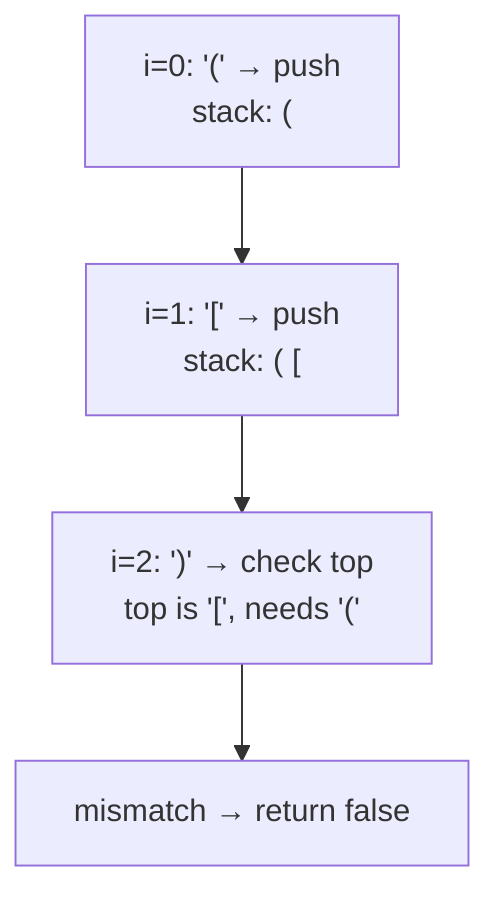

# 20. Valid Parentheses
`Easy` · **Pattern:** Stack — match the most recent unclosed opener

> [!question] Problem
> Given a string `s` containing just the characters `'('`, `')'`, `'{'`, `'}'`, `'['` and `']'`, determine if the input string is **valid**.
> An input string is valid if:
> 1. Open brackets must be closed by the same type of bracket.
> 2. Open brackets must be closed in the correct order.
> 3. Every close bracket has a corresponding open bracket of the same type.
>
> **Example 1:**
> ```
> Input: s = "()"
> Output: true
> ```
>
> **Example 2:**
> ```
> Input: s = "()[]{}"
> Output: true
> ```
>
> **Example 3:**
> ```
> Input: s = "(]"
> Output: false
> ```
>
> **Example 4:**
> ```
> Input: s = "([)]"
> Output: false
> ```
>
> **Constraints:**
> - `1 <= s.length <= 10^4`
> - `s` consists only of `'()[]{}'`

---

## 🧩 Pattern this follows

> [!tip] "Most recently opened, first closed" = a stack, by definition
> Valid nesting requires that whichever bracket opened **last** must be the one that closes **next** — that's literally the definition of LIFO (last-in, first-out), which is exactly what a stack gives you. Push every opener; on a closer, check it matches whatever's currently on **top** — if it doesn't, brackets closed out of order (`"([)]"` fails exactly here: `]` tries to close while `[` isn't on top).

### 🖼️ Visualizing it

Stack state as `"([)]"` is scanned — the mismatch triggers the instant `)` finds `[` sitting on top instead of `(`.



## 💻 My Solution (C++)

```cpp
class Solution {
public:
    bool isValid(string s) {
        stack<int> st;
        for (int i = 0; i < s.size(); i++) {
            if (s[i] == '(' || s[i] == '[' || s[i] == '{') {
                st.push(s[i]);
            } else {
                if (st.empty()) {
                    return false;
                }

                if (s[i] == ')') {
                    if (st.top() == '(') {
                        st.pop();
                    } else {
                        return false;
                    }
                } else if (s[i] == ']') {
                    if (st.top() == '[') {
                        st.pop();
                    } else {
                        return false;
                    }
                } else if (s[i] == '}') {
                    if (st.top() == '{') {
                        st.pop();
                    } else {
                        return false;
                    }
                }
            }
        }
        if (st.empty()) {
            return true;
        }

        return false;
    }
};
```

## 🔍 Walkthrough

1. **Opener** (`(`, `[`, `{`) → push it onto `st`.
2. **Closer** → first check the stack isn't empty (a closer with nothing open to match is immediately invalid). Then check the top of the stack is the **matching** opener for this specific closer type — `)` needs `(` on top, `]` needs `[`, `}` needs `{`. If it matches, `pop()` (that pair is now resolved); if not, the nesting order is broken → `false`.
3. After scanning the whole string, the string is valid **only if the stack is empty** — an empty stack means every opener found its matching closer. A non-empty stack means some opener was never closed (e.g. `"(("`).

## ⏱️ Complexity

| | Complexity | Why |
|---|---|---|
| **Time** | O(n) | Single pass, each character pushed/popped at most once |
| **Space** | O(n) | Worst case (all openers, e.g. `"((((("`), the stack holds every character |

## 🚀 Tricks & Similar Problems

> [!success] The "empty stack at the end" check is easy to forget
> A string like `"((("` never returns `false` inside the loop — every character is a valid opener push, no closer ever triggers a mismatch. The **only** thing catching this case is the final `st.empty()` check after the loop. Any time you're validating with a stack, ask explicitly: *"what if the input ends with unclosed stuff still on the stack?"*
> **Similar pattern:** any "must close/resolve in the reverse order they opened" problem — nested tags (HTML/XML validation), nested function-call tracing, [[Largest Rectangle in Histogram (LeetCode #84)]] and [[Daily Temperatures (LeetCode #739)]] both use a stack for a different reason (finding the nearest greater/smaller element) but share the same "most recent unresolved thing lives on top" mental model.
