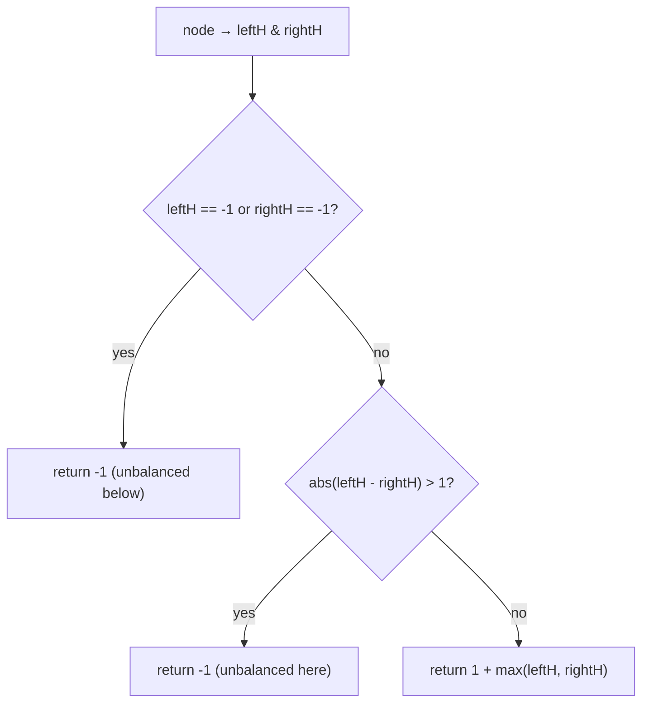

# 110. Balanced Binary Tree
`Easy` · **Pattern:** Height DFS with a `-1` "unbalanced" sentinel (bottom-up)

> [!question] Problem
> Given a binary tree, determine if it is **height-balanced** — a binary tree in which the left and right subtrees of *every* node differ in height by **no more than 1**.
>
> **Example 1:**
> ```
> Input: root = [3,9,20,null,null,15,7]
> Output: true
> ```
>
> **Example 2:**
> ```
> Input: root = [1,2,2,3,3,null,null,4,4]
> Output: false
> ```
>
> **Example 3:**
> ```
> Input: root = []
> Output: true
> ```
>
> **Constraints:**
> - Nodes are in `[0, 5000]`.
> - `-10^4 <= Node.val <= 10^4`

---

## 🧩 Pattern this follows

> [!tip] Compute height and check balance in ONE pass, using −1 as a flag
> The naive approach recomputes height at every node → `O(n²)`. The trick: a single bottom-up DFS that returns the node's height **or `-1` if any subtree below it is unbalanced**. The instant a child reports `-1`, or the two child heights differ by more than 1, propagate `-1` upward and stop caring about the real height. One traversal, `O(n)`.

### 🖼️ Visualizing it

`-1` poisons the chain upward the moment `|leftH − rightH| > 1`.



## 💻 My Solution (C++)

```cpp
class Solution {
public:

   

    int treeHeight(TreeNode* root){
        if(root==nullptr){
            return 0;
        }

        int leftHeight=treeHeight(root->left);
        if(leftHeight==-1){
            return -1;
        }
        int rightHeight=treeHeight(root->right);
        if(rightHeight==-1){
            return -1;
        }

        if(abs(rightHeight-leftHeight)>1){
            return -1;
        }
        return max(rightHeight,leftHeight)+1;
    }

    bool isBalanced(TreeNode* root) {
        
        if(root==nullptr){
            return true;
        }

        int height=treeHeight(root);
        if(height==-1){
            return false;
        }

        return true;


    }
};
```

## 🔍 Walkthrough

1. **`treeHeight`** returns the height, *or* `-1` meaning "unbalanced somewhere below."
2. Get `leftHeight`; if it's `-1`, short-circuit and return `-1` (don't even bother with the right side).
3. Get `rightHeight`; same early-exit on `-1`.
4. If `abs(rightHeight - leftHeight) > 1`, **this** node is unbalanced → return `-1`.
5. Otherwise return the real height `max(left, right) + 1`.
6. **`isBalanced`** just asks: did the whole tree come back as `-1`? If yes → `false`, else `true`.

## ⏱️ Complexity

| | Complexity | Why |
|---|---|---|
| **Time** | O(n) | One bottom-up pass; each node visited once (the `-1` sentinel avoids recomputing heights) |
| **Space** | O(h) | Recursion stack |

## 🚀 Tricks & Similar Problems

> [!success] The `-1` sentinel fuses "measure" and "validate" into one pass
> Overloading the return value (a real height ≥ 0, or `-1` for failure) is the classic way to avoid the `O(n²)` recompute trap. The early-exit `if(...==-1) return -1;` after **each** child is what makes it stop as soon as it knows.
> **Similar pattern:** [[Maximum Depth of Binary Tree (LeetCode #104)]] (the plain height function), [[Diameter of Binary Tree (LeetCode #543)]] (height DFS carrying extra info).
