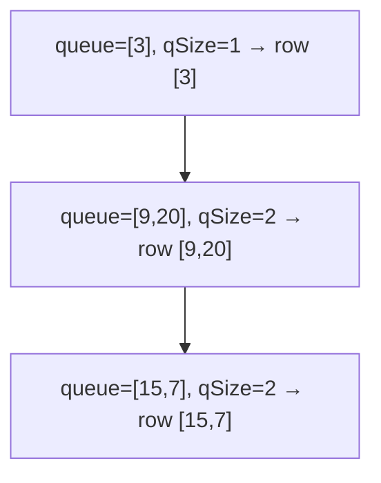

# 102. Binary Tree Level Order Traversal
`Medium` · **Pattern:** BFS with a per-level `qSize` snapshot

> [!question] Problem
> Given the `root` of a binary tree, return the **level-order traversal** of its nodes' values — level by level, left to right.
>
> **Example 1:**
> ```
> Input: root = [3,9,20,null,null,15,7]
> Output: [[3],[9,20],[15,7]]
> ```
>
> **Example 2:**
> ```
> Input: root = [1]
> Output: [[1]]
> ```
>
> **Constraints:**
> - Nodes are in `[0, 2000]`.
> - `-1000 <= Node.val <= 1000`

---

> [!note] Why this note exists
> Not in your pasted set, but it's the **BFS template** every level-based tree problem is built on — [[Binary Tree Right Side View (LeetCode #199)]] and [[Serialize and Deserialize Binary Tree (LeetCode #297)]] both reuse this exact loop. Master the `qSize` snapshot here once.

## 🧩 Pattern this follows

> [!tip] Freeze the level size *before* draining the queue
> Push the root, then loop while the queue is non-empty. Each iteration: grab `qSize = q.size()` — that's exactly **this level's** node count. Pop precisely `qSize` nodes into a row, enqueuing their children (which form the *next* level) as you go. The snapshot is what keeps levels from bleeding into each other.

### 🖼️ Visualizing it

Each outer loop consumes one whole level; children queue up for the next.



## 💻 Solution (C++)

```cpp
class Solution {
public:
    vector<vector<int>> levelOrder(TreeNode* root) {
        vector<vector<int>> ans;
        if (root == nullptr) return ans;

        queue<TreeNode*> q;
        q.push(root);

        while (!q.empty()) {
            int qSize = q.size();          // this level's count, frozen
            vector<int> level;
            for (int i = 0; i < qSize; i++) {
                TreeNode* node = q.front();
                q.pop();
                level.push_back(node->val);
                if (node->left)  q.push(node->left);
                if (node->right) q.push(node->right);
            }
            ans.push_back(level);
        }
        return ans;
    }
};
```

## 🔍 Walkthrough

1. Empty tree → empty result.
2. Seed the queue with `root`.
3. **Per level:** snapshot `qSize`, then pop exactly that many nodes into `level`, pushing each node's children for the next round.
4. Append the finished `level` row; repeat until the queue empties.

## ⏱️ Complexity

| | Complexity | Why |
|---|---|---|
| **Time** | O(n) | Each node enqueued/dequeued once |
| **Space** | O(n) | Queue holds up to a full level (~n/2 leaves at the widest) |

## 🚀 Tricks & Similar Problems

> [!success] `int qSize = q.size()` before the inner loop — the one line that matters
> Read `q.size()` **once** into a variable; if you loop on `q.size()` directly it changes as you enqueue children and levels merge. This template flexes into: right-side view (take last of each level), zigzag (alternate row direction), averages per level, etc.
> **Similar pattern:** [[Binary Tree Right Side View (LeetCode #199)]] (last node per level), [[Serialize and Deserialize Binary Tree (LeetCode #297)]] (BFS encode with nulls).
