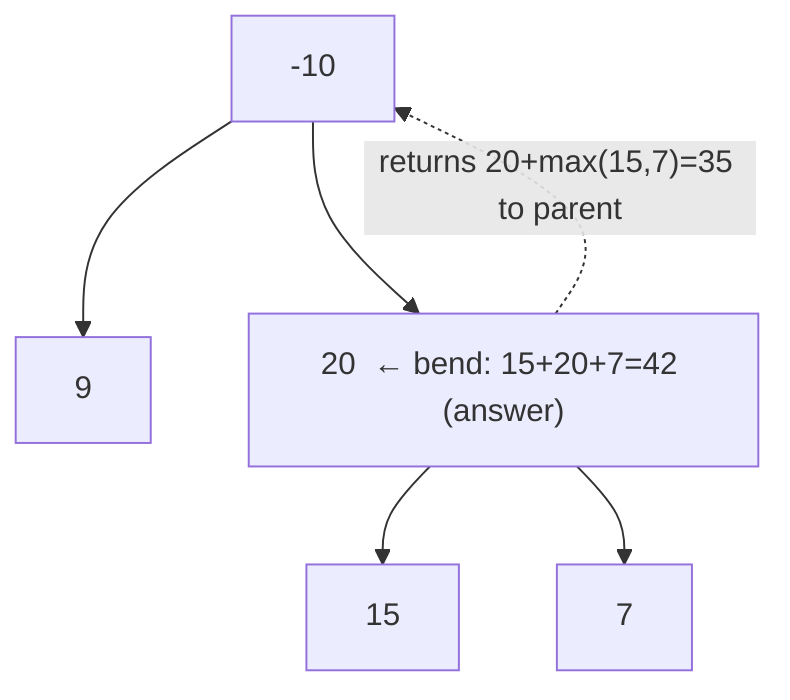

# 124. Binary Tree Maximum Path Sum
`Hard` · **Pattern:** Post-order DFS — return one-sided gain, record best bent path

> [!question] Problem
> A **path** in a binary tree is a sequence of nodes where each pair of adjacent nodes has an edge. A node appears **at most once**; the path need **not** pass through the root. The **path sum** is the sum of the node values on the path. Return the **maximum** path sum of any non-empty path.
>
> **Example 1:**
> ```
> Input: root = [1,2,3]
> Output: 6   (2 → 1 → 3)
> ```
>
> **Example 2:**
> ```
> Input: root = [-10,9,20,null,null,15,7]
> Output: 42   (15 → 20 → 7)
> ```
>
> **Constraints:**
> - Nodes are in `[1, 3·10^4]`.
> - `-1000 <= Node.val <= 1000`

---

## 🧩 Pattern this follows

> [!tip] Two different quantities: what you *return* vs. what you *record*
> The exact same "return one thing, stash the answer in a global" trick as [[Diameter of Binary Tree (LeetCode #543)]] — but with sums instead of heights:
> - **What you RETURN to the parent:** the best *downward* path that goes through this node and picks **at most one** child — `node->val + max(leftGain, rightGain)`. A parent can only extend a straight line, not a fork.
> - **What you RECORD in the global answer:** the best path that **bends** at this node using **both** children — `node->val + leftGain + rightGain`. That path can't continue upward, so it only ever contributes to the answer here.
> - **Clamp negatives to 0:** a subtree with negative gain is better dropped (`max(0, gain)`).

### 🖼️ Visualizing it

At node `20`: bent path `15 + 20 + 7 = 42` (recorded); returns straight `20 + max(15,7) = 35` upward.



## 💻 My Solution (C++)

```cpp
class Solution {
public:
    int ans=INT_MIN;
    int getSum(TreeNode* root){
        if (!root){
            return 0;
        }


        int leftSum=max(0,getSum(root->left));
        int rightSum=max(0,getSum(root->right));

        int currentSum=max(root->val,root->val+leftSum+rightSum);
        ans=max(ans,currentSum);

        return max(leftSum,rightSum)+root->val;


    }

    int maxPathSum(TreeNode* root) {
        getSum(root);
        return ans;
    }
};
```

## 🔍 Walkthrough

1. **Base case:** `nullptr` contributes `0` gain.
2. `leftSum = max(0, getSum(left))`, `rightSum = max(0, getSum(right))` — **clamp negatives to 0** so a harmful subtree is simply not taken.
3. **Record** the best path that *bends here*: `currentSum = max(root->val, root->val + leftSum + rightSum)` (using both children), and update the global `ans`.
4. **Return** the best *straight* path upward: `max(leftSum, rightSum) + root->val` — the parent can only attach **one** side, never a fork.
5. `maxPathSum` runs the DFS and reads off the global `ans`.

## ⏱️ Complexity

| | Complexity | Why |
|---|---|---|
| **Time** | O(n) | Each node visited once |
| **Space** | O(h) | Recursion stack |

## 🚀 Tricks & Similar Problems

> [!success] Never return the "both children" sum — it can't extend upward
> The single most common bug: returning `val + leftSum + rightSum`. That path forks and a parent can't continue it, so it must only feed the **global answer**, never the return value. Return the one-sided gain. Clamping with `max(0, …)` handles all-negative subtrees cleanly.
> **Similar pattern:** [[Diameter of Binary Tree (LeetCode #543)]] (identical structure, height instead of sum), [[Maximum Depth of Binary Tree (LeetCode #104)]] (the underlying post-order skeleton).
