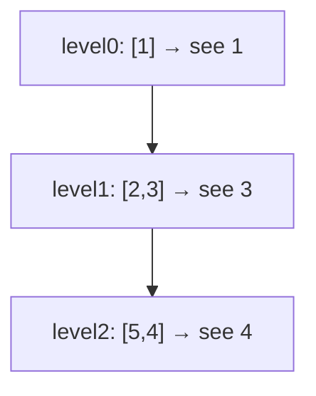

# 199. Binary Tree Right Side View
`Medium` · **Pattern:** Level-order BFS — keep the last node of each level

> [!question] Problem
> Given the `root` of a binary tree, imagine yourself standing on the **right side** of it. Return the values of the nodes you can see, ordered top to bottom.
>
> **Example 1:**
> ```
> Input: root = [1,2,3,null,5,null,4]
> Output: [1,3,4]
> ```
>
> **Example 2:**
> ```
> Input: root = [1,null,3]
> Output: [1,3]
> ```
>
> **Constraints:**
> - Nodes are in `[0, 100]`.
> - `-100 <= Node.val <= 100`

---

## 🧩 Pattern this follows

> [!tip] The right-side view = the *last* node of every level
> Standing on the right, at each depth you see only the **rightmost** node. So do a standard [[Binary Tree Level Order Traversal (LeetCode #102)]] BFS, and from each level keep just the **last** node processed. Because we push `left` then `right`, the final node popped in a level's `qSize` loop is its rightmost visible one.

### 🖼️ Visualizing it

The rightmost node of each level is the visible one.



## 💻 My Solution (C++)

```cpp
class Solution {
public:
    vector<int> rightSideView(TreeNode* root) {
        
        vector<int> ans;

        queue<TreeNode*> q;

        if(root==nullptr){
            return {};
        }

        q.push(root);

        while(!q.empty()){
            int qSize=q.size();
            int rightValue;
            for(int i=0;i<qSize;i++){

                TreeNode* frontNode=q.front();
                q.pop();

                if(frontNode->left){
                    q.push(frontNode->left);
                }

                if(frontNode->right){
                    q.push(frontNode->right);
                }

                rightValue=frontNode->val;
                

            }

            ans.push_back(rightValue);
        }

        return ans;

    }
};
```

## 🔍 Walkthrough

1. Empty tree → `{}`.
2. BFS with the `qSize` snapshot template. Push `left` then `right` so nodes are processed left-to-right within a level.
3. Overwrite `rightValue` with **every** node's value as you go — after the loop it holds the **last** (rightmost) node of that level.
4. Push `rightValue` into `ans` once per level. Result is the top-to-bottom right-side view.

## ⏱️ Complexity

| | Complexity | Why |
|---|---|---|
| **Time** | O(n) | Each node enqueued/dequeued once |
| **Space** | O(n) | Queue holds up to one full level |

## 🚀 Tricks & Similar Problems

> [!success] Just keep the last node per level — no special casing
> Since the inner loop runs exactly `qSize` times and pushes children left→right, `rightValue` naturally ends on the rightmost node. (DFS alternative: recurse **right-first**, and record the first node seen at each new depth.)
> **Similar pattern:** [[Binary Tree Level Order Traversal (LeetCode #102)]] (same BFS, keep whole rows), [[Serialize and Deserialize Binary Tree (LeetCode #297)]] (BFS traversal).
