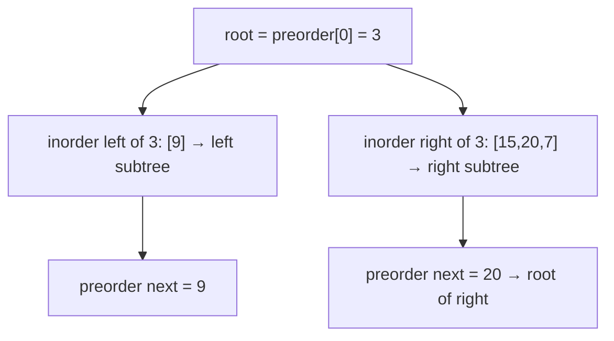

# 105. Construct Binary Tree from Preorder and Inorder Traversal
`Medium` · **Pattern:** Preorder gives roots; inorder splits left/right (hashmap index)

> [!question] Problem
> Given two integer arrays `preorder` and `inorder` where `preorder` is the preorder traversal of a binary tree and `inorder` is the inorder traversal of the **same** tree, construct and return the binary tree.
>
> **Example 1:**
> ```
> Input: preorder = [3,9,20,15,7], inorder = [9,3,15,20,7]
> Output: [3,9,20,null,null,15,7]
> ```
>
> **Example 2:**
> ```
> Input: preorder = [-1], inorder = [-1]
> Output: [-1]
> ```
>
> **Constraints:**
> - `1 <= preorder.length <= 3000`, `inorder.length == preorder.length`
> - All values are **unique**; `inorder` is a permutation of `preorder`.

---

## 🧩 Pattern this follows

> [!tip] Preorder = "root first"; inorder = "left | root | right"
> **Preorder** visits **root → left → right**, so the very first unused element is always the current subtree's **root**. **Inorder** visits **left → root → right**, so once you know the root's position in `inorder`, everything **left** of it is the left subtree and everything **right** is the right subtree. Consume preorder left-to-right with a moving `preOrderIndex`, and use a **hashmap** `value → inorder index` for `O(1)` root lookups instead of scanning.

### 🖼️ Visualizing it

`preorder[0]=3` is root; in `inorder`, `9` is left of `3`, `15,20,7` are right.



## 💻 My Solution (C++)

```cpp
class Solution {
public:

    unordered_map<int,int> mp;
    int preOrderIndex=0;

    TreeNode* buildBinaryTree(vector<int>& preorder, vector<int>& inorder,int leftIndex, int rightIndex){

        if(leftIndex>rightIndex){
            return nullptr;
        }

        int val=preorder[preOrderIndex];
        int mid=mp[val];
        preOrderIndex++;

        TreeNode* newNode=new TreeNode(val);

        newNode->left=buildBinaryTree(preorder,inorder,leftIndex,mid-1);
        newNode->right=buildBinaryTree(preorder,inorder,mid+1,rightIndex);

        return newNode;

    }

    TreeNode* buildTree(vector<int>& preorder, vector<int>& inorder) {

        for(int i=0;i<inorder.size();i++){
            mp[inorder[i]]=i;
        }

        return buildBinaryTree(preorder,inorder,0,inorder.size()-1);

    }
};
```

## 🔍 Walkthrough

1. **Pre-index inorder:** build `mp[value] = its index in inorder` so finding a root's split point is `O(1)`.
2. `buildBinaryTree(left, right)` builds the subtree covering `inorder[left..right]`:
   - **Base case:** `leftIndex > rightIndex` → empty range → `nullptr`.
   - **Root** = `preorder[preOrderIndex]` (next unused preorder element); advance `preOrderIndex`.
   - `mid = mp[val]` = root's position in inorder.
3. **Order matters:** recurse **left first** (`left..mid-1`), *then* right (`mid+1..right`). Preorder emits the entire left subtree before the right, so `preOrderIndex` must consume the left side first.
4. Return the assembled node.

## ⏱️ Complexity

| | Complexity | Why |
|---|---|---|
| **Time** | O(n) | Each node built once; hashmap makes root lookup `O(1)` (naive scan would be `O(n²)`) |
| **Space** | O(n) | Hashmap + recursion stack |

## 🚀 Tricks & Similar Problems

> [!success] Recurse LEFT before RIGHT — the shared `preOrderIndex` demands it
> Because `preOrderIndex` is a single global cursor and preorder lists the whole left subtree before the right, building right first would grab the wrong root. The inorder hashmap is what turns this from `O(n²)` (scanning for the root each time) into `O(n)`.
> **Similar pattern:** #106 *Construct from Inorder and Postorder* (mirror: postorder gives roots **back-to-front**, recurse **right** first), [[Kth Smallest Element in a BST (LeetCode #230)]] (inorder structure).
