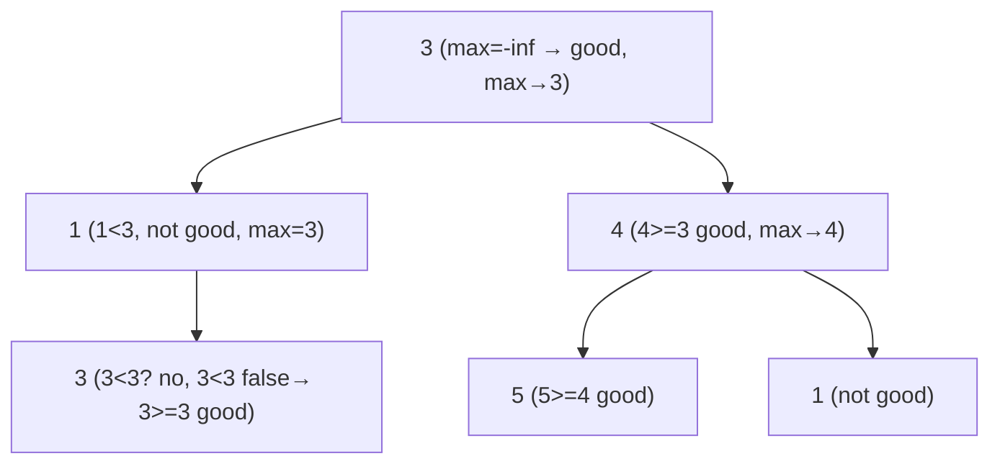

# 1448. Count Good Nodes in Binary Tree
`Medium` · **Pattern:** Pre-order DFS carrying the max-so-far down the path

> [!question] Problem
> Given a binary tree `root`, a node `X` is **good** if in the path from root to `X` there are **no** nodes with a value **greater than** `X`. Return the number of good nodes.
>
> **Example 1:**
> ```
> Input: root = [3,1,4,3,null,1,5]
> Output: 4
> Explanation: Nodes 3(root), 4, 5, and the left-3 are good.
> ```
>
> **Example 2:**
> ```
> Input: root = [3,3,null,4,2]
> Output: 3
> ```
>
> **Example 3:**
> ```
> Input: root = [1]
> Output: 1
> ```
>
> **Constraints:**
> - Nodes are in `[1, 10^5]`.
> - `-10^4 <= Node.val <= 10^4`

---

## 🧩 Pattern this follows

> [!tip] Push the "max seen on the path" *downward* as a parameter
> A node is good iff its value ≥ the **maximum value along the root-to-here path**. So carry that running max **down** the recursion (top-down / pre-order). At each node: if `val >= maxSoFar`, it's good (+1) and the max for its children becomes `val`; otherwise pass the old max unchanged. Sum the counts from both subtrees. This *"accumulate state on the way down"* is the counterpart to the *"combine on the way up"* pattern of [[Maximum Depth of Binary Tree (LeetCode #104)]].

### 🖼️ Visualizing it

`maxSoFar` only ever grows as you descend; a node ≥ it is good.



## 💻 My Solution (C++)

```cpp
class Solution {
public:

    int getNodes(TreeNode* root,int maxElement){

        if(root==nullptr){
            return 0;
        }

        int count=0;

        if(root->val>=maxElement){
            count=1;
            maxElement=root->val;
        }

        return getNodes(root->left,maxElement) + getNodes(root->right,maxElement) + count;


    }

    int goodNodes(TreeNode* root) {
        
        return getNodes(root,INT_MIN);


    }
};
```

## 🔍 Walkthrough

1. Start the DFS with `maxElement = INT_MIN` so the root is always good.
2. **Base case:** `nullptr` contributes `0`.
3. If `root->val >= maxElement`, this node is **good** → `count = 1`, and update `maxElement = root->val` for the subtrees below (the biggest value on the path so far).
4. If not good, leave `count = 0` and pass the **unchanged** `maxElement` down.
5. Return `left + right + count` — total good nodes in this subtree. The updated max is passed *by value*, so each branch sees its own path's maximum.

## ⏱️ Complexity

| | Complexity | Why |
|---|---|---|
| **Time** | O(n) | Each node visited once |
| **Space** | O(h) | Recursion stack |

## 🚀 Tricks & Similar Problems

> [!success] Pass-by-value is doing quiet work here
> Because `maxElement` is passed **by value**, updating it for the left branch never leaks into the right branch — each root-to-leaf path carries its own running max automatically. No backtracking/restore needed. This "state flows down as a parameter" contrasts with the "answer flows up as a return" style.
> **Similar pattern:** [[Validate Binary Search Tree (LeetCode #98)]] (carries `min`/`max` bounds down the same way), [[Maximum Depth of Binary Tree (LeetCode #104)]].
