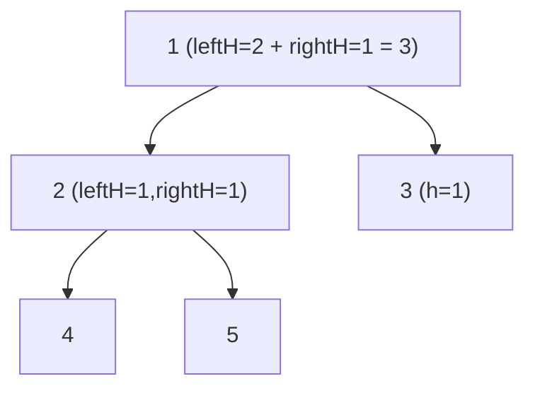

# 543. Diameter of Binary Tree
`Easy` · **Pattern:** Height DFS + a global max "through-node" path

> [!question] Problem
> Given the `root` of a binary tree, return the length of the **diameter** — the length of the **longest path** between any two nodes. This path may or may not pass through the root. The length is measured by the **number of edges** between the two nodes.
>
> **Example 1:**
> ```
> Input: root = [1,2,3,4,5]
> Output: 3
> Explanation: longest path 4→2→1→3 (or 5→2→1→3), 3 edges.
> ```
>
> **Example 2:**
> ```
> Input: root = [1,2]
> Output: 1
> ```
>
> **Constraints:**
> - Nodes are in `[1, 10^4]`.
> - `-100 <= Node.val <= 100`

---

## 🧩 Pattern this follows

> [!tip] At each node, the longest path *through it* = leftHeight + rightHeight
> The diameter is the max over all nodes of "deepest-left + deepest-right." So run the standard [[Maximum Depth of Binary Tree (LeetCode #104)]] height DFS, but at every node **also** update a global `diameter = max(diameter, leftHeight + rightHeight)`. The function still *returns* height (for its parent), while the answer accumulates in the global. This "return one thing, record another in a global" is a key tree trick — reused in [[Binary Tree Maximum Path Sum (LeetCode #124)]].

### 🖼️ Visualizing it

At node `1`: left height `2` + right height `1` = path of `3` edges → the diameter.



## 💻 My Solution (C++)

```cpp
class Solution {
public:

    int diameter=0;

    int depthOfBinaryTree(TreeNode* root){
        if(root==nullptr){
            return 0;
        }

        int leftDepth=depthOfBinaryTree(root->left);
        int rightDepth=depthOfBinaryTree(root->right);

        diameter=max(diameter,leftDepth+rightDepth);

        return max(leftDepth,rightDepth)+1;
    }

    int diameterOfBinaryTree(TreeNode* root) {
        if(root==nullptr){
            return 0;
        }

        int leftDia=depthOfBinaryTree(root->left);
        int rightDia=depthOfBinaryTree(root->right);

        return max(diameter,leftDia + rightDia);
    }
};
```

## 🔍 Walkthrough

1. **`depthOfBinaryTree`** is the height function with one extra line: at every node it updates the **global** `diameter` with `leftDepth + rightDepth` (edges in the path bending through this node), then returns `max(left, right) + 1` to its parent.
2. **`diameterOfBinaryTree`** computes the heights of the root's two subtrees — which triggers the full DFS and populates `diameter` across the whole tree.
3. It returns `max(diameter, leftDia + rightDia)` — the global max, also folding in the path through the root itself.

## ⏱️ Complexity

| | Complexity | Why |
|---|---|---|
| **Time** | O(n) | Single height DFS; each node visited once |
| **Space** | O(h) | Recursion stack |

## 🚀 Tricks & Similar Problems

> [!success] Return height, but stash the answer in a global
> Height (returned to parent) and diameter (the answer) are **different quantities** — the classic move is to return one and accumulate the other in a member variable. Note diameter counts **edges** = `leftHeight + rightHeight` (not `+1`).
> **Similar pattern:** [[Binary Tree Maximum Path Sum (LeetCode #124)]] (identical trick — return one-sided gain, record best bent path), [[Maximum Depth of Binary Tree (LeetCode #104)]] (the height function it's built on).
