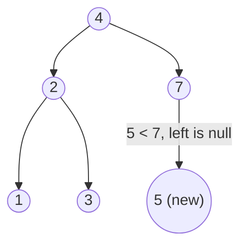

# 701. Insert into a Binary Search Tree
`Medium` · **Pattern:** BST descent — go left/right, plant new node at the null

> [!question] Problem
> You are given the `root` of a binary search tree (BST) and a `value` to insert into the tree. Return the root of the BST after the insertion. It is **guaranteed** the new value does not exist in the original BST.
>
> There may be multiple valid ways to insert; you may return **any** of them, as long as the tree remains a BST.
>
> **Example 1:**
> ```
> Input: root = [4,2,7,1,3], val = 5
> Output: [4,2,7,1,3,5]
> ```
>
> **Example 2:**
> ```
> Input: root = [40,20,60,10,30,50,70], val = 25
> Output: [40,20,60,10,30,50,70,null,null,25]
> ```
>
> **Constraints:**
> - Nodes are in `[0, 10^4]`.
> - `-10^8 <= Node.val, val <= 10^8`, all values unique.

---

## 🧩 Pattern this follows

> [!tip] Follow the BST rule down until you fall off — that empty spot is where it goes
> The BST property tells you exactly where a value belongs: at each node go **left** if `val < node->val`, else **right**. Keep descending until you hit a `nullptr` — that's the unique empty slot for the new leaf. Insertion never needs restructuring (for the basic version); it's just "find the null, attach."

### 🖼️ Visualizing it

Insert `5` into `[4,2,7,1,3]`: `5 > 4` → right to `7`; `5 < 7` → left is null → plant `5`.



## 💻 My Solution (C++)

```cpp
class Solution {
public:

    TreeNode* insertNode(TreeNode* root,int val){
        if(root==nullptr){
            TreeNode* newNode=new TreeNode(val);
            return newNode;
        }

        if(val<root->val){
            root->left=insertNode(root->left,val);
        }else{
            root->right=insertNode(root->right,val);
        }

        return root;

    }

    TreeNode* insertIntoBST(TreeNode* root, int val) {
        return insertNode(root,val);
    }
};
```

## 🔍 Walkthrough

1. **Base case:** `root == nullptr` — we've reached the empty slot → create and **return** the new node. The returned pointer gets wired into the parent.
2. If `val < root->val`, the value belongs in the **left** subtree → `root->left = insertNode(root->left, val)`.
3. Otherwise it belongs in the **right** subtree → `root->right = insertNode(root->right, val)`.
4. Return `root` so the recursion re-links the (possibly unchanged) child pointers on the way back up.

## ⏱️ Complexity

| | Complexity | Why |
|---|---|---|
| **Time** | O(h) | One root-to-leaf descent; `O(log n)` balanced, `O(n)` skewed |
| **Space** | O(h) | Recursion stack (an iterative version is `O(1)`) |

## 🚀 Tricks & Similar Problems

> [!success] The `child = recurse(child)` re-assignment is the key idiom
> Returning the subtree root and re-assigning `root->left/right` handles both "attach the new node" (when the child was null) and "leave the pointer unchanged" (when it wasn't) uniformly. This same "return the subtree root" idiom powers BST **delete** (#450). Iterative: walk with a parent pointer, attach at the null.
> **Similar pattern:** [[Validate Binary Search Tree (LeetCode #98)]], [[Lowest Common Ancestor of a Binary Search Tree (LeetCode #235)]] (both navigate by the BST `< / >` rule).
