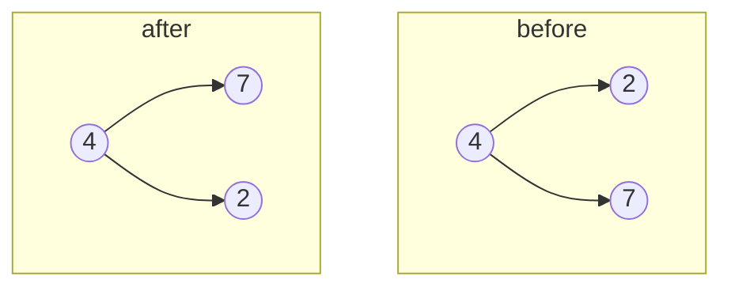

# 226. Invert Binary Tree
`Easy` · **Pattern:** Post-order DFS — swap children at every node

> [!question] Problem
> Given the `root` of a binary tree, **invert** the tree (mirror it left-to-right), and return its root.
>
> **Example 1:**
> ```
> Input: root = [4,2,7,1,3,6,9]
> Output: [4,7,2,9,6,3,1]
> ```
>
> **Example 2:**
> ```
> Input: root = [2,1,3]
> Output: [2,3,1]
> ```
>
> **Constraints:**
> - The number of nodes is in `[0, 100]`.
> - `-100 <= Node.val <= 100`

---

## 🧩 Pattern this follows

> [!tip] Mirroring = swap `left`↔`right` at every node
> To mirror a tree, every node must exchange its two children. Do it recursively: invert the left subtree, invert the right subtree, then swap the two pointers at the current node. (Order doesn't matter — you can swap first or last; both give the mirror.) Same "touch every node, recurse both sides" shape as [[Maximum Depth of Binary Tree (LeetCode #104)]].

### 🖼️ Visualizing it

At the root, subtrees are swapped after each is itself inverted.



## 💻 My Solution (C++)

```cpp
class Solution {
public:
    TreeNode* invertTree(TreeNode* root) {
        
        if(root==nullptr){
            return root;
        }

        invertTree(root->left);
        invertTree(root->right);

        TreeNode* temp=root->right;
        root->right=root->left;
        root->left=temp;

        return root;
    }
};
```

## 🔍 Walkthrough

1. **Base case:** `nullptr` → nothing to invert, return it.
2. Recursively invert the **left** subtree and the **right** subtree (each becomes internally mirrored).
3. **Swap** `root->left` and `root->right` using a temp pointer — now this node's children are exchanged.
4. Return `root`. Every node performs the same swap, so the whole tree ends up mirrored.

## ⏱️ Complexity

| | Complexity | Why |
|---|---|---|
| **Time** | O(n) | Each node visited and swapped once |
| **Space** | O(h) | Recursion stack up to the tree height |

## 🚀 Tricks & Similar Problems

> [!success] Swap order is irrelevant — pre-order or post-order both work
> You can swap the pointers *before* recursing or *after*; the mirror is identical. A BFS/queue version works too: dequeue a node, swap its kids, enqueue them. This is the gentlest introduction to "do one small op at every node."
> **Similar pattern:** [[Maximum Depth of Binary Tree (LeetCode #104)]] (same recursion skeleton), [[Same Tree (LeetCode #100)]] (dual traversal), [[Subtree of Another Tree (LeetCode #572)]].
