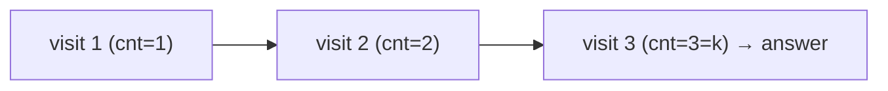

# 230. Kth Smallest Element in a BST
`Medium` · **Pattern:** In-order traversal (BST → sorted) + a counter

> [!question] Problem
> Given the `root` of a binary search tree, and an integer `k`, return the `k`th **smallest** value (1-indexed) of all the node values in the tree.
>
> **Example 1:**
> ```
> Input: root = [3,1,4,null,2], k = 1
> Output: 1
> ```
>
> **Example 2:**
> ```
> Input: root = [5,3,6,2,4,null,null,1], k = 3
> Output: 3
> ```
>
> **Constraints:**
> - Nodes are in `[1, 10^4]`.
> - `0 <= Node.val <= 10^4`, `1 <= k <= n`

---

## 🧩 Pattern this follows

> [!tip] In-order traversal of a BST yields values in *sorted* order
> `left → node → right` visits BST nodes in strictly increasing order. So walk in-order and **count** as you visit; the `k`th node visited is the answer. Stop as soon as `count == k` — no need to finish the traversal.

### 🖼️ Visualizing it

In-order visit order of Example 2's `[5,3,6,2,4,…,1]`: `1, 2, 3, 4, 5, 6` — the 3rd is `3`.



## 💻 My Solution (C++)

```cpp
class Solution {
public:

    int cnt=0;
    int ans=0;

    void inorderTraversal(TreeNode* root,int k){

        if(!root){
            return;
        }

        inorderTraversal(root->left,k);
        cnt++;
        if(cnt==k){
            ans=root->val;
            return;
        }
        inorderTraversal(root->right,k);
        
        return;

    }

    int kthSmallest(TreeNode* root, int k) {
        
        inorderTraversal(root,k);

        return ans;

    }
};
```

## 🔍 Walkthrough

1. Two members: `cnt` (nodes visited so far) and `ans` (the result).
2. **In-order:** recurse **left** first (smaller values), then process the current node, then **right**.
3. On processing a node: `cnt++`; if `cnt == k`, this is the `k`th smallest → save `ans` and return.
4. Otherwise continue into the right subtree.
5. `kthSmallest` kicks off the traversal and returns `ans`.

## ⏱️ Complexity

| | Complexity | Why |
|---|---|---|
| **Time** | O(h + k) | Descend to the smallest (`O(h)`), then visit `k` nodes; worst case `O(n)` |
| **Space** | O(h) | Recursion stack |

## 🚀 Tricks & Similar Problems

> [!success] "BST + sorted order needed" ⇒ think in-order immediately
> In-order = sorted is the single most useful BST fact. The counter lets you short-circuit at the `k`th node. **Iterative version** (explicit stack) is cleaner for early exit. **Follow-up:** if the tree is modified often and you query `k` a lot, augment each node with its subtree size for `O(h)` per query.
> **Similar pattern:** [[Validate Binary Search Tree (LeetCode #98)]] (in-order must be strictly increasing), [[Construct Binary Tree from Preorder and Inorder Traversal (LeetCode #105)]] (uses in-order structure).
