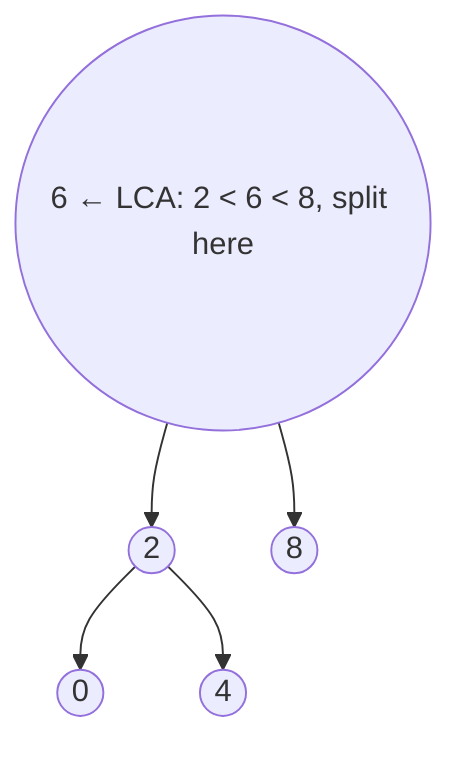

# 235. Lowest Common Ancestor of a Binary Search Tree
`Medium` · **Pattern:** BST navigation — the split point is the LCA

> [!question] Problem
> Given a binary search tree (BST), find the **lowest common ancestor (LCA)** of two given nodes `p` and `q`. The LCA is the lowest node that has **both** `p` and `q` as descendants (a node can be a descendant of itself).
>
> **Example 1:**
> ```
> Input: root = [6,2,8,0,4,7,9,null,null,3,5], p = 2, q = 8
> Output: 6
> ```
>
> **Example 2:**
> ```
> Input: root = [6,2,8,0,4,7,9,null,null,3,5], p = 2, q = 4
> Output: 2
> Explanation: a node can be its own descendant.
> ```
>
> **Constraints:**
> - Nodes are in `[2, 10^5]`; all values unique; `p != q`; both exist in the BST.

---

## 🧩 Pattern this follows

> [!tip] The LCA is the node where `p` and `q` "split" left vs right
> Use the BST ordering. From the root: if **both** `p` and `q` are **greater** than the current node → LCA is in the right subtree. If **both** are **smaller** → go left. The moment they straddle the current node (one ≤ node ≤ other), or the node **equals** one of them, that node is the **split point** = the LCA. No need to search the whole tree — just walk down one path.

### 🖼️ Visualizing it

`p=2, q=8` straddle root `6` immediately → `6` is the LCA.



## 💻 My Solution (C++)

```cpp
class Solution {
public:
    TreeNode* lowestCommonAncestor(TreeNode* root, TreeNode* p, TreeNode* q) {

        if(root==nullptr){
            return root;
        }

        int maxVal=max(p->val,q->val);
        int minVal=min(p->val,q->val);

        while(root){
            if(minVal>root->val){
                root=root->right;
            }else if(maxVal<root->val){
                root=root->left;
            }else{
                return root;
            }
        }

        return root;
        
    }
};
```

## 🔍 Walkthrough

1. Precompute `minVal`/`maxVal` of the two target values so the logic doesn't care which of `p`/`q` is bigger.
2. Walk down from the root:
   - **`minVal > root->val`** → both targets are larger → go **right**.
   - **`maxVal < root->val`** → both targets are smaller → go **left**.
   - **Otherwise** the node sits between them (`minVal <= root->val <= maxVal`), i.e. they split here (or this node *is* one of them) → **this is the LCA**, return it.
3. Iterative, so `O(1)` extra space.

## ⏱️ Complexity

| | Complexity | Why |
|---|---|---|
| **Time** | O(h) | Single descent along one root-to-node path |
| **Space** | O(1) | Iterative loop, no recursion stack |

## 🚀 Tricks & Similar Problems

> [!success] Exploit the BST order — don't do a general-tree search
> Because a BST tells you which side each target lies on, you never explore both subtrees. The "split point" is the first node between the two values. Contrast with a **general** binary tree where you have no ordering and must search both sides.
> **Similar pattern:** [[Lowest Common Ancestor of a Binary Tree (LeetCode #236)]] (the general-tree version — needs full DFS), [[Insert into a Binary Search Tree (LeetCode #701)]], [[Validate Binary Search Tree (LeetCode #98)]] (all navigate by the BST rule).
