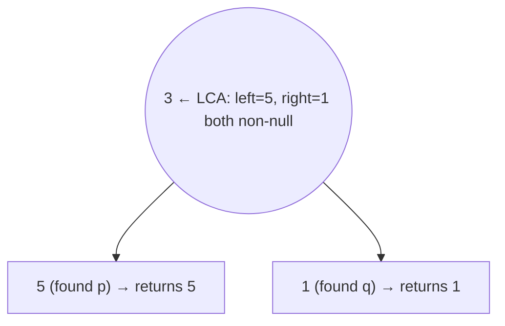

# 236. Lowest Common Ancestor of a Binary Tree
`Medium` · **Pattern:** Post-order DFS — the node where the two finds meet

> [!question] Problem
> Given a binary tree, find the **lowest common ancestor (LCA)** of two given nodes `p` and `q`. The LCA is the lowest node having both `p` and `q` as descendants (a node may be a descendant of itself). Unlike #235, this is a **general** binary tree — no BST ordering.
>
> **Example 1:**
> ```
> Input: root = [3,5,1,6,2,0,8,null,null,7,4], p = 5, q = 1
> Output: 3
> ```
>
> **Example 2:**
> ```
> Input: root = [3,5,1,6,2,0,8,null,null,7,4], p = 5, q = 4
> Output: 5
> ```
>
> **Constraints:**
> - Nodes are in `[2, 10^5]`; unique values; `p`, `q` both exist.

---

> [!note] Why this note exists
> Not in your pasted set, but it's the **general-tree counterpart** to [[Lowest Common Ancestor of a Binary Search Tree (LeetCode #235)]]. Without a BST ordering you can't pick a side by value — you must actually search both subtrees. Knowing both side-by-side is a common interview follow-up.

## 🧩 Pattern this follows

> [!tip] Return the target when you find it; the first node that gets a hit from *both* sides is the LCA
> DFS every node. Base cases: `nullptr` → return `null`; if the node **is** `p` or `q`, return it (found one target). Recurse both children. Then combine:
> - If **both** left and right recursions returned non-null, `p` and `q` were found in *different* subtrees → **this node is the LCA**.
> - If only one side is non-null, propagate it up (both targets are on that side, or this carries the one found target upward).

### 🖼️ Visualizing it

`p=5, q=1` return up from opposite subtrees of `3` → `3` is the meeting point.



## 💻 Solution (C++)

```cpp
class Solution {
public:
    TreeNode* lowestCommonAncestor(TreeNode* root, TreeNode* p, TreeNode* q) {
        // base: empty, or found one of the targets
        if (root == nullptr || root == p || root == q) return root;

        TreeNode* left  = lowestCommonAncestor(root->left,  p, q);
        TreeNode* right = lowestCommonAncestor(root->right, p, q);

        // targets found on both sides → this node is the LCA
        if (left != nullptr && right != nullptr) return root;

        // otherwise bubble up whichever side found something
        return left != nullptr ? left : right;
    }
};
```

## 🔍 Walkthrough

1. **Base case:** `nullptr` → nothing here. If `root` equals `p` or `q`, return `root` — "I found a target."
2. Recurse into **both** subtrees (unavoidable — no ordering to prune with).
3. **Both non-null** → `p` and `q` live in separate subtrees → `root` is the lowest node covering both → return `root`.
4. **One non-null** → that side holds a target (or the already-found LCA); pass it up.
5. **Both null** → neither target below → return `null`.

## ⏱️ Complexity

| | Complexity | Why |
|---|---|---|
| **Time** | O(n) | May visit every node once |
| **Space** | O(h) | Recursion stack |

## 🚀 Tricks & Similar Problems

> [!success] No BST ⇒ you must search both sides; the "both non-null" node is the answer
> The whole trick is *what the return value means*: "the target (or LCA) found in my subtree, else null." The first ancestor receiving a non-null from **each** side is where `p` and `q` diverge. Compare with [[Lowest Common Ancestor of a Binary Search Tree (LeetCode #235)]], which prunes to one path using value comparisons — `O(h)` there vs `O(n)` here.
> **Similar pattern:** [[Binary Tree Maximum Path Sum (LeetCode #124)]] (post-order combine of both children), [[Subtree of Another Tree (LeetCode #572)]].
