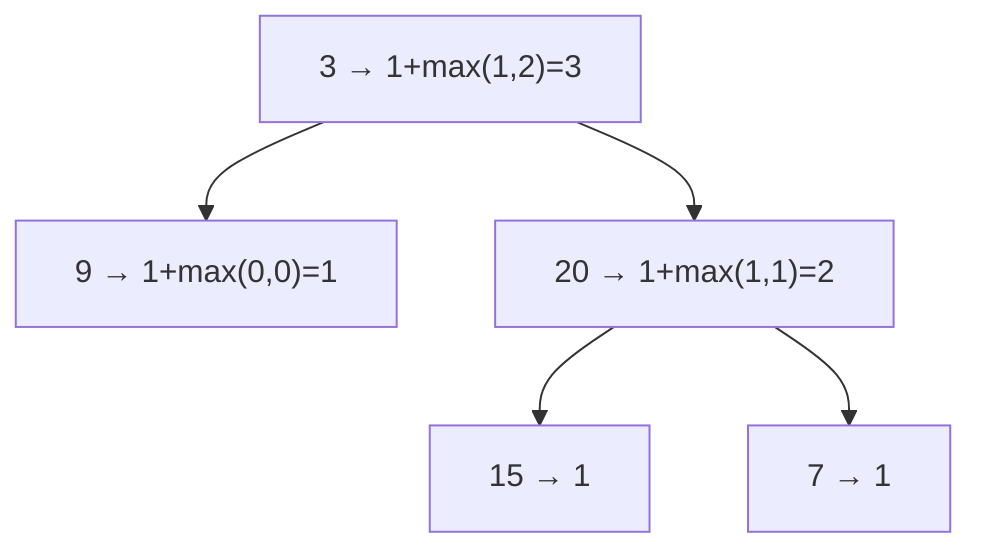

# 104. Maximum Depth of Binary Tree
`Easy` · **Pattern:** Post-order DFS — height = `1 + max(children)`

> [!question] Problem
> Given the `root` of a binary tree, return its **maximum depth**. A binary tree's maximum depth is the number of nodes along the longest path from the root node down to the farthest leaf node.
>
> **Example 1:**
> ```
> Input: root = [3,9,20,null,null,15,7]
> Output: 3
> ```
>
> **Example 2:**
> ```
> Input: root = [1,null,2]
> Output: 2
> ```
>
> **Constraints:**
> - The number of nodes is in `[0, 10^4]`.
> - `-100 <= Node.val <= 100`

---

## 🧩 Pattern this follows

> [!tip] The "shape" of nearly every tree problem: solve children, combine
> A tree's height is defined **recursively**: an empty tree has height 0; any other node's height is `1 + max(height(left), height(right))`. This *"recurse into both subtrees, then combine their answers"* post-order shape is the template underneath most tree questions — [[Diameter of Binary Tree (LeetCode #543)]], [[Balanced Binary Tree (LeetCode #110)]], and [[Binary Tree Maximum Path Sum (LeetCode #124)]] are all this same skeleton with a twist.

### 🖼️ Visualizing it

Each node returns `1 + max(child heights)`; the answer bubbles up from the leaves.



## 💻 My Solution (C++)

```cpp
class Solution {
public:
    int maxDepth(TreeNode* root) {
        if(root==nullptr){
            return 0;
        }

        
        int leftDepth=maxDepth(root->left);
        int rightDepth=maxDepth(root->right);

        return max(leftDepth,rightDepth)+1;

    }
};
```

## 🔍 Walkthrough

1. **Base case:** `root == nullptr` → an empty tree has depth `0`. This is the recursion's floor.
2. Recurse to get `leftDepth` and `rightDepth` — the heights of the two subtrees.
3. **Combine:** this node adds `1` to whichever child subtree is taller → `max(leftDepth, rightDepth) + 1`.
4. The value returned to the very first call is the overall maximum depth.

## ⏱️ Complexity

| | Complexity | Why |
|---|---|---|
| **Time** | O(n) | Each node visited exactly once |
| **Space** | O(h) | Recursion stack depth = tree height `h` (`O(log n)` balanced, `O(n)` skewed) |

## 🚀 Tricks & Similar Problems

> [!success] Memorize this as the base template
> "Return 0 for null, else `1 + max(recurse left, recurse right)`" is muscle memory you'll reuse constantly. A BFS level-count also works (count how many level-order rounds), but recursion is shorter.
> **Similar pattern:** [[Diameter of Binary Tree (LeetCode #543)]] (same height function + a global max), [[Balanced Binary Tree (LeetCode #110)]] (height with a `-1` early-exit), [[Invert Binary Tree (LeetCode #226)]] (same recurse-both-children shape).
