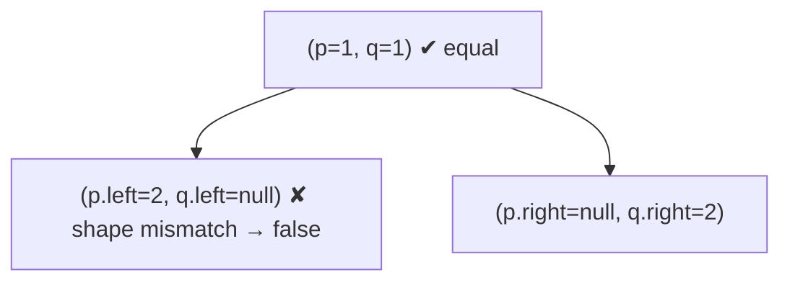

# 100. Same Tree
`Easy` · **Pattern:** Parallel DFS — compare two trees node-for-node

> [!question] Problem
> Given the roots of two binary trees `p` and `q`, write a function to check if they are **the same** — structurally identical *and* with the same node values.
>
> **Example 1:**
> ```
> Input: p = [1,2,3], q = [1,2,3]
> Output: true
> ```
>
> **Example 2:**
> ```
> Input: p = [1,2], q = [1,null,2]
> Output: false
> ```
>
> **Constraints:**
> - Nodes in both trees are in `[0, 100]`.
> - `-10^4 <= Node.val <= 10^4`

---

> [!note] Why this note exists
> Not in your pasted set, but it's the **building block** for [[Subtree of Another Tree (LeetCode #572)]] — that problem's `isValid` helper *is* this exact function. Learn it first and #572 becomes trivial.

## 🧩 Pattern this follows

> [!tip] Walk both trees in lockstep; every step must agree
> Two trees are identical iff, at every position, **both nodes are null**, or **both are non-null with equal values and identical subtrees**. Recurse into `(p->left, q->left)` and `(p->right, q->right)` simultaneously — the moment any pair disagrees, the whole thing is `false`.

### 🖼️ Visualizing it

The `null`/non-`null` mismatch at the second level fails Example 2.



## 💻 Solution (C++)

```cpp
class Solution {
public:
    bool isSameTree(TreeNode* p, TreeNode* q) {
        // both empty → identical here
        if (p == nullptr && q == nullptr) return true;
        // exactly one empty, or values differ → not identical
        if (p == nullptr || q == nullptr) return false;
        if (p->val != q->val) return false;
        // recurse both sides in parallel
        return isSameTree(p->left, q->left) && isSameTree(p->right, q->right);
    }
};
```

## 🔍 Walkthrough

1. **Both null** → this position matches → `true`.
2. **Exactly one null** → shapes differ → `false`.
3. **Values differ** → `false`.
4. Otherwise recurse left-with-left and right-with-right; both must be `true` (short-circuit `&&`).

## ⏱️ Complexity

| | Complexity | Why |
|---|---|---|
| **Time** | O(min(n, m)) | Stops at the first mismatch; at most the smaller tree's size |
| **Space** | O(min(h₁, h₂)) | Parallel recursion depth |

## 🚀 Tricks & Similar Problems

> [!success] The null-ordering matters
> Check `both null` **before** `either null` — reversing them makes the "both null" case wrongly return `false`. This 3-check ladder (both-null / one-null / value) recurs everywhere in tree comparison.
> **Similar pattern:** [[Subtree of Another Tree (LeetCode #572)]] (calls this on every node), [[Invert Binary Tree (LeetCode #226)]], [[Serialize and Deserialize Binary Tree (LeetCode #297)]] (equality of round-trip).
