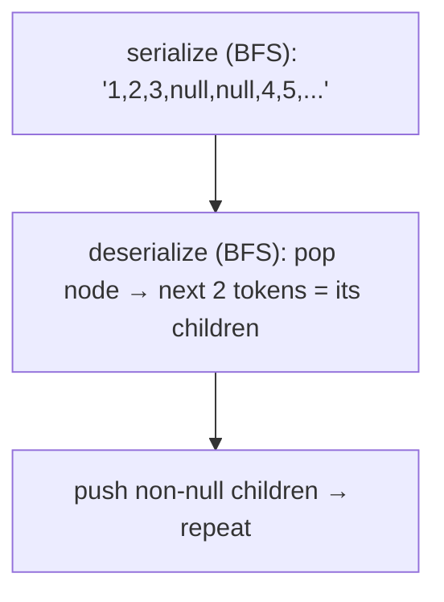

# 297. Serialize and Deserialize Binary Tree
`Hard` · **Pattern:** BFS to a string with `null` markers, BFS back to a tree

> [!question] Problem
> Serialization is converting a data structure into a string; deserialization reverses it. Design an algorithm to **serialize** and **deserialize** a binary tree. There is no restriction on your format — only that `deserialize(serialize(root))` returns the original tree.
>
> **Example 1:**
> ```
> Input: root = [1,2,3,null,null,4,5]
> Output: [1,2,3,null,null,4,5]
> ```
>
> **Example 2:**
> ```
> Input: root = []
> Output: []
> ```
>
> **Constraints:**
> - Nodes are in `[0, 10^4]`.
> - `-1000 <= Node.val <= 1000`

---

## 🧩 Pattern this follows

> [!tip] Level-order BFS + explicit `null` markers = a fully reconstructable string
> A traversal alone is ambiguous — but a traversal **with `null` placeholders** for missing children pins down the exact shape. Serialize with the [[Binary Tree Level Order Traversal (LeetCode #102)]] BFS, emitting `"val,"` for real nodes and `"null,"` for empties. Deserialize with a second BFS: the first token is the root; then consume tokens in pairs as each dequeued node's left & right children, enqueuing the non-null ones.

### 🖼️ Visualizing it

Serialized string and the queue-driven rebuild move in lockstep.



## 💻 My Solution (C++)

```cpp
class Codec {
public:

    // Encodes a tree to a single string.
    string serialize(TreeNode* root) {
        
        string serializedStr="";

        queue<TreeNode*> q;

        if(!root){
            return "";
        }
        

        q.push(root);

        while(!q.empty()){

            int qSize=q.size();

            for(int i=0;i<qSize;i++){

                TreeNode* frontNode=q.front();
                q.pop();

                if(frontNode){
                    q.push(frontNode->left);
                    q.push(frontNode->right);
                    serializedStr += to_string(frontNode->val) + ",";
                }else{
                    serializedStr += "null,";
                }

            }

        }

        return serializedStr;

    }

    // Decodes your encoded data to tree.
    TreeNode* deserialize(string data) {
        
        if(data.size()==0){
            return nullptr;
        }

        vector<string> v;
        string temp="";
        for(char c:data){
            if(c==','){
                v.push_back(temp);
                temp="";
            }else{
                temp+=c;
            }
        }

        int i=0;

        TreeNode* newNode=new TreeNode(stoi(v[i]));

        queue<TreeNode*> q;
        q.push(newNode);
        
        while(!q.empty() && i<v.size()){
           
            TreeNode* frontNode=q.front();
            q.pop();

            i++;
            if(i<v.size() && v[i]!="null"){
                TreeNode* curNode=new TreeNode(stoi(v[i]));
                frontNode->left=curNode;
                q.push(curNode);
            }

            i++;
            if(i<v.size() && v[i]!="null"){
                TreeNode* curNode=new TreeNode(stoi(v[i]));
                frontNode->right=curNode;
                q.push(curNode);
            }
            
        }

        return newNode;


    }
};
```

## 🔍 Walkthrough

**serialize:**
1. Empty tree → `""`.
2. BFS from the root. For a real node, append `"val,"` and enqueue **both** children (even null ones). For a null, append `"null,"`.
3. Result is a comma-terminated level-order string with explicit nulls.

**deserialize:**
1. Empty string → `nullptr`.
2. **Split** on `,` into a `vector<string>` of tokens.
3. Token `0` is the root; enqueue it.
4. BFS: pop a node, then the **next two tokens** (`i++` twice) are its left and right children. For each non-`"null"` token, create the child, link it, and enqueue it (so its own children get filled later).
5. Return the root — a faithful rebuild.

> [!note] Small mismatch worth knowing
> `serialize` uses the `qSize` level-batched loop and enqueues children of `null` sentinels too, so it can emit some extra trailing `null`s; `deserialize` reads with a flat two-tokens-per-node cursor and stops when the queue drains. They round-trip correctly (the parser ignores surplus trailing nulls), but the string isn't the minimal encoding. Kept **as you wrote it**.

## ⏱️ Complexity

| | Complexity | Why |
|---|---|---|
| **Time** | O(n) | Each node emitted once and parsed once |
| **Space** | O(n) | Queue + the token string/vector |

## 🚀 Tricks & Similar Problems

> [!success] Null markers are what make a traversal invertible
> A bare BFS/DFS order is ambiguous — the `null` placeholders encode structure so the shape is recoverable. Deserialize mirrors serialize: same traversal order, consuming tokens as you go. **DFS (preorder) variant** is even shorter to code: recurse, writing `null` for empties; rebuild by reading tokens in the same preorder.
> **Similar pattern:** [[Binary Tree Level Order Traversal (LeetCode #102)]] (the BFS engine), [[Construct Binary Tree from Preorder and Inorder Traversal (LeetCode #105)]] (rebuild a tree from a linear encoding).
