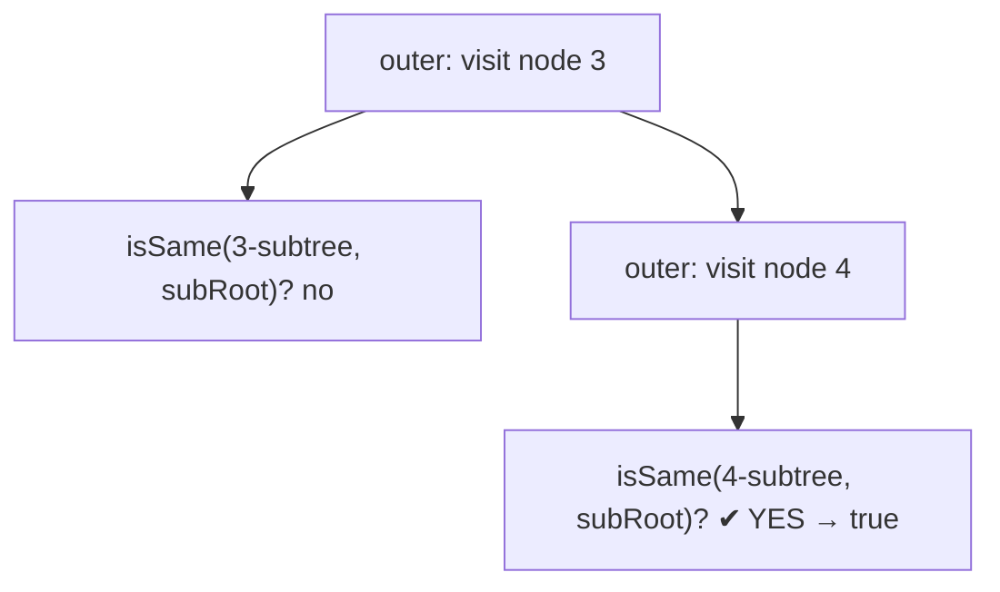

# 572. Subtree of Another Tree
`Easy` · **Pattern:** DFS every node + "Same Tree" check at each

> [!question] Problem
> Given the roots of two binary trees `root` and `subRoot`, return `true` if there is a subtree of `root` with the **same structure and node values** as `subRoot`, and `false` otherwise. A subtree consists of a node in `root` and **all** of its descendants.
>
> **Example 1:**
> ```
> Input: root = [3,4,5,1,2], subRoot = [4,1,2]
> Output: true
> ```
>
> **Example 2:**
> ```
> Input: root = [3,4,5,1,2,null,null,null,null,0], subRoot = [4,1,2]
> Output: false
> ```
>
> **Constraints:**
> - Nodes in `root` are in `[1, 2000]`; in `subRoot` are in `[1, 1000]`.
> - `-10^4 <= Node.val <= 10^4`

---

## 🧩 Pattern this follows

> [!tip] "Is X a subtree?" = try to match X starting at *every* node of the big tree
> Two nested traversals: the **outer** DFS visits every node of `root`; at each node it runs an **inner** "are these two trees identical?" check (exactly [[Same Tree (LeetCode #100)]]) against `subRoot`. If any node is the root of a perfect match, return `true`.

### 🖼️ Visualizing it

Outer DFS scans for a candidate node; inner check confirms a full structural match.



## 💻 My Solution (C++)

```cpp
class Solution {
public:

    bool isValid(TreeNode* root,TreeNode* subRoot){
        if (root==nullptr && subRoot==nullptr){
            return true;
        }

        if(root==nullptr || subRoot==nullptr ){
            return false;
        }

        if(root->val!=subRoot->val){
            return false;
        }
        
       return (isValid(root->right,subRoot->right) && isValid(root->left,subRoot->left));
        
    }

    bool isSubtree(TreeNode* root, TreeNode* subRoot) {
        
        if(root==nullptr){
            return false;
        }

        if(isValid(root,subRoot)){
            return true;
        }

        return (isSubtree(root->left,subRoot) || isSubtree(root->right,subRoot));

    }
};
```

## 🔍 Walkthrough

1. **`isValid`** is the *Same Tree* check — both null → `true`; one null or values differ → `false`; else recurse both sides. It confirms two trees are *exactly* identical from these roots down.
2. **`isSubtree`** is the outer scan:
   - `root == nullptr` → ran out of nodes without a match → `false`.
   - `isValid(root, subRoot)` → the subtree rooted **here** matches → `true`.
   - Otherwise try the same in the **left** or **right** subtree (`||` short-circuits on the first hit).

## ⏱️ Complexity

| | Complexity | Why |
|---|---|---|
| **Time** | O(n · m) | `n` = size of `root`; at each of its nodes the inner check costs up to `m` = size of `subRoot` |
| **Space** | O(h) | Recursion depth of the two nested traversals |

## 🚀 Tricks & Similar Problems

> [!success] It's literally "Same Tree" run at every node
> Recognize the composition: an outer "visit all nodes" wrapped around an inner "are these identical" (`isValid`). Get [[Same Tree (LeetCode #100)]] right and this is a 5-line wrapper.
> **Faster alternative:** serialize both trees and check if `subRoot`'s serialization is a substring of `root`'s (guard leaves with sentinels) → `O(n + m)` with KMP.
> **Similar pattern:** [[Same Tree (LeetCode #100)]], [[Invert Binary Tree (LeetCode #226)]].
