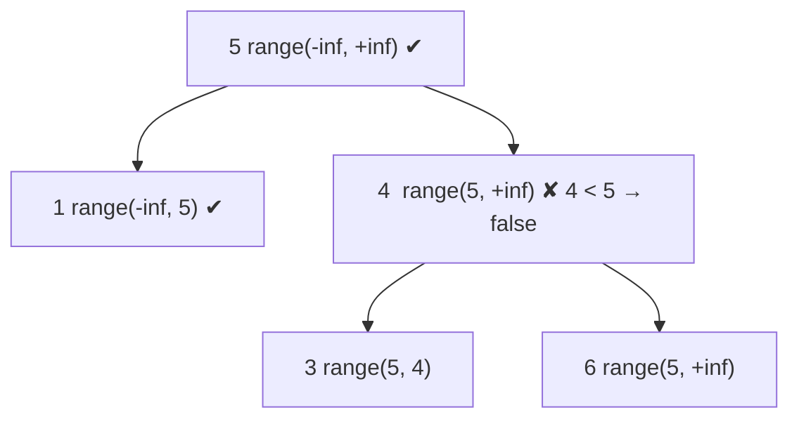

# 98. Validate Binary Search Tree
`Medium` · **Pattern:** DFS carrying `(min, max)` valid-range bounds down

> [!question] Problem
> Given the `root` of a binary tree, determine if it is a **valid binary search tree (BST)**. A valid BST:
> - The left subtree of a node contains only nodes with keys **less than** the node's key.
> - The right subtree contains only nodes with keys **greater than** the node's key.
> - Both subtrees must also be valid BSTs.
>
> **Example 1:**
> ```
> Input: root = [2,1,3]
> Output: true
> ```
>
> **Example 2:**
> ```
> Input: root = [5,1,4,null,null,3,6]
> Output: false
> Explanation: node 4's left child 3 is < 5 → violates the ancestor bound.
> ```
>
> **Constraints:**
> - Nodes are in `[1, 10^4]`.
> - `-2^31 <= Node.val <= 2^31 - 1`

---

## 🧩 Pattern this follows

> [!tip] Every node lives inside an open interval `(min, max)` set by its ancestors
> A common wrong answer only compares a node with its direct children — but the BST rule is about **all** ancestors. Instead, pass a valid range down: the root may be anything `(-∞, +∞)`. Going **left**, the upper bound tightens to the parent's value; going **right**, the lower bound tightens. A node is valid iff `min < val < max`. This "carry bounds down" mirrors [[Count Good Nodes in Binary Tree (LeetCode #1448)]].

### 🖼️ Visualizing it

Example 2: node `3` inherits range `(-∞, 5)` from ancestor `5` but sits under `4`'s right → range `(4, 5)`... wait, it's `4`'s **left**, range `(-∞, 4)` **and** ancestor cap `5` → but `3` also must be `> 5`? Bounds catch it.


> Node `4` already fails: as `5`'s right child it must be `> 5`, but `4 < 5`.

## 💻 My Solution (C++)

```cpp
class Solution {
public:

    bool validateBST(TreeNode* root, long minVal,long maxVal){
        if(!root){
            return true;
        }

        if(root->val<=minVal || root->val>=maxVal){
            return false;
        }

        return validateBST(root->left,minVal,root->val) && validateBST(root->right,root->val,maxVal);
    }

    bool isValidBST(TreeNode* root) {
        return validateBST(root,LONG_MIN,LONG_MAX);
    }
};
```

## 🔍 Walkthrough

1. Start with the widest range `(LONG_MIN, LONG_MAX)`.
2. **Base case:** `nullptr` is a valid (empty) BST → `true`.
3. **Check bounds:** if `val <= minVal` or `val >= maxVal`, this node breaks the BST property for some ancestor → `false`. (Strict `<=`/`>=` because BSTs here forbid duplicates.)
4. Recurse:
   - **Left** subtree must all be `< val` → new range `(minVal, root->val)`.
   - **Right** subtree must all be `> val` → new range `(root->val, maxVal)`.
5. Both sides must pass (`&&`).

## ⏱️ Complexity

| | Complexity | Why |
|---|---|---|
| **Time** | O(n) | Each node checked once |
| **Space** | O(h) | Recursion stack |

## 🚀 Tricks & Similar Problems

> [!success] Use `long` bounds — node values can be `INT_MIN`/`INT_MAX`
> Values reach the full 32-bit range, so an `int` bound of `INT_MIN` would wrongly reject a legitimate `INT_MIN` node. Widening to `long` (`LONG_MIN`/`LONG_MAX`) sidesteps it. **Alternative:** an in-order traversal of a valid BST is strictly increasing — verify each value exceeds the previous.
> **Similar pattern:** [[Kth Smallest Element in a BST (LeetCode #230)]] (uses the in-order = sorted property), [[Count Good Nodes in Binary Tree (LeetCode #1448)]] (bounds carried down), [[Lowest Common Ancestor of a Binary Search Tree (LeetCode #235)]].
