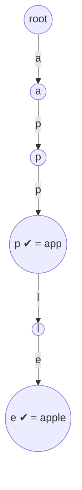

# 208. Implement Trie (Prefix Tree)
`Medium` · **Pattern:** Trie — 26-way node tree, one edge per letter

> [!question] Problem
> A **trie** (pronounced "try") or **prefix tree** is a tree data structure used to efficiently store and retrieve keys in a set of strings. Implement the `Trie` class:
> - `Trie()` initializes the object.
> - `void insert(String word)` inserts `word` into the trie.
> - `boolean search(String word)` returns `true` if `word` is in the trie (i.e., inserted before), `false` otherwise.
> - `boolean startsWith(String prefix)` returns `true` if a previously inserted word has the prefix `prefix`.
>
> **Example:**
> ```
> Trie trie = new Trie();
> trie.insert("apple");
> trie.search("apple");     // true
> trie.search("app");       // false
> trie.startsWith("app");   // true
> trie.insert("app");
> trie.search("app");       // true
> ```
>
> **Constraints:**
> - `1 <= word.length, prefix.length <= 2000`
> - `word` and `prefix` consist only of lowercase English letters.
> - At most `3 * 10^4` calls to `insert`, `search`, and `startsWith`.

---

## 🧩 Pattern this follows

> [!tip] Each node = "a letter position"; the path spells the word
> A trie stores strings by **sharing prefixes**. Every node owns a `children[26]` array — index `c - 'a'` points to the child for that letter. Walking from the root along a word's letters lands you on the node *after* its last letter; mark that node `isTerminal` to record "a real word ends here." `search` = walk and check the end node is terminal; `startsWith` = walk and just confirm the path exists (terminal or not). Shared prefixes (`app`, `apple`) share the same first nodes → compact and `O(word length)` per op, independent of how many words are stored.

### 🖼️ Visualizing it

Insert `apple` then `app`. `app`'s terminal flag flips on at the third node.


> ✔ = `isTerminal`. `search("app")` → reach P2, terminal → true. `search("ap")` → reach P1, **not** terminal → false. `startsWith("ap")` → path exists → true.

## 💻 My Solution (C++)

```cpp
class TrieNode{

    public:

        char data;
        vector<TrieNode*> children;
        bool isTerminal;

        TrieNode(char ch){
            data=ch;
            children.resize(26,NULL);
            isTerminal=false;
        }
};

class Trie{

    public:
    TrieNode* head;

    Trie(){
        head= new TrieNode('\0');
    }

    void insert(string word){

        TrieNode* curr=head;

        for(char c:word){
            int index=c-'a';

            if(curr->children[index]==NULL){
                TrieNode* newNode=new TrieNode(c);
                curr->children[index]=newNode;
            }

            curr=curr->children[index];
        }

        curr->isTerminal=true;

    }

    bool search(const string& word){
        TrieNode* curr=head;

        for(char c: word){
            int index=c-'a';

            if(curr->children[index]==NULL){
                return false;
            }

            curr=curr->children[index];
        }

        return curr->isTerminal;
    }

    bool startsWith(const string& word){
        TrieNode* curr=head;

        for(char c:word){
            int index=c-'a';

            if(curr->children[index]==NULL){
                return false;
            }

            curr=curr->children[index];
        }

        return true;
    }
    

};
```

## 🔍 Walkthrough

1. **`TrieNode`** holds `children[26]` (one slot per lowercase letter, all `NULL` at first) and `isTerminal` (does a word end at this node?). The `data` char is informational — indexing is by position, not by reading `data`.
2. **`Trie()`** makes an empty root (`'\0'`) that represents the empty prefix.
3. **`insert(word)`**: walk letter by letter from the root. If the child slot for a letter is `NULL`, create it. Move down. After the last letter, set `curr->isTerminal = true` — "a word ends here."
4. **`search(word)`**: walk the same way; if any letter's child is missing, the word was never inserted → `false`. Reaching the end, return `isTerminal` (distinguishes a full word from a mere prefix).
5. **`startsWith(prefix)`**: identical walk, but return `true` the moment the whole path exists — the end node needn't be terminal.

## ⏱️ Complexity

| | Complexity | Why |
|---|---|---|
| **`insert` / `search` / `startsWith`** | O(L) | `L` = length of the word/prefix; one step per character, independent of the number of stored words |
| **Space** | O(N · L · 26) worst | Each node carries 26 child pointers; total nodes bounded by total characters inserted |

## 🚀 Tricks & Similar Problems

> [!success] `search` vs `startsWith` differ by *one line* — the terminal check
> Both walk the trie identically; `search` returns `isTerminal` at the end, `startsWith` returns `true` as long as the path exists. That single distinction is the whole point of the `isTerminal` flag. For 26-lowercase problems the fixed `children[26]` array is fastest; for larger/unknown alphabets swap to `unordered_map<char, TrieNode*>`.
> **Similar pattern:** [[Trie — Fundamentals & Full Implementation]] (this node/insert/search skeleton + delete & count), [[Design Add and Search Words Data Structure (LeetCode #211)]] (adds `.` wildcard → DFS branch), [[Word Search II (LeetCode #212)]] (trie + grid DFS).
