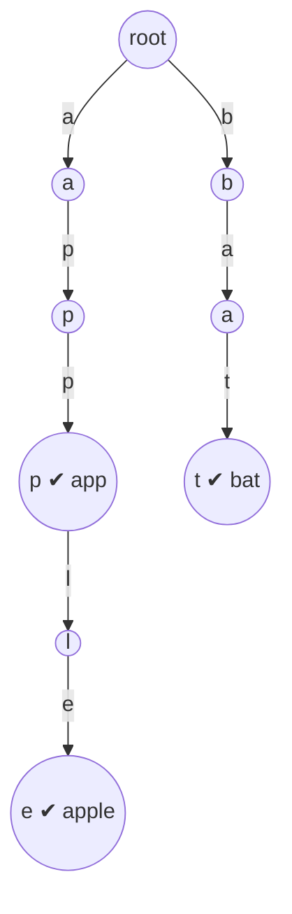

# Trie — Fundamentals & Full Implementation
`Reference` · **Pattern:** Prefix tree — the shared skeleton behind every trie problem

> [!abstract] What & why
> A **Trie** (prefix tree) stores a set of strings so that operations cost **`O(word length)`** — *independent of how many words are stored*. Words that share a prefix share nodes, so `app`, `apple`, `apply` all reuse the same first three nodes. Use a trie whenever you need: prefix lookups, autocomplete, "does any word start with X", spell-check, or word-in-grid search.

---

## 🧩 Core idea

> [!tip] One node per letter-position; the *path* spells the string
> - Every node holds `children[26]` — slot `c - 'a'` is the edge for letter `c` (all `nullptr` initially).
> - `isTerminal` (a.k.a. `isEnd`) marks a node where a **complete word** ends — this is what separates a stored word from a mere prefix.
> - The **root** is an empty node representing the empty prefix; nothing is stored *in* it.
> - Traversing a word = descend child by child; create missing children on insert, return `false` on a missing child during search.

### 🖼️ Anatomy

Words stored: `app`, `apple`, `bat`. Shared prefix `ap` = shared nodes.


> ✔ = `isTerminal`.

---

## 💻 Full Implementation (C++)

Beyond the LeetCode #208 basics (`insert`, `search`, `startsWith`), this adds **count** and **delete** — the two operations interviewers most often tack on.

```cpp
#include <iostream>
#include <string>
#include <vector>
using namespace std;

class TrieNode {
public:
    vector<TrieNode*> children;
    bool isTerminal;          // a full word ends here
    int wordsEndingHere;      // how many times this exact word was inserted
    int prefixCount;          // how many words pass through this node

    TrieNode() {
        children.resize(26, nullptr);
        isTerminal = false;
        wordsEndingHere = 0;
        prefixCount = 0;
    }
};

class Trie {
public:
    TrieNode* root;

    Trie() {
        root = new TrieNode();
    }

    // --- INSERT: O(L) ---
    void insert(const string& word) {
        TrieNode* curr = root;
        for (char c : word) {
            int idx = c - 'a';
            if (curr->children[idx] == nullptr) {
                curr->children[idx] = new TrieNode();
            }
            curr = curr->children[idx];
            curr->prefixCount++;      // one more word runs through here
        }
        curr->isTerminal = true;
        curr->wordsEndingHere++;
    }

    // --- helper: walk to the node at the end of `s`, or nullptr ---
    TrieNode* walk(const string& s) {
        TrieNode* curr = root;
        for (char c : s) {
            int idx = c - 'a';
            if (curr->children[idx] == nullptr) return nullptr;
            curr = curr->children[idx];
        }
        return curr;
    }

    // --- SEARCH full word: O(L) ---
    bool search(const string& word) {
        TrieNode* node = walk(word);
        return node != nullptr && node->isTerminal;
    }

    // --- PREFIX exists: O(L) ---
    bool startsWith(const string& prefix) {
        return walk(prefix) != nullptr;
    }

    // --- COUNT exact word occurrences: O(L) ---
    int countWordsEqualTo(const string& word) {
        TrieNode* node = walk(word);
        return node == nullptr ? 0 : node->wordsEndingHere;
    }

    // --- COUNT words with this prefix: O(L) ---
    int countWordsStartingWith(const string& prefix) {
        TrieNode* node = walk(prefix);
        return node == nullptr ? 0 : node->prefixCount;
    }

    // --- DELETE one occurrence of `word`: O(L) ---
    // Returns true if the word existed and was removed.
    bool erase(const string& word) {
        if (!search(word)) return false;   // nothing to delete

        TrieNode* curr = root;
        for (char c : word) {
            int idx = c - 'a';
            curr = curr->children[idx];
            curr->prefixCount--;           // one fewer word runs through here
        }
        curr->wordsEndingHere--;
        if (curr->wordsEndingHere == 0) {
            curr->isTerminal = false;      // no copies of this word remain
        }
        return true;
        // (Optional) to reclaim memory, delete nodes whose prefixCount hit 0
        // on the way back up — omitted for clarity; not needed for correctness.
    }
};

int main() {
    Trie t;
    t.insert("apple");
    t.insert("app");
    t.insert("app");                       // inserted twice

    cout << boolalpha;
    cout << t.search("app")                 << "\n"; // true
    cout << t.search("ap")                  << "\n"; // false (prefix, not a word)
    cout << t.startsWith("ap")              << "\n"; // true
    cout << t.countWordsEqualTo("app")      << "\n"; // 2
    cout << t.countWordsStartingWith("ap")  << "\n"; // 3 (apple, app, app)

    t.erase("app");
    cout << t.countWordsEqualTo("app")      << "\n"; // 1
    cout << t.search("app")                 << "\n"; // true (one copy left)
    return 0;
}
```

## 🔍 Operation-by-operation

| Op | What it does | Key line |
|---|---|---|
| **`insert`** | Create missing children, mark end terminal | `curr->isTerminal = true` + bump counters |
| **`search`** | Walk; end node must be terminal | `node && node->isTerminal` |
| **`startsWith`** | Walk; path just has to exist | `walk(prefix) != nullptr` |
| **`countWordsEqualTo`** | Read `wordsEndingHere` at the end node | needs the counter field |
| **`countWordsStartingWith`** | Read `prefixCount` at the end node | incremented on every insert step |
| **`erase`** | Decrement counters along the path; clear terminal if count hits 0 | guard with `search` first |

> [!note] The two counters (`prefixCount`, `wordsEndingHere`) are optional
> LeetCode #208 needs neither. Add them when the problem asks "how many words start with X" or "how many times was X inserted" (e.g. the classic "Implement Trie II"). Without them, a plain `bool isTerminal` suffices.

## ⏱️ Complexity

| Operation | Time | Space |
|---|---|---|
| insert / search / startsWith / count / erase | **O(L)** (`L` = word length) | — |
| whole structure | — | **O(total characters inserted × 26)** worst case (fixed 26-array per node) |

## 🚀 Variations & when to reach for a Trie

> [!success] Recognize the trigger, pick the node layout
> **Trigger words:** "prefix", "autocomplete", "starts with", "dictionary of words", "match with wildcards", "find all words in a grid." Reach for a trie *before* a hashset when **prefix** relationships matter (a hashset gives O(1) exact lookup but can't answer prefix queries efficiently).
>
> **Node layouts:**
> - `children[26]` — fastest for lowercase-only (what these problems use).
> - `unordered_map<char, TrieNode*>` — arbitrary/large alphabets, saves space when sparse.
> - `children[2]` — a **bitwise / binary trie** for XOR-maximization problems (store numbers bit by bit).
>
> **Direct applications in this folder:** [[Implement Trie (LeetCode #208)]] (insert/search/startsWith), [[Design Add and Search Words Data Structure (LeetCode #211)]] (`.` wildcard → DFS branch), [[Word Search II (LeetCode #212)]] (trie + grid backtracking).
