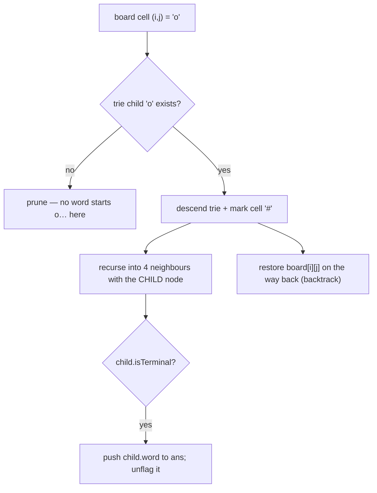

# 212. Word Search II
`Hard` · **Pattern:** Build a Trie of all words, then one DFS over the grid

> [!question] Problem
> Given an `m x n` `board` of characters and a list of strings `words`, return **all words** on the board. Each word must be constructed from letters of **sequentially adjacent** cells (horizontally or vertically neighbouring). The **same cell may not be used more than once** in a word.
>
> **Example 1:**
> ```
> Input: board = [["o","a","a","n"],
>                 ["e","t","a","e"],
>                 ["i","h","k","r"],
>                 ["i","f","l","v"]]
>         words = ["oath","pea","eat","rain"]
> Output: ["eat","oath"]
> ```
>
> **Example 2:**
> ```
> Input: board = [["a","b"],["c","d"]], words = ["abcb"]
> Output: []
> ```
>
> **Constraints:**
> - `1 <= m, n <= 12`, `board[i][j]` is a lowercase letter.
> - `1 <= words.length <= 3 * 10^4`, `1 <= words[i].length <= 10`.
> - All `words[i]` are unique.

---

## 🧩 Pattern this follows

> [!tip] Trie flips the problem: search the board once, not once-per-word
> Running Word Search I for **each** word is `O(words · cells · 4^L)` — far too slow. Instead, insert **all** words into a **Trie**, then DFS the board **once**. At each cell you descend *both* the grid and the trie in lockstep: the trie child for the current letter tells you instantly whether **any** word can continue this way — if there's no child, prune the entire branch. Store the full `word` on terminal nodes so a match is emitted directly, and **un-flag** matched terminals to avoid duplicates.

### 🖼️ Visualizing it

Grid DFS and trie descent move together; a missing trie child kills the branch immediately.



## 💻 My Solution (C++)

```cpp
class TrieNode{

    public:
        string word;
        vector<TrieNode*> children;
        bool isTerminal;

        TrieNode(){
            children.resize(26,nullptr);
            isTerminal=false;
        }

};


class Solution {
public:
    TrieNode* head;

    Solution(){
        head=new TrieNode();
    }

    void insert(const string& word){
        
        TrieNode* curr=head;

        for(char c:word){
            int index=c-'a';
            if(curr->children[index]==nullptr){
                TrieNode* newNode=new TrieNode();
                curr->children[index]=newNode;
            }

            curr=curr->children[index];
        }
        curr->isTerminal=true;
        curr->word=word;
    }

    void dfs(vector<vector<char>>& board, TrieNode* node,int i,int j,vector<string> &ans){

        
        if(i<0 || i>=board.size() || j<0 || j>=board[0].size()){
            return;
        }

        char ch=board[i][j];

        if(ch=='#'){
            return;
        }

        int index=ch-'a';

        

        TrieNode* child=node->children[index];

        if(child==nullptr){
            return;
        }

        if(child->isTerminal){
            ans.push_back(child->word);
            child->isTerminal=false;
        }

        board[i][j]='#';

        dfs(board,child,i+1,j,ans);
        dfs(board,child,i,j+1,ans);
        dfs(board,child,i-1,j,ans);
        dfs(board,child,i,j-1,ans);

        board[i][j]=ch;

    }

    vector<string> findWords(vector<vector<char>>& board, vector<string>& words) {
        
        for(const string& word:words){
            insert(word);
        }

        vector<string> ans;

        for(int i=0;i<board.size();i++){
            for(int j=0;j<board[0].size();j++){
                dfs(board,head,i,j,ans);
            }
        }

        return ans;


    }
};
```

## 🔍 Walkthrough

1. **Build the trie** from every word. Note this `TrieNode` stores the whole `word` on the terminal node — so a match needs no path reconstruction, just read `child->word`.
2. **Launch DFS from every board cell**, always starting at the trie `head`.
3. **`dfs(board, node, i, j, ans)`**:
   - Bounds check; skip cells already marked `'#'` (used in the current path).
   - Look up `child = node->children[board[i][j] - 'a']`. **`nullptr` → prune** — no dictionary word continues down this letter, so stop immediately. *This is the trie's payoff.*
   - `child->isTerminal` → a word ends here: push `child->word`, then set `isTerminal = false` so the **same word isn't added twice** if reachable via another path.
   - **Mark** `board[i][j] = '#'` (block reuse), recurse into all 4 neighbours **passing `child`** (trie and grid advance together), then **restore** `board[i][j] = ch` (backtrack).
4. Collect all matches in `ans`.

## ⏱️ Complexity

| | Complexity | Why |
|---|---|---|
| **Build** | O(W · L) | `W` words, up to `L` chars each |
| **Search** | O(m · n · 4 · 3^(L-1)) | Every cell starts a DFS; first step has 4 directions, each subsequent has ≤3 (can't revisit), depth bounded by longest word `L` — trie pruning cuts this hugely in practice |
| **Space** | O(W · L) | Trie nodes; plus recursion stack up to `O(L)` |

## 🚀 Tricks & Similar Problems

> [!success] Store the word on the terminal node + un-flag after a hit
> Two tricks make this clean: (1) `curr->word = word` on insert means a match is a one-liner — no reconstructing the path. (2) Setting `isTerminal = false` after emitting prevents duplicate outputs when a word is reachable by multiple grid paths. The `'#'` swap is the standard in-place visited marker with backtracking restore.
> **Further optimization:** prune dead trie leaves after matching to shrink the search over time.
> **Similar pattern:** [[Implement Trie (LeetCode #208)]] & [[Trie — Fundamentals & Full Implementation]] (the structure), [[Design Add and Search Words Data Structure (LeetCode #211)]] (trie + DFS branching). Grid-DFS-with-backtracking mirrors "Word Search I" and "Number of Islands."
