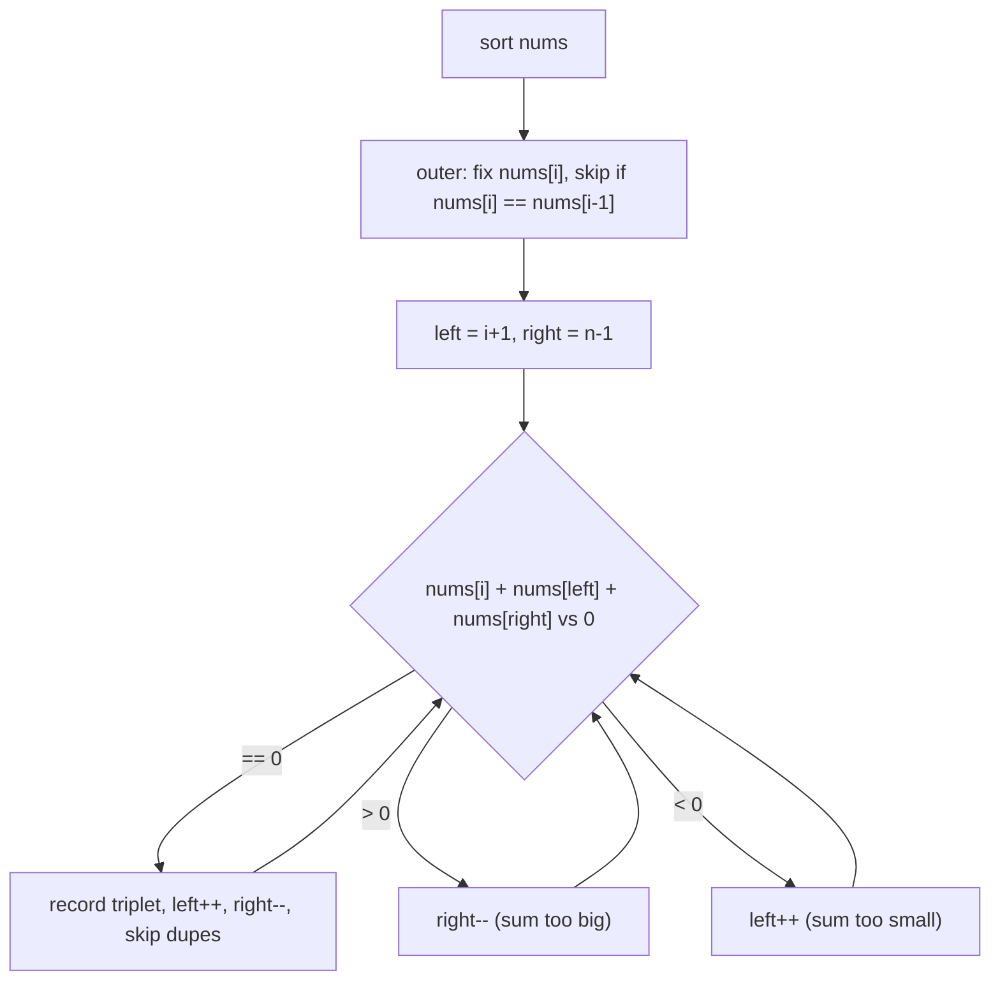

# 15. 3Sum
`Medium` · **Pattern:** Sort + fix one element + two pointers on the rest

> [!question] Problem
> Given an integer array `nums`, return all the **triplets** `[nums[i], nums[j], nums[k]]` such that `i != j`, `i != k`, `j != k`, and `nums[i] + nums[j] + nums[k] == 0`.
> The solution set **must not contain duplicate triplets**.
>
> **Example 1:**
> ```
> Input: nums = [-1,0,1,2,-1,-4]
> Output: [[-1,-1,2],[-1,0,1]]
> Explanation: The distinct triplets that sum to 0 are [-1,0,1] and [-1,-1,2].
> ```
>
> **Example 2:**
> ```
> Input: nums = [0,1,1]
> Output: []
> Explanation: The only possible triplet does not sum up to 0.
> ```
>
> **Example 3:**
> ```
> Input: nums = [0,0,0]
> Output: [[0,0,0]]
> Explanation: The only possible triplet sums up to 0.
> ```
>
> **Constraints:**
> - `3 <= nums.length <= 3000`
> - `-10^5 <= nums[i] <= 10^5`

---

## 🧩 Pattern this follows

> [!tip] Reduce 3Sum to repeated Two Sum
> Brute force is `O(n³)` (three nested loops). The upgrade: **sort the array**, then **fix one element** `nums[i]` and turn the rest of the problem into "find two numbers in the remaining sorted array that sum to `-nums[i]`" — exactly [[Two Sum II - Input Array Is Sorted (LeetCode #167)|Two Sum II's]] two-pointer pattern, run once per `i`. That's `O(n²)` total. **Sorting also solves duplicate-triplet avoidance for free** — equal values end up adjacent, so skipping repeats becomes a simple neighbor check.

### 🖼️ Visualizing it

Two nested patterns stacked on top of each other: the outer loop fixes `nums[i]`, and the inner loop is a full [[Two Sum II - Input Array Is Sorted (LeetCode #167)|Two Sum II]] scan over everything to its right.



## 💻 My Solution (C++)

```cpp
class Solution {
public:
    vector<vector<int>> threeSum(vector<int>& nums) {
        vector<vector<int>> ans;
        sort(nums.begin(), nums.end());

        for (int i = 0; i < nums.size(); i++) {
            if (i > 0 && nums[i] == nums[i - 1]) continue;

            int left = i + 1;
            int right = nums.size() - 1;

            while (left < right) {
                if (nums[i] == -1 * (nums[left] + nums[right])) {
                    ans.push_back({nums[i], nums[left], nums[right]});
                    left++;
                    right--;
                    while (left < right && nums[left] == nums[left - 1]) left++;
                    while (left < right && nums[right] == nums[right + 1]) right--;
                } else if (nums[i] > -1 * (nums[left] + nums[right])) {
                    right--;
                } else {
                    left++;
                }
            }
        }

        return ans;
    }
};
```

## 🔍 Walkthrough

1. **Sort first** — this both enables the two-pointer scan below and makes duplicate values sit next to each other.
2. Loop `i` over every index as the "fixed" first element of the triplet.
3. **Skip duplicate `i`'s:** `if (i > 0 && nums[i] == nums[i-1]) continue;` — if the current value is identical to the previous one, any triplet starting here would be a duplicate of one already found when `i` pointed at the earlier occurrence, so skip it entirely.
4. For the remaining subarray `(i, size-1]`, run the **Two Sum II** two-pointer scan looking for a pair summing to `-nums[i]` (written here as `nums[i] == -1 * (nums[left] + nums[right])`, i.e. `nums[i] + nums[left] + nums[right] == 0`):
   - **Match found** → record the triplet, then move both pointers inward.
   - **Sum too big** (`nums[i] > -(sum)`, meaning the actual pair-sum is too negative/small relative to what's needed) → shrink from the right.
   - **Sum too small** → grow from the left.
5. **Skip duplicate `left`/`right` after a match:** once a valid triplet is recorded and both pointers move inward, the two inner `while` loops skip past any further values equal to the one just used — preventing the *same* triplet (with a repeated left or right value) from being recorded again.

## ⏱️ Complexity

| | Complexity | Why |
|---|---|---|
| **Time** | O(n²) | Sorting is `O(n log n)`; the outer loop is `O(n)`, and each inner two-pointer scan is `O(n)` — dominates at `O(n²)` |
| **Space** | O(log n) – O(n) | Depends on the sort's internal implementation; output storage for `ans` isn't counted as extra space |

## 🚀 Tricks & Similar Problems

> [!bug] Two separate duplicate-skips, both necessary
> There are **two different dedup checks** in this solution, easy to conflate: skipping duplicate `i` (outer loop, before the inner scan even starts) prevents re-processing the same *first* element; skipping duplicate `left`/`right` (inside the inner loop, only after a match) prevents the same *pair* from being recorded twice for a fixed `i`. Missing either one produces duplicate triplets in the output.
> **Similar pattern:** [[Two Sum II - Input Array Is Sorted (LeetCode #167)]] (the exact inner two-pointer routine, standalone), **4Sum** (same idea, one more fixed loop nested outside).
