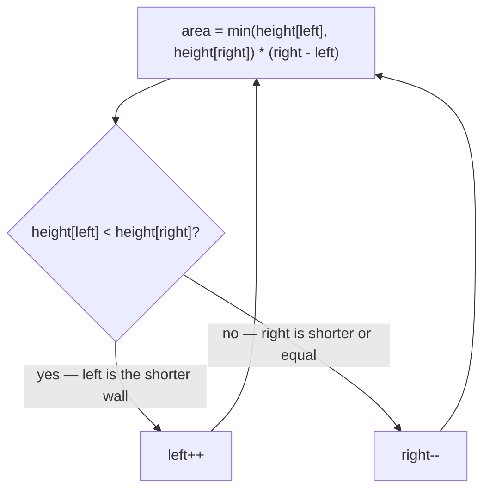

# 11. Container With Most Water
`Medium` · **Pattern:** Two Pointers (greedy — always discard the shorter wall)

> [!question] Problem
> You are given an integer array `height` of length `n`. There are `n` vertical lines drawn such that the two endpoints of the `i`th line are `(i, 0)` and `(i, height[i])`.
> Find two lines that, together with the x-axis, form a container that can hold the **most water**. Return the maximum amount of water a container can store.
> Notice that you may not slant the container.
>
> **Example 1:**
> ```
> Input: height = [1,8,6,2,5,4,8,3,7]
> Output: 49
> Explanation: The max area is between the lines of height 8 (index 1) and height 7 (index 8): min(8,7) * (8-1) = 7 * 7 = 49.
> ```
>
> 
>
> **Example 2:**
> ```
> Input: height = [1,1]
> Output: 1
> ```
>
> **Constraints:**
> - `n == height.length`
> - `2 <= n <= 10^5`
> - `0 <= height[i] <= 10^4`

---

## 🧩 Pattern this follows

> [!tip] Start at max width, greedily discard the shorter wall
> Brute force checks every pair of lines — `O(n²)`. The two-pointer trick: start with the **widest possible container** (`left = 0`, `right = n-1`), then repeatedly move whichever pointer points at the **shorter** wall. Why that pointer specifically, never the taller one? Because the container's height is capped by `min(height[left], height[right])` — moving the *taller* wall inward can only shrink the width while the height stays capped by the same short wall (or gets worse), so it can **never** improve the area. Moving the shorter wall is the only move that has any chance of finding a taller wall and increasing area to compensate for the lost width.

### 🖼️ Visualizing it

Not the problem setup (already pictured above) — just the per-step decision that drives the pointer walk.



## 💻 My Solution (C++)

```cpp
class Solution {
public:
    int maxArea(vector<int>& height) {
        int left = 0;
        int right = height.size() - 1;
        int maxWater = 0;

        while (left < right) {
            int h = min(height[left], height[right]);
            int w = right - left;
            int totalWater = h * w;
            maxWater = max(maxWater, totalWater);

            if (height[left] < height[right]) {
                left++;
            } else {
                right--;
            }
        }

        return maxWater;
    }
};
```

## 🔍 Walkthrough

1. Start with the widest container possible: `left = 0`, `right = last index`.
2. At each step, the container's height is limited by the **shorter** of the two walls (`h = min(...)`) — water can't rise above the shorter side without spilling over it. Width is simply the distance between the pointers (`w = right - left`).
3. Compute this container's area (`h * w`) and keep a running `maxWater`.
4. **Move the pointer at the shorter wall inward.** If `height[left] < height[right]`, the left wall is the bottleneck, so `left++` — searching for something taller that might raise the capped height, even though the width shrinks by one. If the right wall is shorter (or equal), `right--` instead.
5. Repeat until the pointers meet. Every container that *could* be the maximum gets considered along the way, because the greedy discard step never throws away a wall that could have produced a better answer than what's already been checked.

## ⏱️ Complexity

| | Complexity | Why |
|---|---|---|
| **Time** | O(n) | Each pointer moves inward at most `n` times total, one step per iteration |
| **Space** | O(1) | Only a handful of scalar variables |

## 🚀 Tricks & Similar Problems

> [!success] The "never move the taller wall" proof is the whole interview answer
> If asked to justify correctness: "moving the taller pointer inward strictly decreases width while the height stays bounded by the *same* shorter wall (or an even shorter new one) — so the area can only stay the same or get worse. Moving the shorter pointer is the only choice that can possibly increase area, since it's the only way to raise the height ceiling." That single argument is what separates "I found a two-pointer solution" from "I understand why it's correct."
> **Similar pattern:** [[Trapping Rain Water (LeetCode #42)]] (same two-pointer skeleton, different goal — trapped volume instead of max single container).
