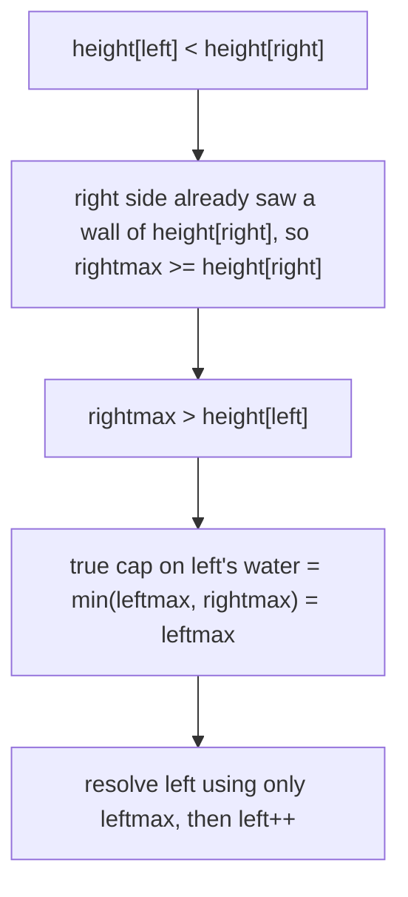

# 42. Trapping Rain Water
`Hard` · **Pattern:** Two Pointers with running left-max / right-max

> [!question] Problem
> Given `n` non-negative integers representing an elevation map where the width of each bar is `1`, compute how much water it can trap after raining.
>
> **Example 1:**
> ```
> Input: height = [0,1,0,2,1,0,1,3,2,1,2,1]
> Output: 6
> Explanation: The elevation map traps 6 units of rain water (shown in blue below).
> ```
>
> 
>
> **Example 2:**
> ```
> Input: height = [4,2,0,3,2,5]
> Output: 9
> ```
>
> **Constraints:**
> - `n == height.length`
> - `1 <= n <= 2 * 10^4`
> - `0 <= height[i] <= 10^5`

---

## 🧩 Pattern this follows

> [!tip] Water at each bar is capped by the shorter of the two tallest walls around it
> The water sitting **above any single bar** `i` is determined by `min(maxHeightToLeft(i), maxHeightToRight(i)) - height[i]` — water can't rise higher than the *shorter* of the tallest wall to its left and the tallest wall to its right, because it would spill over that shorter side. A naive approach precomputes `leftMax[]` and `rightMax[]` arrays first (`O(n)` extra space). The two-pointer version collapses this into **one pass, O(1) space**, by tracking a running `leftmax`/`rightmax` and always advancing whichever side currently has the **smaller** height — because that side's water level is already fully determined without needing to know the exact max on the *other* side, only that it's `≥` the current running max.

### 🖼️ Visualizing it

The hardest part to internalize: why branching on `height[left] < height[right]` (not `leftmax < rightmax`) is still safe.



## 💻 My Solution (C++)

```cpp
class Solution {
public:
    int trap(vector<int>& height) {
        int leftmax = 0;
        int rightmax = 0;

        int left = 0;
        int right = height.size() - 1;
        int water = 0;

        while (left < right) {
            if (height[left] < height[right]) {
                if (leftmax <= height[left]) {
                    leftmax = height[left];
                } else {
                    water += leftmax - height[left];
                }
                left++;
            } else {
                if (rightmax <= height[right]) {
                    rightmax = height[right];
                } else {
                    water += rightmax - height[right];
                }
                right--;
            }
        }

        return water;
    }
};
```

## 🔍 Walkthrough

1. `leftmax`/`rightmax` track the tallest bar seen so far from each side as the pointers close in; `left`/`right` are the converging pointers; `water` accumulates the answer.
2. Each iteration, compare `height[left]` vs `height[right]` to decide **which side to process**:
   - **`height[left] < height[right]`** → the left side is currently shorter, so we know its water level is bounded by `leftmax` (we don't yet need to know the exact right-side max — we already know it's `≥ height[right] > height[left]`, which is enough).
     - If `height[left]` is a **new tallest** wall from the left (`leftmax <= height[left]`), it can't trap any water itself — update `leftmax` and move on.
     - Otherwise, this bar is shorter than the tallest wall behind it, so it traps `leftmax - height[left]` units — add that to `water`.
     - Advance `left++`.
   - **Otherwise (right side is shorter or equal)** → mirror the same logic using `rightmax` and `right--`.
3. Because we always process the **currently shorter side**, the running max on that side is guaranteed to already be the *true* bounding wall for that position — the taller side, wherever its true max ends up being, can only help, never hurt, so it's safe to defer.

## ⏱️ Complexity

| | Complexity | Why |
|---|---|---|
| **Time** | O(n) | Single pass — `left` and `right` together traverse the array exactly once |
| **Space** | O(1) | Just four scalar variables — no `leftMax[]`/`rightMax[]` arrays needed |

## 🚀 Tricks & Similar Problems

> [!success] Why comparing heights (not maxes) is enough to pick a side safely
> The subtle correctness point: we branch on `height[left] < height[right]`, **not** on `leftmax < rightmax`. This works because `rightmax >= height[right] > height[left]` whenever we take the left branch — so no matter what `rightmax` truly is, it's already guaranteed to be at least as tall as `height[left]`'s side needs, which is all the left branch's water calculation depends on. This is the one line worth being able to justify out loud in an interview.
> **Similar pattern:** [[Container With Most Water (LeetCode #11)]] (same converging two-pointer skeleton, simpler goal), a DP/prefix-array variant of this same problem (precompute `leftMax[]`/`rightMax[]` explicitly — same idea traded for `O(n)` space instead of two pointers).
