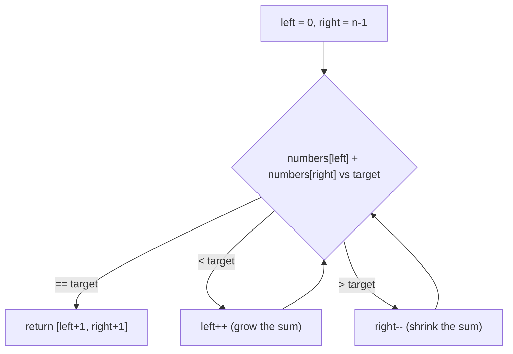

# 167. Two Sum II - Input Array Is Sorted
`Medium` · **Pattern:** Two Pointers (sorted array, converge toward target)

> [!question] Problem
> Given a **1-indexed** array of integers `numbers` that is already sorted in **non-decreasing order**, find two numbers such that they add up to a specific `target` number.
> The two numbers should be `numbers[index1]` and `numbers[index2]` where `1 <= index1 < index2 <= numbers.length`. Return the indices `[index1, index2]`, added by one.
> The tests are generated such that there is **exactly one solution**. You may not use the same element twice. Your solution **must use only constant extra space**.
>
> **Example 1:**
> ```
> Input: numbers = [2,7,11,15], target = 9
> Output: [1,2]
> Explanation: 2 + 7 = 9, so index1 = 1, index2 = 2.
> ```
>
> **Example 2:**
> ```
> Input: numbers = [2,3,4], target = 6
> Output: [1,3]
> ```
>
> **Example 3:**
> ```
> Input: numbers = [-1,0], target = -1
> Output: [1,2]
> ```

---

## 🧩 Pattern this follows

> [!tip] Sorted input + O(1) space → two pointers, not a hash map
> [[Two Sum (LeetCode #1)|Two Sum]] used a hash map because the array was unsorted. Here, `numbers` is **already sorted**, and the problem explicitly demands **constant space** — which rules the hash map back out. Sorted order means you can start pointers at both ends and reason directly about the sum: if it's too big, the *right* pointer (larger values) must move down; if too small, the *left* pointer must move up. Every "sorted array, find a pair/triplet matching a target" problem starts from this exact idea.

### 🖼️ Visualizing it

The decision at each step is a simple three-way branch on the sum vs. target — this is the shape every sorted-array two-pointer problem reduces to.



## 💻 My Solution (C++)

```cpp
class Solution {
public:
    vector<int> twoSum(vector<int>& numbers, int target) {
        int left = 0;
        int right = numbers.size() - 1;

        while (left < right) {
            if (numbers[left] + numbers[right] == target) {
                return {left + 1, right + 1};
            } else if (numbers[left] + numbers[right] < target) {
                left++;
            } else {
                right--;
            }
        }

        return {};
    }
};
```

## 🔍 Walkthrough

1. `left` starts at the smallest value (index `0`), `right` at the largest (last index) — sorted order guarantees this.
2. At each step, compute `numbers[left] + numbers[right]`:
   - **Equal to `target`** → found it. Return `{left + 1, right + 1}` — the `+1` converts back to the 1-indexed answer the problem requires.
   - **Less than `target`** → the sum needs to grow. Since the array is sorted, the only way to increase the sum is to bring in a bigger left value, so `left++`.
   - **Greater than `target`** → the sum needs to shrink, so pull in a smaller right value: `right--`.
3. Pointers converge toward each other every iteration, guaranteeing termination; the problem guarantees exactly one valid pair exists, so the loop is guaranteed to return from inside before `left` and `right` cross.

## ⏱️ Complexity

| | Complexity | Why |
|---|---|---|
| **Time** | O(n) | Each pointer moves at most `n` steps total, in one direction each, never backtracking |
| **Space** | O(1) | Only two index variables — no map, no extra array |

## 🚀 Tricks & Similar Problems

> [!success] Why moving a pointer never skips the answer
> The correctness hinge: if `numbers[left] + numbers[right] < target`, then pairing `numbers[left]` with **any** value at or before `right` is *also* too small (since the array is sorted, nothing to the left of `right` is bigger) — so `numbers[left]` can never be part of a valid pair with anything from here on, and it's safe to discard it by moving `left++`. Symmetric reasoning applies to shrinking `right`. This "provably safe to discard" argument is what justifies two pointers over brute force in every sorted-array problem.
> **Similar pattern:** [[Two Sum (LeetCode #1)|Two Sum]] (unsorted version, hash map instead), [[3Sum (LeetCode #15)]] (fix one index, two-pointer the rest), [[Container With Most Water (LeetCode #11)]] (converge based on a different comparison rule).
