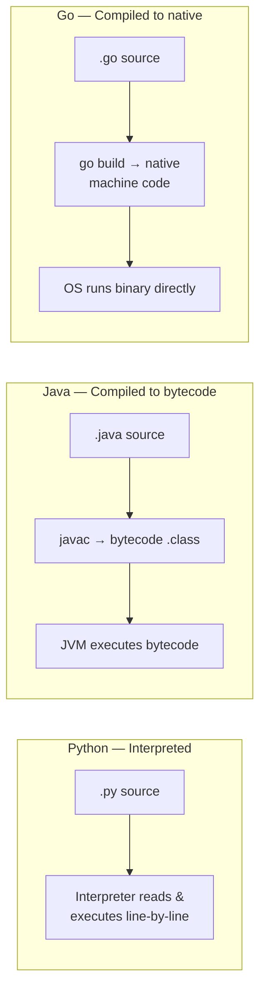
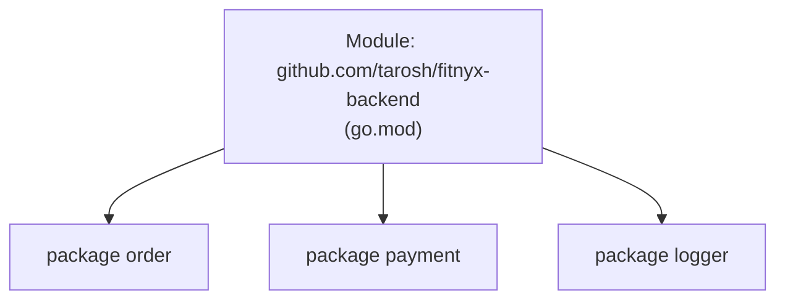

# Execution Model, Tooling & Core Terminology
*The vocabulary you're expected to use fluently. Misusing these terms reads as "resume Go, not real Go."*

> [!abstract] One-line answer
> Go compiles directly to **native machine code** (no VM, no interpreter), is **statically typed** (checked at compile time), and is **garbage collected** (memory freed automatically). The tooling — `go build`, `go test`, `go vet`, `go mod` — is built in, opinionated, and standardized across every Go codebase on Earth.

---

## 1. The execution model

> [!example] Layman's terms
> **Python** is like reading a recipe aloud step-by-step while cooking (interpreted). **Java** is like translating the recipe into a universal shorthand first, then having a "kitchen robot" (the JVM) read that shorthand every time you cook (bytecode + VM). **Go** is like translating the recipe directly into the exact hand movements for your specific kitchen, once, in advance — so you just run it, no translator standing between you and the stove.



- **Compiled, not interpreted:** `go build` turns your `.go` files straight into a native machine-code binary for a specific OS/architecture. No bytecode, no VM, no interpreter step at runtime.
- **Statically typed:** every variable's type is known and checked **at compile time**, not discovered while the program runs. If you try to add a string to an int, it won't compile — Python would happily crash at runtime instead.
- **Garbage collected:** you don't call `free()` like in C. The runtime tracks which heap objects are still reachable and reclaims the rest automatically (concurrent tri-color mark-and-sweep — more depth in [[Chapter 11 - Memory Management, Escape Analysis & GC|Chapter 11]]).
- **No VM / no runtime dependency:** unlike Java (needs a JVM) or Python (needs a Python interpreter) on the target machine, a Go binary carries what it needs. *(Caveat: true only if statically linked — `CGO_ENABLED=0`.)*

> [!tip] Memory hook
> **"Compiled + statically typed + garbage collected + no VM."** Four words, four guarantees.
> Spectrum: **C/C++/Rust** (compiled, no GC) → **Go** (compiled, GC) → **Java** (compiled to bytecode, VM, GC) → **Python** (interpreted, GC).

---

## 2. The toolchain (what you type, and why)

| Command | What it does — and why it exists |
|---|---|
| `go build` | Compiles your code into an executable binary. Doesn't run it, just produces the file. |
| `go run` | Compiles *and* immediately runs, discarding the binary after. Good for quick iteration. |
| `go test` | Runs all `_test.go` files. Built into the language — no external test framework needed to get started. |
| `go vet` | Static analysis — catches suspicious code that compiles fine but is likely a bug (e.g. wrong `Printf` verb, unreachable code). |
| `go fmt` | Auto-formats code to *the* one canonical Go style. Ends all tabs-vs-spaces / brace-placement debates team-wide. |
| `go mod` | Manages dependencies via `go.mod` (Section 3 below). |
| `GOOS` / `GOARCH` | Env vars for **cross-compilation** — build a Linux binary from your Mac: `GOOS=linux GOARCH=amd64 go build`. One command, no separate build machine needed. |

> [!example] Layman's terms
> **Cross-compilation** is like writing a letter in your office in Delhi, but addressing and formatting it exactly for a mailbox in Tokyo — without ever traveling there. You tell the compiler "target Tokyo" (`GOOS=linux GOARCH=arm64`) and it produces a binary built for that destination, from your own machine.

---

## 3. Package vs Module — the most confused pair

| | Package | Module |
|---|---|---|
| **Is** | A folder of `.go` files that all start with the same `package` name line. | A collection of packages, versioned together, defined by a `go.mod` file at the root. |
| **Unit of** | **Code organization** — like a folder of related tools. | **Dependency management** — like the whole toolbox with a version sticker on it. |

> [!example] Layman's terms
> Think of a **module** as a cookbook (it has a name/version, e.g. `github.com/you/myapp v1.2.0`), and each **package** as one chapter inside it (e.g. `desserts`, `mains`). You *import* a chapter (package) when coding, but you *version and publish* the whole cookbook (module).



```go
// go.mod — defines the MODULE
module github.com/tarosh/fitnyx-backend

go 1.22

require github.com/gin-gonic/gin v1.9.1

// inside file order/order.go — defines a PACKAGE
package order

func Create() { ... }
```

---

## 4. Exported vs unexported — Go's only access control

Go has **no** `public`/`private` keywords. Instead: **capitalized identifier = exported** (visible outside the package), **lowercase = unexported** (package-private).

```go
package order

func CreateOrder() {}   // exported — other packages CAN call this
func validateOrder() {} // unexported — only usable inside package "order"
```

> [!bug] Common trap
> Forgetting this **is** the entire access-control system — there's no `private` keyword, no annotations. One capital letter is the whole mechanism. Interviewers sometimes ask "how does Go do encapsulation?" — this casing rule *is* the answer.

---

## 5. Zero values — Go never lets a variable be "undefined"

Every type has a default "zero value" it gets automatically if you don't initialize it. There's no `null`/`undefined` chaos like JS.

| Type | Zero value |
|---|---|
| `int`, `float` | `0` |
| `string` | `""` (empty string, not null) |
| `bool` | `false` |
| pointer, slice, map, channel, func, interface | `nil` |
| `struct` | every field set to *its own* zero value |

> [!example] Layman's terms
> It's like handing someone a new notebook — it's never "missing," it's just blank pages (zero value) until you write in it. Go guarantees every variable starts on a defined "blank page" for its type, so you never get a surprise crash from touching something totally uninitialized.

---

## 6. Small syntax terms, explained plainly

| Term | Meaning + example |
|---|---|
| **`iota`** | Auto-incrementing constant generator, used for enum-like lists. `const ( Red = iota; Green; Blue )` → `0, 1, 2` |
| **blank identifier `_`** | Explicitly discard a value Go forces you to receive but you don't need: `value, _ := someFunc()`. Also used for side-effect-only imports: `import _ "some/driver"`. |
| **`rune`** | Alias for `int32` — represents a single **Unicode code point** (one "character," even multi-byte ones like emoji or Hindi script). |
| **`byte`** | Alias for `uint8` — one raw byte. A Go string is really just bytes (usually UTF-8 encoded); iterating by byte vs rune gives different results for non-ASCII text. |
| **`init()`** | A special function every package can define, that runs automatically **before** `main()` — used for setup (registering drivers, validating config). Can't be called manually. |
| **build tags** | Comments like `//go:build linux` at the top of a file that tell the compiler "only include this file for this OS/config." Lets one codebase have OS-specific implementations. |

> [!example] Layman's terms — rune vs byte
> Say the string is `"नमस्ते"` (Hindi for "hello"). If you slice it **byte by byte**, you'll cut individual Unicode characters into meaningless fragments — like tearing a photo in half instead of separating it from its neighbors. If you iterate **rune by rune**, you get each actual character intact. **Byte = raw storage unit. Rune = one real character.**

---

## 7. Go vs Java/Python on the execution model (quick contrast)

| Language | Execution | Typing | Needs on target machine |
|---|---|---|---|
| **Go** | Compiled → native binary | Static | Nothing (if static build) |
| **Java** | Compiled → bytecode, run by JVM | Static | JVM installed |
| **Python** | Interpreted line-by-line | Dynamic | Python interpreter installed |

> [!quote] Say this in the interview
> **"Walk me through what happens when I run `go build`."** → "The Go toolchain parses and type-checks all the source files, resolves the module's dependencies from `go.mod`, compiles everything straight to native machine code for the target `GOOS`/`GOARCH`, and links it into a single binary — statically, by default, so it has no external runtime dependency."

---
*Chapter 2 of 15 · Go Theory Interview Curriculum*

*Related: [[Index]] · ← Previous [[Chapter 1 - Why Go]] · Next → [[Chapter 3 - Types, Memory & Data Structures]]*
