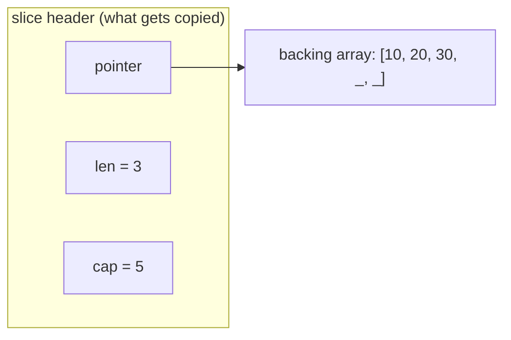
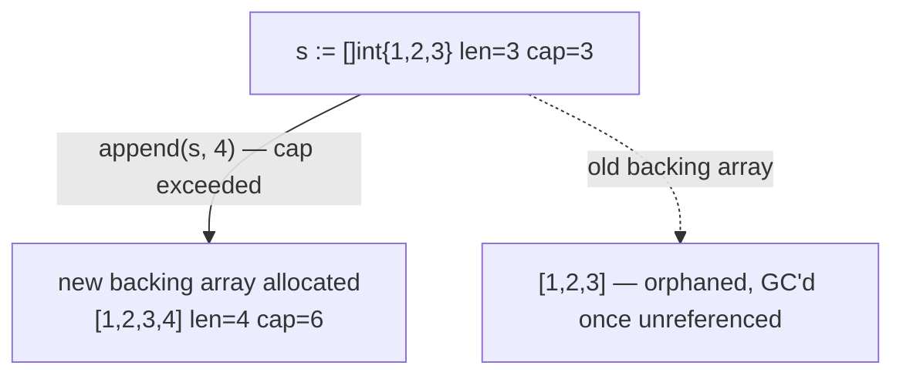

# Types, Memory & Data Structures
*Slice/map internals are the most common "trick" theory questions. This chapter is about knowing exactly what gets copied and what gets shared.*

> [!abstract] One-line answer
> Go passes **everything by value** — including slices, maps, and interfaces, which are really small structs called **headers**. Reasoning about Go memory is really just reasoning about **whether you copied a header (cheap, shares underlying data) or a whole value (independent copy)**.

---

## 1. Value vs reference semantics — what actually gets copied

Every assignment (`=`), function argument, and return in Go **copies** the value. The question is: copies *how much*?

| Type | What's copied | Underlying data shared after copy? |
|---|---|---|
| `int`, `float`, `bool`, `string`, `array`, `struct` | The **entire value** | No — fully independent copy |
| `slice`, `map`, `channel`, `func` | A small **header struct** (pointer + metadata) | **Yes** — both copies point at the same underlying data |
| `pointer` | The address (8 bytes) | Yes — both point at the same variable |
| `interface` | A **(type, value) pair** — see [[Chapter 4 - Interfaces & Method Sets\|Chapter 4]] | Depends on what's stored inside |

> [!example] Layman's terms
> Value types are like **photocopying a whole document** — the copy is fully independent, scribble on it and the original is untouched. Reference types (slice, map, pointer) are like **photocopying a claim ticket to a shared storage locker** — you now have two tickets, but there's still only one locker. Change what's in the locker through either ticket, and both tickets "see" the change.

> [!bug] Common trap
> Passing a large **struct** or **array** to a function copies the *whole thing* — including nested arrays. Passing a **slice** only copies the 24-byte header, so mutating elements through it (not `append`-ing) affects the caller's data too. Confusing these two is a classic "why did my function not update the struct" / "why did my function accidentally mutate the caller's slice" bug pair.

---

## 2. Arrays vs slices — the slice header

An **array**'s length is part of its type (`[5]int` ≠ `[10]int`) — copying an array copies every element. A **slice** is a small header that *views* into a backing array:



```go
s := make([]int, 3, 5)   // len=3, cap=5
// slice header = { pointer → backing array, len: 3, cap: 5 }
```

### `append` and the aliasing surprise

- If `len < cap`, `append` writes **into the same backing array** and returns a slice header pointing at it — **no new allocation**. Any other slice sharing that backing array will see the change.
- If `len == cap`, `append` **allocates a new, bigger backing array** (commonly ~2× for small slices, tapering to ~1.25× for large ones — exact factor is a runtime implementation detail), copies the old elements over, and returns a header pointing at the *new* array. The old backing array is now orphaned from this slice.



> [!bug] Common trap — silent aliasing via sub-slicing
> ```go
> parent := []int{1, 2, 3, 4, 5}
> child := parent[0:2]      // len=2, cap=5 — shares parent's backing array
> child = append(child, 99) // cap not exceeded → writes into parent[2]!
> fmt.Println(parent)       // [1 2 99 4 5] — parent silently mutated
> ```
> `child` had spare capacity borrowed from `parent`, so `append` overwrote `parent[2]` without ever reallocating. This is *the* classic slice interview gotcha — the fix is `parent[0:2:2]` (a 3-index slice expression) to cap `child`'s capacity at its length, forcing a reallocation on append.

> [!tip] Memory hook
> **Slice = `{pointer, len, cap}`.** Append **within cap → shares & mutates in place**. Append **beyond cap → reallocates & detaches**. Aliasing bugs live in that first case.

---

## 3. Maps

- **Unordered:** Go deliberately **randomizes** map iteration order on every run (since Go 1) specifically to stop anyone from accidentally depending on it.
- **Not concurrency-safe:** concurrent reads/writes from multiple goroutines without synchronization trigger a **runtime fatal error** — `fatal error: concurrent map read and map write` — which is **not recoverable with `recover()`** and crashes the whole program (unlike a panic from your own code). Use `sync.Mutex`/`sync.RWMutex` or `sync.Map` for concurrent access.
- **Nil map:** *reading* from a nil map is safe and returns the zero value; *writing* to a nil map **panics**: `assignment to entry in nil map`. A `var m map[string]int` is nil until initialized with `make()` or a map literal.

```go
var m map[string]int
fmt.Println(m["x"]) // 0 — safe read, no panic
m["x"] = 1           // panic: assignment to entry in nil map
```

> [!bug] Common trap
> `var m map[string]int` looks initialized (it compiles, you can even read it) but it's `nil` — the panic only shows up the moment you try to *write*. Always `m := make(map[string]int)` or use a literal before writing.

---

## 4. Strings vs `[]byte` vs `rune`; UTF-8

- A Go **string** is an **immutable** read-only view over a sequence of bytes — typically (by convention, not enforcement) **UTF-8 encoded**.
- `len(s)` returns the **byte length**, not the character count — for multi-byte characters (emoji, Hindi/Devanagari, etc.) these differ.
- Converting `string ↔ []byte` **copies** the underlying data (O(n)) — a string's bytes are never directly mutable, so Go must duplicate them into a new, mutable `[]byte`.
- Ranging over a string with `for i, r := range s` decodes UTF-8 as it goes: `r` is a **`rune`** (the actual Unicode character), and `i` jumps by however many bytes that character took — not by 1 each time.

```go
s := "héllo"
fmt.Println(len(s))          // 6 — 'é' is 2 bytes in UTF-8
for i, r := range s {
    fmt.Println(i, string(r)) // byte index (skips), then the real rune
}
```

> [!example] Layman's terms
> Think of a string as a **sealed, printed book** — you can read it (iterate, index by byte), but you can't scribble in the margins (immutable). A `[]byte` is a **photocopy you're allowed to write on**. Converting between them is literally photocopying the whole book, which is why it costs O(n).

---

## 5. Structs, embedding, pointers

- **Structs** are value types — assigning or passing one copies every field.
- **Embedding** (`type Manager struct { Employee }`) is Go's composition mechanism: the outer struct **promotes** the embedded type's fields and methods, so `mgr.Name` works if `Employee` has a `Name` field, without inheritance existing in the language.
- **Pointer vs value — when to use which:**

| Use a **pointer** when... | Use a **value** when... |
|---|---|
| The struct is large (avoid copy cost on every call) | The struct is small (a couple of fields — copy is cheap, sometimes cheaper than a pointer indirection) |
| The method needs to **mutate** the receiver | The value should be **immutable** / read-only from the callee's perspective |
| You need shared, mutable state across goroutines/callers | Each goroutine should safely own its **own independent copy** (no synchronization needed) |
| The type has a `sync.Mutex` or similar — **never copy a mutex** | Sharing isn't needed at all |

> [!bug] Common trap
> Copying a struct that embeds a `sync.Mutex` (or any type wrapping one) copies the lock itself — you now have two "independent" locks guarding what was meant to be one critical section. `go vet` flags this (`copylocks`), but it's a favorite "spot the bug" interview snippet.

---

## 6. Say this in the interview

> [!quote]- "What's actually copied when you pass a slice to a function?"
> "Just the header — a 24-byte struct of pointer, length, and capacity. The backing array isn't copied, so writes to existing elements are visible to the caller, but `append` may or may not be, depending on whether it had to reallocate."

> [!quote]- "Why does writing to a nil map panic but reading doesn't?"
> "A nil map has no underlying hash table to write into — Go could either silently allocate one on first write or panic to force you to be explicit. It chose to panic, which surfaces the bug immediately instead of hiding an uninitialized map behind silent allocation."

---
*Chapter 3 of 15 · Go Theory Interview Curriculum*

*Related: [[Index]] · ← Previous [[Chapter 2 - Execution Model, Tooling & Terminology]] · Next → [[Chapter 4 - Interfaces & Method Sets]]*
