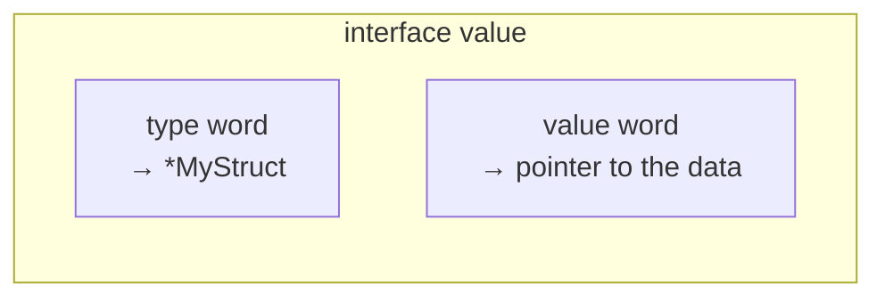

# Interfaces & Method Sets
*The typed-nil trap and receiver rules are staple senior questions. This chapter is about what an interface value actually *is* under the hood.*

> [!abstract] One-line answer
> A Go interface value is really a **two-word pair — a concrete type and a concrete value**. An interface is only truly `nil` when **both** words are nil. This single fact explains almost every "why isn't my nil check working" bug in Go.

---

## 1. Interface internals — the (type, value) pair

An interface variable isn't a "wrapper" in the OOP sense — it's a small struct with exactly two words:



| Interface state | type word | value word | `iface == nil`? |
|---|---|---|---|
| Truly nil (`var i error`) | nil | nil | **true** |
| Holds a concrete non-nil value | e.g. `*MyErr` | points to real data | false |
| Holds a **typed nil pointer** | e.g. `*MyErr` | nil | **false** ← the gotcha |

`i == nil` compares **both words**. If the type word is set to anything — even if the value word is nil — the interface itself is **not** nil.

---

## 2. The typed-nil gotcha (the famous bug)

```go
type MyErr struct{}
func (e *MyErr) Error() string { return "boom" }

func mayFail() error {
    var e *MyErr = nil
    return e // returns an interface{ type: *MyErr, value: nil }
}

func main() {
    err := mayFail()
    fmt.Println(err == nil) // false! type word is *MyErr, even though value is nil
}
```

Even though `e` itself is a nil pointer, the moment it's assigned to the `error` interface, the interface's **type word gets set to `*MyErr`**. The interface is a non-nil box holding a nil pointer — and `err == nil` checks the box, not what's inside it, so it evaluates to `false`.

> [!bug] Common trap
> This bites hardest when a function returns a **concrete pointer type wrapped in an interface**:
> ```go
> func doSomething() *MyErr { return nil }        // fine on its own
>
> var err error = doSomething()                    // BUG: err is a typed-nil, not nil
> if err != nil { /* this branch runs unexpectedly! */ }
> ```
> **Fix:** functions returning `error` should return the **bare `nil` literal**, not a nil-valued concrete type, when there's no error: `return nil`, not `return e` where `e` is a nil `*MyErr`.

> [!example] Layman's terms
> An interface is like an **envelope with a label**. A truly nil interface is an empty desk — no envelope at all. A typed nil is an envelope **labeled "MyErr"** sitting on the desk, even though there's nothing inside it. Asking "is the desk empty?" (`== nil`) says no — there's an envelope there, even though the envelope itself is empty.

---

## 3. Pointer vs value receivers & method sets

Whether a type satisfies an interface depends on its **method set**, and that depends on whether methods are defined with a **pointer** or **value** receiver.

| Receiver type | Included in method set of `T` (value) | Included in method set of `*T` (pointer) |
|---|---|---|
| Value receiver `func (t T) M()` | ✅ Yes | ✅ Yes |
| Pointer receiver `func (t *T) M()` | ❌ No | ✅ Yes |

**Practical implication:** if a type has *any* pointer-receiver method, only `*T` — not `T` — satisfies an interface requiring that method.

```go
type Writer interface { Write() }

type File struct{}
func (f *File) Write() {} // pointer receiver

var w Writer = File{}   // compile error: File does not implement Writer
var w Writer = &File{}  // OK — *File has Write() in its method set
```

> [!tip] Memory hook
> **Value receiver → both `T` and `*T` qualify. Pointer receiver → only `*T` qualifies.** When in doubt: if a struct has a mix, or is large, or needs mutation anywhere — make *all* its methods pointer receivers for consistency, and pass it around as `*T`.

---

## 4. Type assertions, type switches, `any`

```go
var i interface{} = "hello"

// Comma-ok form — safe, never panics
s, ok := i.(string) // s = "hello", ok = true
n, ok := i.(int)    // n = 0, ok = false

// Bare form — panics if the assertion is wrong
s := i.(string) // fine
n := i.(int)    // panic: interface conversion

// Type switch — branch on the dynamic type
switch v := i.(type) {
case string:
    fmt.Println("string:", v)
case int:
    fmt.Println("int:", v)
default:
    fmt.Println("unknown type")
}
```

`any` is simply an **alias for `interface{}`** (introduced in Go 1.18 alongside generics) — the empty interface, which every type satisfies since it requires zero methods.

> [!bug] Common trap
> Using the bare `i.(T)` form on unpredictable input (e.g. from JSON, or an API boundary) is a live panic risk. Reach for the comma-ok form or a type switch whenever the underlying type isn't guaranteed.

---

## 5. "Accept interfaces, return structs" & define interfaces at the consumer

Two related Go idioms:

- **Accept interfaces, return structs:** functions should take the **narrowest interface they need** as a parameter (easy to mock/test, decouples from concrete implementations), but **return concrete struct types** (gives the caller full type information and access to all fields/methods — an interface return type hides that unnecessarily).
- **Define interfaces at the consumer, not the producer:** the package that *uses* a dependency should declare the small interface it needs, rather than the producer package pre-declaring one big interface for everyone. This keeps coupling minimal — a consumer needing only `Read()` shouldn't be forced to depend on a producer's 12-method interface.

```go
// producer package "storage" — returns a concrete struct
func NewFileStore(path string) *FileStore { ... }

// consumer package "backup" — defines only what IT needs
type Reader interface {
    Read(p []byte) (n int, err error)
}
func Backup(r Reader) error { ... } // FileStore satisfies this automatically
```

> [!example] Layman's terms
> Don't hand someone a **master key to the whole building** (a fat interface) when they only need to open **one door** (the one method they call). Let each visitor define the smallest key they actually need.

---

## 6. Say this in the interview

> [!quote]- "What does a nil interface actually mean in Go?"
> "An interface value is a two-word pair: a type and a value. It's only nil when both words are nil. The typed-nil gotcha happens when a concrete nil pointer gets assigned to an interface — the type word gets set, so the interface itself is non-nil even though the underlying pointer is nil. That's why `err != nil` can be true even when the returned error 'looks' nil."

> [!quote]- "Why would you ever want interfaces defined in the consumer package instead of the producer?"
> "It keeps coupling minimal — the consumer only depends on the handful of methods it actually calls, not the producer's entire public surface. It also means a producer never needs to know an interface exists at all; Go's interfaces are satisfied implicitly, so this works without any explicit 'implements' declaration."

---
*Chapter 4 of 15 · Go Theory Interview Curriculum*

*Related: [[Index]] · ← Previous [[Chapter 3 - Types, Memory & Data Structures]] · Next → [[Chapter 5 - Goroutines & the Runtime Scheduler]]*
