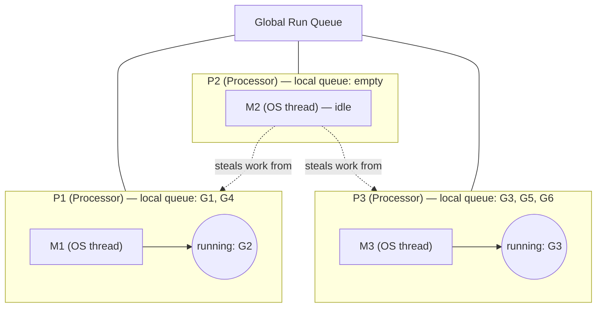
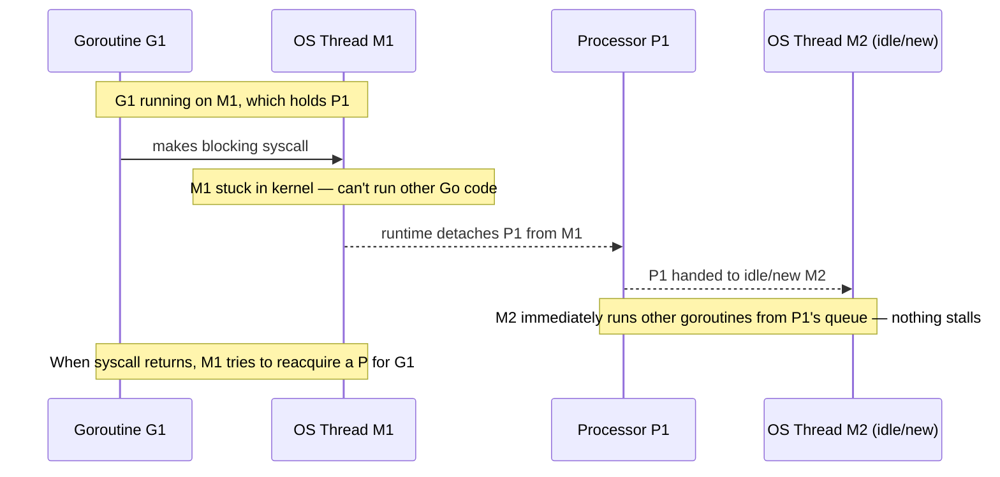
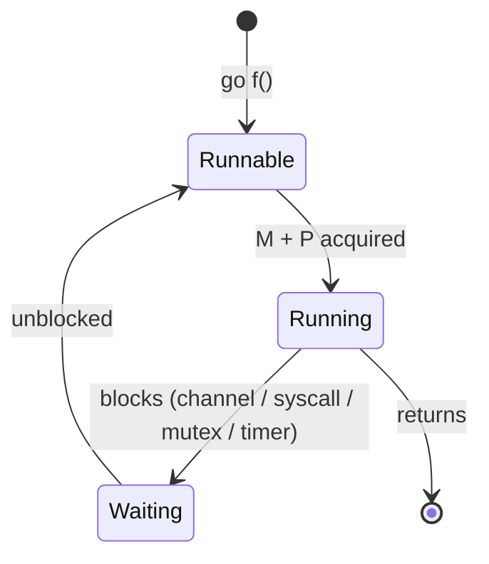

# Goroutines & the Runtime Scheduler
*The Go-specific systems question. Owning the GMP model instantly separates you from candidates who only know "goroutines are lightweight threads."*

> [!abstract] One-line answer
> Go's scheduler is a **user-space, cooperative-but-preemptible, work-stealing scheduler** that multiplexes many **goroutines (G)** onto a small pool of **OS threads (M)**, coordinated by logical **processors (P)** whose count is set by `GOMAXPROCS`. This is called the **GMP model**.

---

## 1. What a goroutine actually is

A goroutine is **not** an OS thread. It's a lightweight unit of work the Go runtime schedules — a small struct tracking a function to run, its own tiny stack, and its current state. Created with `go f()`, it starts with a stack of just **~2KB** that grows and shrinks dynamically (via stack copying) as needed, instead of the **~1–2MB** fixed stack an OS thread reserves upfront.

> [!example] Layman's terms
> An OS thread is like hiring a full-time employee with their own dedicated desk, chair, and office supplies (expensive, heavy setup) — the OS kernel has to manage them. A goroutine is like a sticky note with a task on it that any available employee can pick up (cheap, lightweight) — the Go runtime manages the sticky notes itself, without asking the OS for help each time.

---

## 2. The GMP model — the heart of this chapter

| Letter | Stands for          | Role                                                                                                                                                                                              |
| ------ | ------------------- | ------------------------------------------------------------------------------------------------------------------------------------------------------------------------------------------------- |
| **G**  | Goroutine           | The unit of work — a function plus its own small stack and state. Thousands can exist.                                                                                                            |
| **M**  | Machine (OS thread) | An actual kernel thread. Expensive, so the runtime keeps relatively few of these compared to G's.                                                                                                 |
| **P**  | Processor (logical) | Holds the context needed to run Go code: a local run queue of G's, memory allocation caches, etc. Count = `GOMAXPROCS` (default: number of CPU cores). An M **must** hold a P to execute Go code. |

*P2's M is idle → work-stealing kicks in, grabs a G from P1 or P3's queue.*

> [!example] Layman's terms — the restaurant analogy
> Think of a kitchen. **G (goroutines)** are the individual food orders coming in. **M (OS threads)** are the actual chefs — real, physical workers, expensive to hire. **P (processors)** are the cooking stations — each station has a queue of orders (its local run queue) and the tools needed to cook. A chef can only cook if they're standing at a station. If one station runs out of orders, that idle chef doesn't just stand around — they walk over and grab an order from a busier station's queue. That's **work-stealing**.

> [!tip] Memory hook
> **G = the work. M = the worker. P = the permission slip to work.** An M without a P can't execute Go code — this is exactly what happens during a blocking syscall (Section 4).

---

## 3. Cooperative scheduling vs preemption

Early Go (pre-1.14) was **cooperatively scheduled**: a goroutine only yielded control at specific points — function calls, channel operations, `go` statements, GC points. A tight loop with no function calls could hog its M/P forever, starving other goroutines.

> [!bug] The famous pre-1.14 bug
> A goroutine running a pure computational loop like `for { x++ }` with no function calls could **block the entire program** from scheduling anything else on that thread — because there was no forced interruption point.

**Go 1.14** introduced **asynchronous preemption**: the runtime now uses OS signals to forcibly interrupt a long-running goroutine (roughly, if it's run >10ms without yielding), even mid-loop, and hands control back to the scheduler. So Go today is **cooperative by default, with a preemptive safety net**.

> [!example] Layman's terms
> Cooperative scheduling is like trusting each person in a meeting to naturally pause and pass the mic. Preemption is the meeting host having a buzzer that goes off if someone talks too long, cutting in and passing the mic by force. Go mostly relies on people pausing naturally (cooperative) but added the buzzer in 1.14 so nobody can hog the mic forever.

---

## 4. The blocking syscall handoff (the detail that impresses interviewers)

What happens when a goroutine makes a **blocking syscall** (e.g. reading a file, or a blocking network call without the netpoller)?

1. Goroutine **G1** is running on thread **M1**, which holds processor **P1**.
2. G1 makes a blocking syscall. M1 is now stuck waiting on the kernel — it can't run any other Go code.
3. The Go runtime detects this and **detaches P1 from M1**, handing P1 to a different thread — either an idle M, or a freshly created one.
4. That new M+P1 pair immediately continues running other goroutines from P1's queue. Nothing stalls.
5. When G1's syscall finally returns, M1 tries to reacquire a P to keep running G1. If none is free, G1 is placed back on a run queue and M1 may go idle (or be destroyed if there are too many idle M's).

> [!example] Layman's terms
> Chef M1 gets a huge, slow order that requires standing at the oven doing nothing else for 20 minutes (a blocking syscall). Instead of that chef's whole station shutting down, the kitchen manager (the runtime) immediately gives station P1 to a *different* chef, who keeps cooking the other waiting orders. When the slow order finally finishes, that original chef rejoins the kitchen — if there's a free station, great; if not, they wait for one.

> [!quote] Say this in the interview
> "If a goroutine makes a blocking syscall, its M can't run other goroutines, so the runtime detaches the P from that M and hands it to another thread, which keeps executing goroutines from that P's queue. This is why one slow, blocking goroutine doesn't stall everything else — the P, not the M, is what really matters for keeping work flowing."

> [!info] Note the contrast with channel/network blocking
> This M-detach handoff is specifically for **OS-level blocking syscalls**. When a goroutine blocks on a **channel operation** or **network I/O through Go's netpoller**, it's handled far more cheaply: the goroutine is simply **parked** (marked waiting, removed from the run queue) and the **same M keeps its P** and immediately runs a different goroutine — no new OS thread needed at all. The expensive M-detach path is the exception, reserved for true blocking syscalls.

---

## 5. Work-stealing scheduler

Each P has its own **local run queue** of runnable goroutines — this avoids lock contention on a single shared queue. But what if one P's queue is empty while another's is full?

- An idle P first checks the **global run queue** (shared, used as overflow).
- If that's empty too, it **"steals" work** — it randomly picks another P and takes **half** of that P's local queue.
- This keeps all cores busy without needing a single central lock that every P must contend for on every scheduling decision.

> [!tip] Memory hook
> **Local queues = speed** (no contention). **Stealing = balance** (no idle cores while others are overloaded). **Global queue = overflow valve.**

---

## 6. Goroutine lifecycle & leaks

| State | Meaning |
|---|---|
| **Runnable** | Ready to run, sitting in a local or global queue, waiting for an M+P. |
| **Running** | Actively executing on an M, which holds a P. |
| **Waiting** | Blocked on a channel, syscall, mutex, or timer — not consuming a P. |

> [!failure] Why "start a goroutine, forget its exit" is a real bug
> A goroutine that's blocked forever (e.g., waiting to send on a channel nobody will ever receive from) sits in the **Waiting** state permanently. It's not consuming CPU, but it **never gets garbage collected** — the Go GC only collects unreachable *memory*, and a leaked goroutine's stack, plus anything it references, stays reachable forever because the runtime itself still holds a reference to it. Thousands of these silently accumulate as a **memory leak** that `pprof`'s goroutine profile will reveal, but that no crash will announce until memory runs out.

> [!example] Layman's terms
> A leaked goroutine is like an employee sent to wait at a phone that will never ring. They're not doing any work (no CPU cost), but they're still on payroll forever (still consuming memory), and nobody notices until HR (ops/monitoring) checks headcount and finds thousands of people just... waiting.

> [!quote] Say this in the interview
> "Every goroutine I start needs a guaranteed way to end — a done channel, a context cancellation, or a natural return. Otherwise it can block forever, and since the runtime still holds a live reference to it, the garbage collector can never reclaim it — that's a goroutine leak, and it shows up as slowly growing memory that pprof's goroutine profile can catch."

---
*Chapter 5 of 15 · Go Theory Interview Curriculum*

*Related: [[Index]] · ← Previous [[Chapter 4 - Interfaces & Method Sets]] · Next → [[Chapter 6 - Channels]]*
