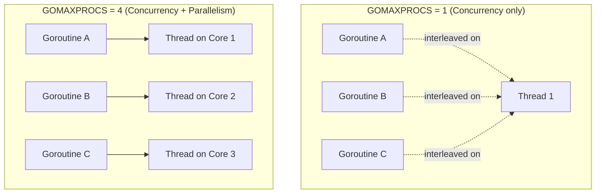
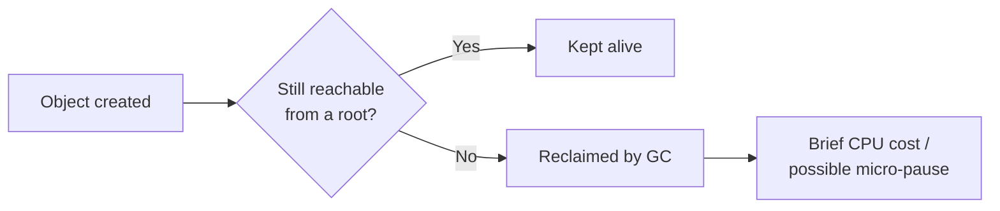
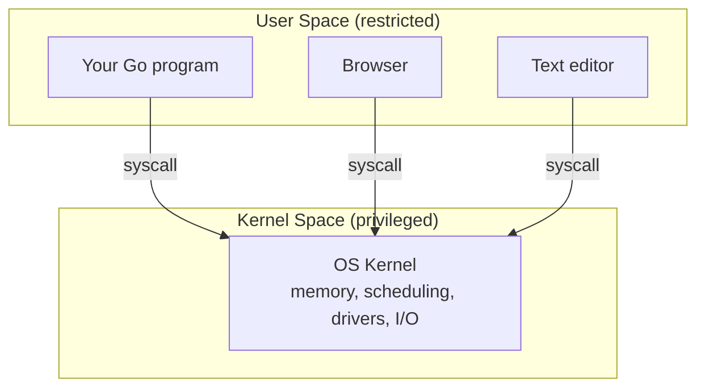

---
tags:
  - golang
  - interview-prep
  - concurrency
  - memory-management
---

> [!info] About this note
> Go interview Q&A, deep-dive style. Each section: **question → answer → memory hook**, with extra layman explanations added where the concept is tricky.

## Table of Contents
- [[#1. Why Go over Node/Java?]]
- [[#2. Why are goroutines "lightweight"?]]
- [[#3. Concurrency vs Parallelism]]
- [[#4. What does "static binary" actually mean?]]
- [[#5. Go vs Java — binary size showdown]]
- [[#6. Garbage Collection — benefit or liability?]]
- [[#7. Package vs Module]]
- [[#8. Exported vs unexported struct fields]]
- [[#9. Nil slices — zero value walkthrough]]
- [[#10. Build tags vs runtime.GOOS check]]
- [[#11. What is user space?]]

---

## 1. Why Go over Node/Java?

> [!question] Q
> You work a lot with Go. Why Go? What made it the right choice for the kind of backend services you build?

> [!success]+ A
> We were on Node and Java and hit their ceilings — Node's single-threaded event loop couldn't cleanly use multiple cores for CPU-bound work, and Java carried JVM warmup, heavy memory, and deployment overhead. Go fixed both: compiled C-like performance with real multicore parallelism, goroutines that are lightweight and multiplexed onto a small pool of OS threads by the runtime, and a single static binary that made deploys trivial. It's roughly Python's simplicity with C's speed and concurrency baked into the language — the right trade for services at scale.

| Language | Bottleneck hit |
|---|---|
| **Node.js** | Single-threaded event loop → can't use multiple cores for CPU-bound work |
| **Java** | JVM warmup + heavy memory footprint + deployment overhead |
| **Go** | Compiled performance + native multicore parallelism + lightweight goroutines + single static binary |

> [!tip] Memory Hook
> Go = Python's simplicity + C's speed + concurrency built into the language itself (not bolted on via libraries/frameworks).

---

## 2. Why are goroutines "lightweight"?

> [!question] Q
> Concretely — what makes a goroutine "lightweight" compared to an OS thread? Actual technical reasons, not just the word.

> [!success]+ A
> Goroutines are lightweight for four reasons, and they all come down to one idea: **the Go runtime manages them in user space instead of the kernel.**
> 1. **Cheap to create** — an OS thread starts with a fixed stack (often several MB, e.g. ~8MB default on Linux), while a goroutine starts at just **2KB** and grows/shrinks dynamically. You can run hundreds of thousands of them.
> 2. **Cheap to schedule** — the Go runtime scheduler manages goroutines itself; it doesn't need the kernel to create or track them.
> 3. **Cheap to switch** — switching OS threads is a kernel context switch (expensive). Switching goroutines happens in user space inside the Go runtime, so it's far cheaper.
> 4. **Cheap to block** — if a goroutine blocks (e.g. on I/O), the scheduler just parks it and runs another goroutine on the same OS thread, so the thread never sits idle.

| | OS Thread | Goroutine |
|---|---|---|
| **Initial stack size** | ~1–8 MB (fixed, OS-dependent) | 2 KB (grows/shrinks dynamically) |
| **Created/managed by** | Kernel | Go runtime (user space) |
| **Context switch cost** | Expensive (kernel trap) | Cheap (user-space swap) |
| **On blocking I/O** | Thread sits idle | Runtime parks goroutine, reuses thread |
| **Typical max count** | Thousands | Hundreds of thousands+ |

> [!tip] Memory Hook
> **M:N scheduling** — Go multiplexes **M** goroutines onto **N** OS threads. This M:N model is *why* all four cost savings exist — it keeps the kernel out of the loop entirely.

---

## 3. Concurrency vs Parallelism

> [!question] Q
> Rob Pike said "concurrency is not parallelism." What's the difference — and when you run a Go program with goroutines, are you getting concurrency, parallelism, or both? What controls that?

> [!success]+ A
> **Concurrency** is a way of *structuring* a program — breaking it into independent tasks that can make progress in overlapping time. **Parallelism** is actually *running* those tasks at the exact same instant on multiple cores. They're different: concurrency is about design, parallelism is about execution.
>
> In Go, goroutines give concurrency — work is structured as independent units. Whether they actually run in parallel is controlled by `GOMAXPROCS`, which defaults to the number of CPU cores. On a multi-core machine you get both; if `GOMAXPROCS=1`, you still have concurrency — goroutines interleaving on one thread — but no parallelism. **Concurrency enables parallelism, but doesn't guarantee it.**



> [!tip] Memory Hook
> **Concurrency = structure. Parallelism = execution. `GOMAXPROCS` is the dial.**

---

## 4. What does "static binary" actually mean?

> [!question] Q
> Go compiles to a single static binary and that's great for deployment. But what does "static binary" actually mean, and why does it matter so much in a Docker/Kubernetes world? Is it always static — or can that break?

> [!success]+ A
> A **static binary** bundles all its dependencies inside the executable — no external shared libraries needed at runtime. That's different from a **dynamically linked binary**, which needs libraries like `libc` or a runtime like the JVM present on the target machine.
>
> This matters hugely for containers: you can ship a Go binary in a `scratch` or `distroless` image with nothing else in it — tiny images, no dependency hell, just copy the file and run.
>
> **Caveat:** Go is static by default, but if you use `cgo` or certain stdlib packages (e.g. some `net`/`os/user` code paths), it links `libc` dynamically and is no longer fully static. Setting `CGO_ENABLED=0` forces a truly static build.

> [!warning] Layman take
> Think of a static binary as a **fully packed suitcase** — everything you need is zipped inside, nothing borrowed from the hotel. A dynamic binary is like **packing light and assuming the hotel has a hairdryer** (a library) — works fine until you land somewhere without one (container missing that library) and the whole thing breaks.

> [!tip] Memory Hook
> Static = everything inside the file. Dynamic = needs libraries on the host. `FROM scratch` only works if it's truly static → **`CGO_ENABLED=0`**.

---

## 5. Go vs Java — binary size showdown

> [!question] Q
> Are Java binaries heavier or lighter than Go binaries, and why? Since Go statically links its runtime/libraries into the binary while Java relies on an external JVM, shouldn't Go's binary size be larger by comparison — and if so, why does this reasoning sometimes not hold?

> [!success]+ A
> **The artifact itself:**
> - A Go binary *is* larger — a "hello world" is ~1.5–2MB, because it bundles the runtime, GC, scheduler, and all used stdlib inside the file.
> - A Java `.jar` is smaller — often just kilobytes — because it contains only your bytecode.
>
> So on that narrow comparison, the instinct is correct: **Go's file is heavier.**
>
> But here's the trick — the `.jar` can't run by itself. To execute that tiny jar, the target machine needs a **JVM installed** (a JRE is ~50–200MB). The jar is small because it **externalized its dependency** — it left the runtime on the host.

**So compare *total deployment weight*, not just the artifact:**

| | Ship the app | Ship the runtime | Total to deploy |
|---|---|---|---|
| **Go** | ~2–15MB binary | Nothing (it's inside) | **~2–15MB** |
| **Java** | ~KB–MB jar | JVM ~50–200MB | **~50MB+** |

In a Docker image this is stark:
- **Go:** `FROM scratch` + your binary → image can be ~5–15MB.
- **Java:** base image + JVM + jar → typically ~100–400MB.

> [!tip] Memory Hook
> Java **hides** its weight in the JVM on the host. Go **carries** its weight inside the file. **Total shipped weight is what counts — and Go ships less.**
>
> So "static binary is great for deployment" holds — not because the file is small, but because **the file is the only thing you ship.**

---

## 6. Garbage Collection — benefit or liability?

> [!question] Q
> Go is garbage collected, and that's pitched as a benefit — memory safety without manual management. But GC could just as easily be called a liability. When is Go's garbage collector actually a problem, and why does it make Go unfit for certain workloads?

> [!success]+ A
> GC's benefit is memory safety — it automatically reclaims heap objects that are no longer reachable from any live root, so no manual memory bugs like leaks or dangling pointers.
>
> The cost is that GC isn't free: it consumes CPU, and even though Go's GC is **concurrent** and runs alongside your goroutines rather than fully stopping the program, it still has brief stop-the-world pauses and competes for CPU cycles under allocation pressure. For most services that's a non-issue — pauses are sub-millisecond.
>
> But for **hard real-time systems** — embedded controllers, high-frequency trading — you need *deterministic, bounded latency*, and even occasional microsecond-level unpredictability is disqualifying. That's why Go (like Java, and unlike C/C++/Rust) isn't the right choice there.



> [!tip] Memory Hook
> GC reclaims by **reachability**, not scope. The real cost isn't "less CPU" — it's **unpredictable pause timing**, which is why GC languages fail hard-real-time, not because they're "slow."

---

## 7. Package vs Module

> [!question] Q
> Explain the difference between a Go package and a Go module. When would you have multiple packages in one module?

> [!success]+ A
> A **package** is the basic unit of code organization in Go — a folder of `.go` files sharing the same `package` declaration, compiled together (e.g. `order`, `payment`, `logger`).
>
> A **module** is a collection of packages versioned and released together, defined by a single `go.mod` file at its root — it's the unit of dependency management (fetched via `go get`, versioned via semver tags).
>
> In practice, almost every real Go service is **one module with many packages** — say `internal/order`, `internal/payment`, `pkg/logger` — all under a single `go.mod` at the repo root. You version and fetch the module as one unit, but you import and organize code at the package level.

```
my-service/            ← module root (go.mod lives here)
├── go.mod
├── internal/
│   ├── order/          ← package "order"
│   └── payment/        ← package "payment"
└── pkg/
    └── logger/         ← package "logger"
```

> [!tip] Memory Hook
> **One `go.mod` per repo (usually), many packages inside it.** Module = the shipping container. Package = the boxes inside it.

---

## 8. Exported vs unexported struct fields

> [!question] Q
> Capitalization controls exported vs unexported. Given:
> ```go
> package order
>
> type Order struct {
>     ID     string
>     total  float64
> }
> ```
> From a different package, which fields can you access, and why would a Go developer deliberately mix exported and unexported fields?

> [!success]+ A
> `Order` and `ID` are accessible from another package since they're capitalized; `total` is not, since lowercase makes it package-private.
>
> Developers do this deliberately for **encapsulation** — `total` might depend on internal invariants, like being the sum of line items, and if it were exported, any package could set it directly to a wrong value. By keeping it unexported and exposing a method like `Total()` or `AddItem()` instead, the `order` package controls exactly how that field can change, protecting its own consistency.

| Identifier | Case | Access from other packages |
|---|---|---|
| `Order` (type) | Capitalized | ✅ Accessible |
| `ID` (field) | Capitalized | ✅ Accessible |
| `total` (field) | lowercase | ❌ Package-private |

> [!tip] Memory Hook
> **Hide the field, expose the behavior.** Same goal as `private` + getter in Java — just spelled with a capital letter instead of a keyword.

---

## 9. Nil slices — zero value walkthrough

> [!question] Q
> ```go
> package main
>
> import "fmt"
>
> type Item struct {
>     Name  string
>     Price float64
> }
>
> func main() {
>     var items []Item
>     fmt.Println(items == nil)
>     fmt.Println(len(items))
>
>     items = append(items, Item{Name: "Pen"})
>     fmt.Println(items[0].Name)
> }
> ```
> Walk through what this prints, line by line — and explain what "zero value" means for a slice specifically. Is a nil slice usable, or does it crash?

> [!success]+ A
> This prints:
> ```
> true
> 0
> Pen
> ```
> A slice's zero value is `nil` because a slice is really a small struct under the hood — a **pointer to a backing array, a length, and a capacity** — and its zero value just means pointer is `nil` and length/capacity are zero, same as any struct's zero value.
>
> A nil slice is genuinely usable: you can call `len()`, `cap()`, range over it safely, and — importantly — you can `append()` to it, and Go will allocate a new backing array for you. What you can't do is **index into it directly** (like `items[0]`) before it has elements — that panics with an `index out of range` error.

```
slice = { ptr: nil, len: 0, cap: 0 }   ← zero value
```

| Operation on nil slice | Safe? |
|---|---|
| `len(s)` / `cap(s)` | ✅ Safe (returns 0) |
| `for range s` | ✅ Safe (zero iterations) |
| `append(s, x)` | ✅ Safe (allocates backing array) |
| `s[0]` (index before append) | ❌ **Panics** — `index out of range` |

> [!tip] Memory Hook
> Slice = `{pointer, len, cap}` struct. **Nil slice → safe:** `len`, `range`, `append`. **Unsafe:** direct indexing before it has elements.

---

## 10. Build tags vs `runtime.GOOS` check

> [!question] Q
> You're maintaining a Go CLI tool needing different startup behavior on Linux vs Windows — e.g. registering a different signal handler. You've been told to use `init()` functions and build tags together, but a teammate says "just use an if-statement checking `runtime.GOOS` instead — why bother with build tags at all?" What's the answer? What does each approach cost or save, and when do you truly need build tags over a runtime check?

> [!success]+ A
> A runtime check with `runtime.GOOS` still **compiles both branches into every binary**, so it only works if all the OS-specific code is *valid on every OS you build for*.
>
> Build tags decide **at compile time** which files are even included — so you can write `signal_linux.go` and `signal_windows.go`, each calling OS-only packages, and the wrong one is **never compiled in** for a given target. Each file defines its own `init()`, which runs automatically at startup — so combining them means the correct OS-specific setup happens with **zero runtime branching**, and the codebase still compiles cleanly cross-platform.

| Approach | Decided when | Both branches compiled? | Use when |
|---|---|---|---|
| `runtime.GOOS` if-check | Runtime | ✅ Yes, both must compile on every target | OS-specific *behavior* only, code is portable |
| Build tags (`signal_linux.go`, `signal_windows.go`) | Compile time | ❌ No, only matching file included | OS-specific *code* — the other OS's file wouldn't even compile (e.g. uses `syscall.SIGWINCH` which doesn't exist on Windows) |

> [!tip] Memory Hook
> Runtime check = **one binary, both branches compiled, decided late.** Build tags = **decided before compilation, only the right file even exists in that build.** Use build tags when the other OS's code **wouldn't even compile.**

---

## 11. What is user space?

> [!question] Q
> What is user space?

> [!success]+ A
> Every running system splits memory and privilege into two zones:
> - **Kernel space** — where the OS kernel runs. Full, unrestricted access to hardware: memory management, CPU scheduling, device drivers, network cards, disk I/O. Only trusted OS code runs here.
> - **User space** — where ordinary programs run (a Go program, a browser, a text editor). Code here cannot directly touch hardware or manage other processes. If it needs something privileged — reading a file, opening a network socket, creating a thread — it must ask the kernel via a **system call (syscall)**, a controlled, expensive hand-off into kernel space and back.



> [!warning] Layman take
> Think of an office building. **Kernel space** is the building's control room — security, elevators, power systems — only building staff (the OS) can flip those switches. **User space** is your desk on some floor — free to do your own work, but if you need something from the control room (elevator to move, more power to your floor), you submit a request through building staff and wait. That request-and-wait round trip is a **syscall** — always slower than just doing something yourself at your desk.

> [!tip] Memory Hook
> **User space asks. Kernel space does.** A syscall is the toll booth between them — and it's why goroutines staying in user space (see [[#2. Why are goroutines "lightweight"?]]) is such a big performance win.
