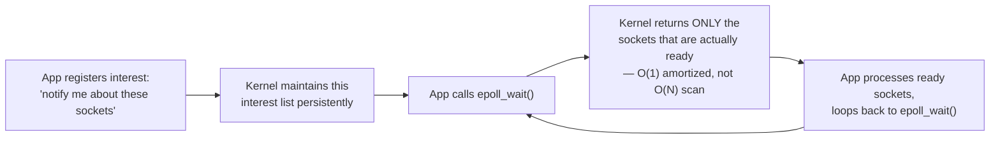

# I/O Models: Blocking, Non-Blocking & Async

> [!abstract] What you'll be able to do after this chapter
> Explain precisely why Redis, Nginx, and Node.js can handle tens of thousands of concurrent connections on a handful of threads, derive the actual mechanism (`epoll`) rather than saying "event loop" as a magic phrase, and know exactly when a single-threaded event-loop model breaks down.

---

## What is it, and why does it exist?

I/O operations (network reads, disk reads) are, per [[CS Fundamentals/00 - Computer Architecture/CPU, Memory & Cache Hierarchy|the Computer Architecture chapter's latency table]], orders of magnitude slower than CPU work. A program that **blocks** — stops entirely — while waiting for each I/O operation wastes enormous amounts of CPU time doing nothing.

**The problem this solves:** early server designs used one thread per connection, blocking on I/O within each thread. This works fine for a handful of connections, but each thread costs real memory (a stack, typically 1-8MB) and real context-switching overhead. Scaling to thousands of concurrent connections this way — the famous **"C10K problem"** (handling 10,000 concurrent connections) — becomes untenable: tens of gigabytes just for thread stacks, and the OS scheduler spending significant time just switching between threads instead of doing real work.

> [!example] Layman analogy
> A restaurant waiter. **Blocking I/O**: the waiter stands at one table, staring at them, refusing to serve anyone else until that table decides what to order. **Non-blocking I/O**: the waiter checks a table, and if they're not ready, immediately moves to check the next table, coming back to re-check periodically. **Event-driven/async I/O**: the waiter drops off every table's order and gets a buzzer that goes off *exactly* when a specific table's food is ready — freeing them to serve every other table in the meantime, with zero wasted re-checking.

## Technical explanation

- **Blocking I/O:** a system call (like `read()`) doesn't return until the operation completes — the calling thread is suspended.
- **Non-blocking I/O:** the call returns immediately, either with data or a "not ready yet" signal — the caller must actively re-check (poll).
- **I/O multiplexing:** one thread monitors *many* file descriptors at once, and is told which ones are ready, rather than blocking on any single one.
- **Asynchronous I/O:** the OS performs the I/O operation itself and notifies the application on **completion** — not just readiness.

## Internal working

### `select`/`poll` — the first multiplexing attempt, and why it doesn't scale

`select` and `poll` let one thread ask the OS "which of these N file descriptors are ready?" — but the OS has to **scan the entire list** on every single call, an `O(N)` operation. With thousands of connections, most idle at any given moment, this scan becomes the bottleneck itself.

### `epoll` (Linux) — the actual mechanism behind "the event loop"

> [!success] This is the real mechanism behind "Redis/Nginx/Node.js are single-threaded and fast"
> `epoll` lets a single thread hold open tens of thousands of idle connections at near-zero ongoing cost — the kernel does the bookkeeping of "which sockets have data waiting" and only wakes the application up for the ones that actually matter. This is *precisely* the event loop underneath [[CS Fundamentals/04 - Caching/Redis Internals|Redis's single-threaded architecture]]: one thread, `epoll`-driven, never blocking on an idle connection, never paying thread-per-connection memory or context-switch overhead.

### `io_uring` — true async, the newer mechanism

`epoll` still requires a syscall per readiness check and a separate `read()`/`write()` syscall once data is ready — real, if small, overhead per operation at very high request rates. `io_uring` (newer Linux kernel interface) goes further: the application submits I/O requests into a shared ring buffer with the kernel, the kernel performs the actual I/O work, and completions appear in a separate ring buffer — the application can batch-submit and batch-collect with dramatically fewer syscalls overall, not just fewer *blocking* ones.

## Complexity comparison

| Model | Memory per connection | Scales to |
|---|---|---|
| Thread-per-connection (blocking) | ~1-8MB (thread stack) | Low thousands before memory/scheduling overhead dominates |
| `select`/`poll` | Low, but `O(N)` scan per check | Low thousands — the scan itself becomes the bottleneck |
| `epoll` event loop | Very low (socket + minimal state) | Tens to hundreds of thousands |
| `io_uring` | Very low | Highest — minimizes syscall overhead on top of `epoll`'s readiness-scaling win |

## Tradeoffs

> [!warning] The single-threaded event-loop model has one real, sharp failure mode
> A single long-running **CPU-bound** operation on the event-loop thread blocks *everything* — every other connection, no matter how ready they are, waits until that one operation finishes. This is exactly why Redis and Node.js documentation explicitly warn against expensive synchronous computation on the main thread: the entire model's efficiency comes from the thread never blocking, and a CPU-heavy task is a different kind of "blocking" the event loop has no defense against. The fix is offloading CPU-heavy work to a separate worker thread/process, keeping the event loop itself doing only fast, I/O-bound dispatch.

A thread-per-connection (blocking) model doesn't have this specific failure mode — a slow request only blocks *its own* thread — at the cost of much higher baseline memory/scheduling overhead across all connections.

## Where this shows up later in this book

> [!info] Direct connections to chapters already written
> [[CS Fundamentals/04 - Caching/Redis Internals|Redis Internals]]'s single-threaded model is this exact `epoll`-driven event loop, applied to a key-value store. [[CS Fundamentals/02 - Networking/TCP Deep Dive|TCP Deep Dive]]'s socket-level discussion assumes this I/O model underneath. [[CS Fundamentals/05 - Messaging & Streaming/Kafka Internals|Kafka's]] efficient handling of many concurrent producer/consumer connections relies on the same non-blocking I/O foundation.

---

## Interview Q&A

> [!question]- Why is `epoll` faster than `select`/`poll` at high connection counts, precisely?
> `select`/`poll` require the kernel to re-scan the *entire* list of monitored file descriptors on every single call, even if only one connection out of ten thousand has new data — an `O(N)` cost paid repeatedly. `epoll` maintains the interest list persistently inside the kernel and only returns the specific descriptors that became ready — the application never pays for scanning the idle majority.

> [!question]- If Redis is single-threaded, how does it handle thousands of concurrent client connections?
> The single thread doesn't block on any one connection — it uses an `epoll`-style event loop, processing whichever connections have actual work ready, and moving on immediately rather than waiting idly on any single slow or quiet client. "Single-threaded" refers to command *execution* being serialized (no locking needed, per the Redis Internals chapter), not to connection handling being limited to one connection at a time.

> [!question]- What's the actual failure mode of a single-threaded event-loop server, and how would you diagnose it in production?
> A CPU-bound operation (a huge sort, a complex regex, an unbounded loop) run on the event-loop thread blocks every other connection, even ones with pending, ready I/O — the whole server appears to "hang" simultaneously rather than one request being slow. In production, this shows up as a sudden latency spike across *all* concurrent requests at once, not a gradual one, and the fix is moving that specific CPU-heavy work off the event-loop thread entirely.

## Summary / Cheat Sheet

- **Blocking:** thread waits, does nothing else. Simple, but doesn't scale to many connections.
- **Non-blocking + polling (`select`/`poll`):** avoids blocking, but `O(N)` readiness scan doesn't scale either.
- **`epoll`:** the kernel tracks readiness persistently — `O(1)` amortized, the real mechanism behind "event loop," scales to tens of thousands of connections on one thread.
- **`io_uring`:** true async — kernel performs the I/O itself, further reducing syscall overhead.
- The sharp failure mode of any single-threaded event loop: **one CPU-bound task blocks everything** — the fix is always "move it off the event-loop thread," never "make the event loop smarter."

---
*Related: [[CS Fundamentals/00 - Learning Path|CS Fundamentals Learning Path]] · [[CS Fundamentals/04 - Caching/Redis Internals|Redis Internals]] · [[CS Fundamentals/02 - Networking/TCP Deep Dive|TCP Deep Dive]]*
