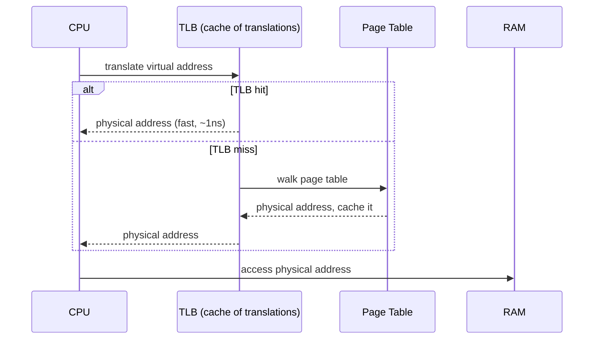
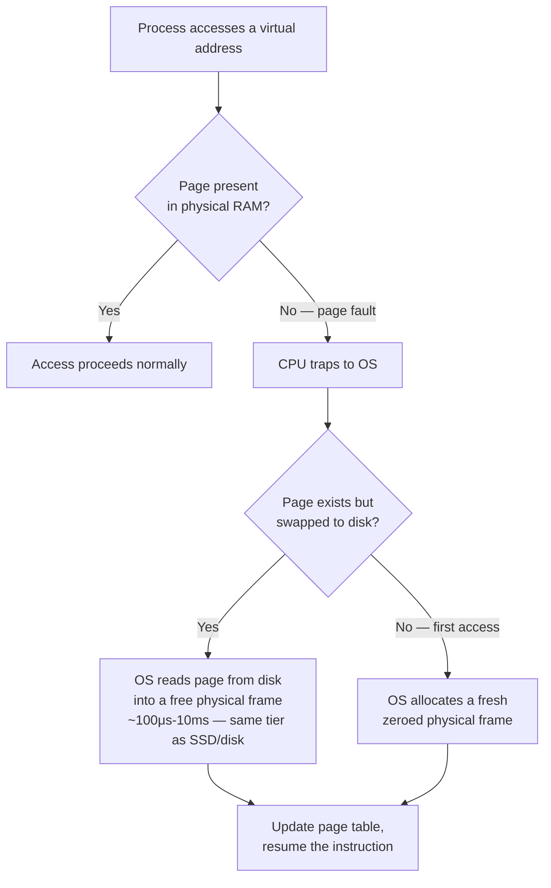
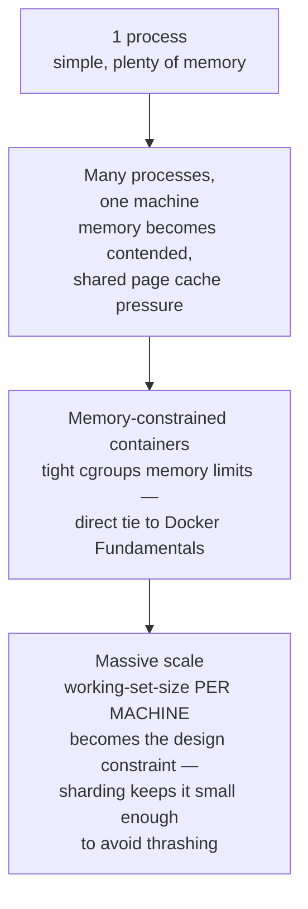

# Memory Management & Virtual Memory

> [!abstract] What you'll be able to do after this chapter
> Explain exactly what happens between a process reading a pointer and the CPU actually getting that data, derive why a server running out of RAM degrades catastrophically rather than gracefully, and explain why `fork()` is "cheap" despite conceptually duplicating an entire process's memory.

> [!info] Picks up where Computer Architecture left off
> [[CS Fundamentals/00 - Computer Architecture/CPU, Memory & Cache Hierarchy|The Computer Architecture chapter]] established that a pointer is a virtual address, translated to a physical one, and deferred the mechanics to here. This chapter is that mechanism, in full.

---

## What is it, and why does it exist?

Virtual memory gives every running process the illusion that it owns a private, contiguous block of memory starting near address zero — even though physical RAM is actually shared among dozens or hundreds of other processes, and even though the process's data might not all be in RAM at all at any given moment.

**The problem this solves:** early systems let programs address physical memory directly. Two processes could accidentally (or maliciously) overwrite each other's memory, a single misbehaving program could crash the entire machine, and every program had to be written knowing exactly how much physical RAM existed and where other programs' memory lived. None of this scales to a machine running many independent programs at once.

> [!example] Layman analogy
> An apartment building: each tenant (process) is told "you live in Unit 1," and every tenant genuinely believes they have their own Unit 1 — but the building superintendent (the OS) is secretly mapping "Unit 1" to a real, specific physical room, different for every tenant. The super can even move a tenant's belongings to a storage locker (disk) temporarily if rooms are tight, and move them back when needed, all without the tenant noticing — unless they ask for something that's currently in storage, which takes a moment longer to fetch.

## Technical explanation

- **Virtual address space:** the range of addresses a process's code, stack, and heap use — private per process, independent of physical layout.
- **Page:** a fixed-size chunk of memory (typically 4KB) — the unit virtual memory is managed in, not individual bytes.
- **Page table:** a per-process data structure mapping virtual pages to physical frames (or marking them "not currently present").
- **Page fault:** what happens when a process accesses a virtual page that isn't currently mapped to physical RAM — not necessarily an error, often just "not loaded yet."
- **Swap:** disk space used as an overflow area for pages that don't fit in physical RAM.

## Internal working

### Address translation

> [!tip] The TLB is exactly the cache-hierarchy reasoning from Tier 0, applied to translations
> Walking the full page table on every single memory access would be far too slow — so recent virtual-to-physical translations are cached in the **TLB (Translation Lookaside Buffer)**, a small, fast, CPU-level cache. A TLB hit costs about as much as an L1/L2 cache access; a TLB miss means walking the page table structure in memory — slower, though still much faster than what happens on an actual page fault below.

### Page faults, precisely

> [!bug] A page fault requiring a disk read costs the SAME latency tier as any other disk access
> This is the direct, derivable reason a server running low on physical RAM degrades **catastrophically**, not gracefully: once the OS starts swapping pages to and from disk to make room, every "memory access" that hits a swapped-out page pays disk-tier latency (100μs-10ms) instead of RAM-tier latency (~100ns) — a 1,000-10,000x slowdown for that access. If this happens repeatedly across a working set that no longer fits in RAM, the system spends most of its time swapping instead of doing useful work — a state called **thrashing**. This is precisely why "the server ran out of memory" incidents look like a total performance collapse rather than a proportional slowdown.

### Demand paging

Pages are loaded **lazily** — only when actually accessed, not all at once when a process starts. A large program can start running immediately, faulting in only the specific pages it actually touches, rather than paying the cost of loading its entire memory footprint upfront.

### Copy-on-write — why `fork()` is cheap

> [!success] A genuinely elegant real-world optimization, and a classic interview question
> `fork()` conceptually duplicates an entire process's memory — but doing that physically, immediately, would be enormously expensive for a large process. Instead, the OS duplicates only the **page table** (cheap — just pointers), marking every page **read-only** and shared between parent and child. The moment either process **writes** to a shared page, the CPU traps (a fault, similar in mechanism to a page fault), and the OS makes a real physical copy of just *that one page*, then lets the write proceed. Most forked processes (e.g., a web server forking a worker, which soon calls `exec` to run different code entirely) never end up copying more than a handful of pages — the "full copy" almost never actually happens.

## Tradeoffs

| Choice | Benefit | Cost |
|---|---|---|
| Smaller page size | Less wasted memory per allocation (less internal fragmentation) | Larger page tables, more TLB misses |
| Larger page size ("huge pages") | Fewer page table entries, fewer TLB misses — real speedup for memory-heavy workloads | Wastes memory for small allocations; less flexible |

> [!info] "Huge pages" is a real production lever, not a theoretical option
> Databases and in-memory stores (Postgres, Redis) that manage very large memory regions genuinely benefit from configuring the OS to use huge pages — reducing TLB pressure directly translates to fewer slow translation misses across a large working set. Worth naming as a concrete, real tuning knob if the conversation goes there.

## Where this shows up later in this book

> [!success] Not abstract — this is the mechanism underneath several things you'll take for granted later
> - **Why a server running out of memory doesn't degrade gracefully:** thrashing, covered above — a direct, derivable consequence, not a vague "it gets slow" claim.
> - **The Linux OOM killer:** when physical RAM *and* swap are both exhausted, the kernel has no page to evict to make room — it must forcibly terminate a process, chosen by a heuristic ("OOM score"), to reclaim memory. Production incidents where a process mysteriously dies under memory pressure are usually this.
> - **Container memory limits (cgroups):** the mechanism [[CS Fundamentals/00 - Learning Path|the future Docker/Kubernetes chapters]] will build on — a container's memory limit is enforced at exactly this layer, and exceeding it triggers the same OOM-kill mechanism, scoped to the container.

## Scaling: 1 process to memory-constrained global deployment

At container scale, memory limits are enforced via cgroups (per [[CS Fundamentals/07 - Architecture and Deployment Patterns/Docker Fundamentals|Docker Fundamentals]]) — the exact same OOM-kill mechanism from this chapter, just scoped to a container instead of a whole machine. At true large scale, "memory management" stops being a single-machine concern and becomes a data-placement concern: [[CS Fundamentals/06 - Distributed Systems/Sharding & Partitioning|sharding]] exists partly to keep each machine's actual working set small enough to stay comfortably resident in RAM, avoiding the thrashing this chapter describes at a system-design level rather than a single-process level.

## Failure scenarios

> [!bug] What actually happens
> - **OOM kill:** covered above — the kernel forcibly terminates a process when RAM and swap are both exhausted, chosen via an OOM-score heuristic.
> - **Swap thrashing under memory pressure:** covered above — constant major page faults turning "memory access" into "disk access" repeatedly, a catastrophic rather than proportional slowdown.
> - **A memory leak:** gradual, creeping growth that eventually triggers an OOM kill — a genuinely different *failure pattern* than a sudden spike, since it can take hours or days to manifest and is often misdiagnosed as unrelated performance degradation before the eventual crash makes the cause obvious in hindsight.

## Monitoring

> [!info] What to watch
> **Memory usage vs. configured limit** — the direct precursor signal before an OOM kill happens, ideally caught and alerted on well before the limit is reached. **Page fault rate, major vs. minor** — a rising major-fault rate is the leading indicator of thrashing beginning, before it's severe enough to be obvious from throughput alone. **Swap usage** — on a healthy production server this should be near-zero; any nonzero swap usage is often itself worth alerting on, not just a background curiosity.

## Common mistakes

> [!warning] Real, recurring errors
> 1. **Not setting memory limits on containers** — allows one container to consume enough memory to starve others sharing the same host, a real, avoidable "noisy neighbor" problem.
> 2. **Confusing normal page-cache growth with a memory leak** — the OS *should* use available RAM for page cache; that memory being "used" isn't a leak, and reclaiming it under pressure is exactly what the OS does automatically. Treating healthy cache growth as an alarm is a common false-positive mistake.
> 3. **Assuming more RAM always fixes a memory problem** — without first diagnosing whether it's a genuine leak (which more RAM only delays, not fixes) vs. legitimate working-set growth (which more RAM does fix), you risk masking a real bug rather than resolving it.

---

## Interview Q&A

> [!info] Leveled by seniority
> **Beginner:** "What is virtual memory?" — the illusion each process has its own private address space, translated to physical RAM by the OS/MMU. **Intermediate:** "Why is `fork()` cheap despite copying a whole process?" — copy-on-write, above. **Senior:** "A production host's latency degraded sharply with no traffic change — what would you check?" — expects checking swap usage and major-page-fault rate first, recognizing thrashing as a likely cause of a sudden, non-proportional slowdown. **Staff:** "Design memory limits and eviction policy for a multi-tenant host running several containerized services with different memory needs." — expects per-container cgroups limits sized deliberately (not left default), with explicit reasoning about what should happen when a container approaches its limit (OOM-kill that container specifically, not let it starve neighbors). **Architect:** "How does memory management reasoning change when a service moves from a single large machine to many smaller sharded machines?" — expects the Scaling section's answer: working-set-size-per-machine becomes the design lever, and sharding is partly a memory-management decision, not purely a throughput one.

> [!question]- Why does a page fault sometimes cost nanoseconds and sometimes milliseconds?
> Depends entirely on whether the page needs to come from disk. A "minor" page fault (page exists in RAM already, just needs a page-table entry updated — e.g., a freshly `mmap`'d region) is cheap. A "major" page fault (page must be read from disk/swap) pays full disk-tier latency — the same order of magnitude as any other disk access from the Computer Architecture chapter's latency table.

> [!question]- Why is `fork()` considered cheap even though it "copies" a whole process?
> Copy-on-write — only the page table is duplicated immediately; actual memory pages are shared read-only until either process writes to one, at which point just that single page gets physically copied. Covered in depth above.

> [!question]- How does virtual memory provide isolation between processes, precisely?
> Each process has its own independent page table, mapping its virtual addresses to physical frames the OS has assigned specifically to it. A process literally cannot construct a virtual address that resolves into another process's physical memory — the mapping doesn't exist for it, so any attempt either faults or is rejected by the MMU, enforced in hardware, not just convention.

## Summary / Cheat Sheet

- Every pointer is a **virtual address**; the CPU's MMU translates it to a **physical address** via the process's **page table**.
- **TLB** caches recent translations — a TLB miss means walking the page table; still far cheaper than a page fault.
- **Page fault** = accessed page not in RAM. **Minor** fault = cheap fixup. **Major** fault = disk-tier latency (1,000-10,000x slower than RAM).
- **Thrashing** = a working set too large for RAM causes constant major faults — the mechanism behind "out of memory = catastrophic slowdown," not proportional degradation.
- **Copy-on-write** is why `fork()` is cheap — pages are shared until written to, only then physically copied.

---
*Related: [[CS Fundamentals/00 - Learning Path|CS Fundamentals Learning Path]] · [[CS Fundamentals/00 - Computer Architecture/CPU, Memory & Cache Hierarchy|CPU, Memory & Cache Hierarchy]] · [[CS Fundamentals/01 - Operating Systems/Processes, Threads & Context Switching|Processes, Threads & Context Switching]]*
