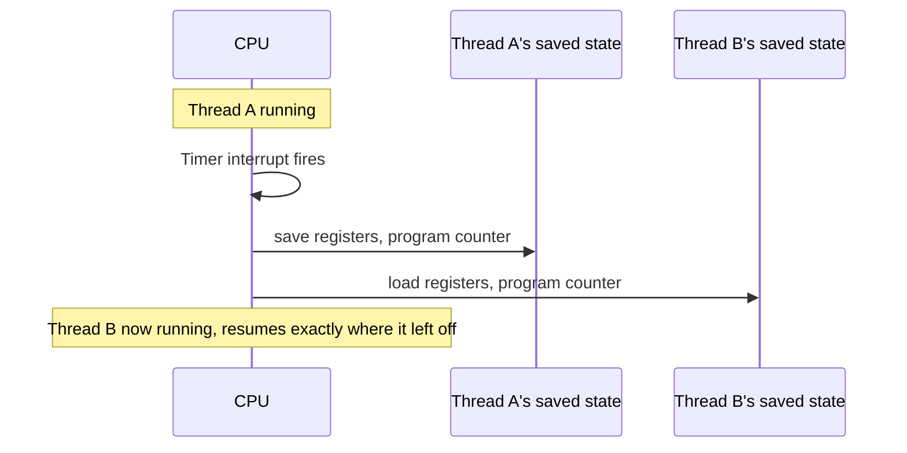
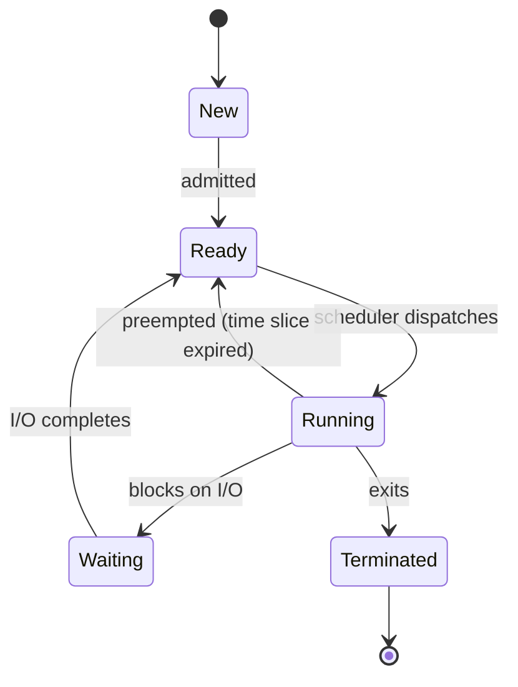

# Processes, Threads & Context Switching

> [!abstract] What you'll be able to do after this chapter
> Explain precisely what a process and a thread each own, why a thread context switch is cheaper than a process one (with the actual mechanism, not just "it's lighter"), and connect this straight to why Go's goroutines are cheaper still.

---

## 1. Why processes exist

Early computers ran one program at a time, start to finish, before loading the next (batch processing). The CPU sat idle constantly — every time a program waited on disk or network I/O, nothing else could run. The OS introduced the **process** to solve two problems at once: **time-sharing** (let the CPU switch between programs so I/O waits on one don't stall everything) and **isolation** (one program's bugs/crashes shouldn't corrupt another's memory).

A **process** is a running instance of a program with its own **virtual address space** (code, heap, stack, data), its own file descriptors, and an OS-tracked **Process Control Block (PCB)** — the PID, saved register state, memory maps, open file handles, and scheduling metadata. The hardware's **MMU (Memory Management Unit)** enforces isolation: one process genuinely cannot read or write another's memory without going through the OS explicitly (shared memory, pipes, etc.).

## 2. Why threads exist — the problem processes didn't solve

Processes solved isolation, but isolation has a cost: if a web server wants to handle 1,000 concurrent connections, spawning 1,000 *processes* means 1,000 separate address spaces, each needing its own copy of shared data (like an in-memory cache) — either duplicated per process (wasteful) or shared via slow, explicit IPC (inter-process communication).

A **thread** is a unit of execution *within* a process — it shares the process's address space (code, heap, global data) but has its own **stack** and its own saved CPU register state (program counter, stack pointer). Multiple threads in one process can read and write the same memory directly, which is fast — and is exactly why [[Glossary/Race Condition|race conditions]] and the need for [[Glossary/Thread-Safety|thread-safety]] exist at all: shared mutable memory, accessed concurrently, without coordination.

## 3. What a context switch actually does

A **context switch** happens when the CPU scheduler stops running one thread and starts running another. Mechanically:
1. Save the currently-running thread's CPU register state (including the program counter — "where was it in its code") into its Thread Control Block.
2. Load the next thread's previously-saved register state into the CPU.
3. Resume execution at exactly where that next thread left off.

## 4. Why a thread switch is cheaper than a process switch

This is the actual mechanism, not just a claim:

A **process** switch changes the entire virtual address space — every virtual-to-physical address mapping the CPU was relying on becomes invalid. The **TLB (Translation Lookaside Buffer)**, a small hardware cache of recent address translations, must be flushed (or, on hardware supporting address-space-tagged TLB entries, the old process's entries are simply no longer useful). Right after the switch, the new process suffers a burst of **TLB misses** as its mappings get re-cached from scratch — genuinely expensive. On top of that, the CPU's L1/L2 caches, warm with the old process's data and instructions, get evicted and refilled for the new process — **cache locality is lost.**

A **thread** switch within the *same* process changes none of that — the address space is identical, so the TLB and CPU caches stay valid. The switch is just swapping register state and stack pointer — a fraction of the cost.

> [!tip] This is exactly why goroutines are cheaper still
> Go's goroutines take this one step further: the Go runtime schedules goroutines **in user space**, without involving the kernel at all for most switches — no syscall, no kernel-level TCB save/restore. See [[Golang/Golang Theory/Chapter 5 - Goroutines & the Runtime Scheduler|Golang Theory Chapter 5]] for the full GMP model — the "cheap to switch" property described there is a direct consequence of the mechanics in this section, just moved one layer higher, out of the kernel's hands entirely.

## 5. Process states & the scheduler's role

A **preemptive** scheduler can forcibly interrupt a running thread (via a timer interrupt) once its time slice expires, guaranteeing no single thread monopolizes the CPU. A **cooperative** scheduler relies on threads voluntarily yielding — simpler to reason about, but one badly-behaved thread can starve everything else (full scheduling algorithm depth is its own future chapter).

## 6. Alternatives & when NOT to use threads

**Multi-process instead of multi-threaded** (e.g. Chrome's one-process-per-tab): trades the memory/IPC overhead of separate address spaces for genuine fault isolation — a crashing tab can't corrupt the rest of the browser. The right call whenever isolation/fault-containment matters more than cheap communication — running untrusted plugin/extension code is a textbook case.

**CPU-bound parallel work in Python**: CPython's Global Interpreter Lock (GIL) means only one thread executes Python bytecode at a time, *regardless of core count* — threads help with I/O-bound concurrency (waiting frees the GIL) but give **zero** speedup for CPU-bound work. The fix is multiprocessing (separate processes, separate GILs, real parallelism), not more threads — a genuinely common "when NOT to use threads" interview trap.

---

## 🎯 Interview follow-up Q&A

> [!quote]- "What's the actual difference between a process and a thread?"
> A process has its own isolated virtual address space, enforced by the MMU; a thread shares its parent process's address space with all sibling threads, owning only its own stack and register state.
>
> **Follow-up: "Why is a thread context switch cheaper than a process one?"**
> A process switch invalidates the CPU's address-translation cache (TLB) and evicts CPU cache locality, since the entire address space changed. A thread switch within the same process leaves the address space untouched — only registers and stack pointer need swapping.

> [!quote]- "How does the OS decide when to preempt a running thread?"
> A hardware timer fires an interrupt at a fixed interval (the scheduling quantum); the interrupt handler invokes the scheduler, which may choose to context-switch to a different ready thread rather than resuming the interrupted one — this is what makes preemptive scheduling preemptive, as opposed to relying on threads yielding voluntarily.

---
*Related: [[00 - Start Here/How This Handbook Works|Book Map]] · [[Golang/Golang Theory/Chapter 5 - Goroutines & the Runtime Scheduler|Golang Theory Ch5 — Goroutines]] · [[Glossary/Thread-Safety|Thread-Safety]] · [[Glossary/Race Condition|Race Condition]]*
