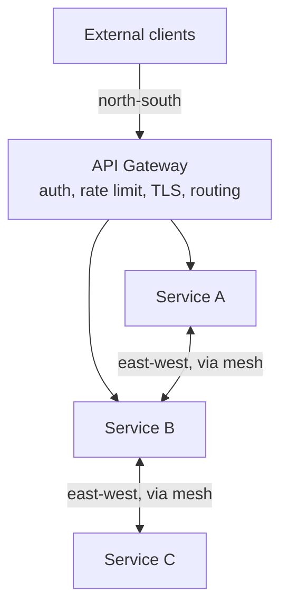
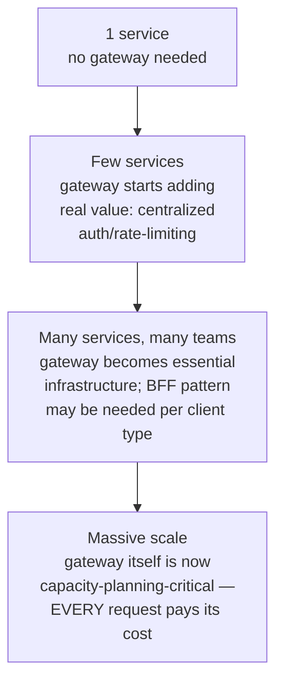

# API Gateway

> [!abstract] What you'll be able to do after this chapter
> Explain precisely what an API gateway does versus a service mesh (a distinction interviewers probe often), and know which cross-cutting concerns belong at the gateway versus inside each service.

---

## Why this exists

Every HLD chapter in this book has assumed "a request arrives at the system" without saying exactly where. In a microservices architecture, a client shouldn't need to know that "get a user's order history" actually means calling three different services — nor should every one of those services independently reimplement auth, rate limiting, and TLS termination. The API gateway is the **single entry point** that owns those cross-cutting concerns once, in front of everything.

## What it actually does

- **Routing** — maps an external request path to the correct internal service.
- **Authentication/authorization** — verifies the caller once, at the edge, using [[CS Fundamentals/08 - Security/Authentication & Authorization|the auth mechanisms already covered]] — internal services trust the gateway's verification rather than each re-implementing it.
- **Rate limiting** — the actual enforcement point for [[HLD/02 - Design a Rate Limiter/Design a Rate Limiter|the Rate Limiter chapter's]] logic, applied per-client at the boundary before requests even reach internal services.
- **TLS termination** — decrypts HTTPS once at the edge; internal traffic can run plain (inside a trusted network) or re-encrypted via mTLS for service-to-service.
- **Request/response transformation** — adapting a public API shape to whatever internal services actually expose, so internal refactors don't break external clients.
- **Aggregation** — combining results from multiple internal calls into one response, reducing client round-trips (the **BFF — Backend for Frontend** pattern is a specialized version of this: a gateway tailored per client type, e.g. one for mobile, one for web, each shaping responses differently for that client's needs).

## API Gateway vs. Service Mesh — the distinction worth stating precisely

> [!warning] These solve different traffic problems — don't conflate them
> **API Gateway** handles **north-south traffic** — external clients talking *into* the system. **Service Mesh** (Istio/Envoy sidecars) handles **east-west traffic** — services talking to *each other* internally (retries, mTLS, circuit breaking, observability between internal hops). A large system typically has both: one gateway at the edge, a mesh handling everything behind it. Describing them as competing alternatives, rather than complementary layers solving different traffic directions, is a common and avoidable imprecision.

## The real failure mode: the gateway becomes a monolith

> [!bug] A gateway accumulating business logic defeats its own purpose
> It's tempting to keep adding request-shaping logic, orchestration, even business rules into the gateway over time — it's the one place that sees every request. Left unchecked, the gateway becomes a second monolith that every team's deploys funnel through, recreating the coupling microservices were meant to remove. The gateway should stay a thin, cross-cutting layer — routing and policy, not business logic.

It's also a **single point of failure and a latency bottleneck** by construction — every request pays its overhead. It must be deployed as a horizontally-scaled, stateless fleet behind its own load balancer (see [[CS Fundamentals/02 - Networking/Load Balancing|Load Balancing]]), never as a single instance.

## Scaling: 1 service to a whole platform

At small scale, a gateway is genuinely optional overhead. As the number of services and teams grows, the gateway's centralization value compounds — each new service gets auth/rate-limiting/TLS for free instead of reimplementing them. At massive scale, the gateway stops being "just infrastructure" and becomes a first-class capacity-planning concern in its own right, since its latency is additive to literally every request in the system — under-provisioning it doesn't degrade one feature, it degrades everything simultaneously.

## Failure scenarios

> [!bug] What actually happens
> - **The gateway goes down:** covered above — the entire system becomes unreachable from outside, the sharpest possible blast radius in this architecture.
> - **The gateway becomes a bottleneck under load:** without adequate horizontal scaling, gateway latency directly adds to every request's total latency, and gateway saturation can look like a system-wide outage even when every backend service behind it is perfectly healthy — a real, confusing failure mode to diagnose if you don't check the gateway first.
> - **A bad deploy to the gateway itself:** since every request flows through it, a bug here has a blast radius spanning the entire system — categorically different from a bug in one backend service, which only affects that service's own callers.

## Monitoring

> [!info] What to watch
> **Gateway-added latency** — the direct overhead per request, a genuinely critical number given it's paid by every single request in the system. **Gateway error rate** — separate from backend error rates, since a gateway-level failure (auth service down, misconfiguration) can produce errors with zero actual backend involvement. **Per-route traffic distribution** — the gateway's own vantage point makes it a natural place to observe which service is under the most load system-wide.

## Common mistakes

> [!warning] Real, recurring errors
> 1. **Letting the gateway accumulate business logic** — the "real failure mode" section above; keep it a thin, cross-cutting layer.
> 2. **Running a single gateway instance** — recreates the exact SPOF pattern named throughout this book.
> 3. **Not treating gateway deploys with the same rigor as backend deploys** — given its outsized blast radius, a gateway change deserves *more* deployment caution (canarying, careful rollback readiness) than an average backend service change, not less.

---

## Interview Q&A

> [!info] Leveled by seniority
> **Beginner:** "What does an API gateway do?" — centralizes routing, auth, rate limiting, and TLS termination at a system's edge. **Intermediate:** "How is an API gateway different from a service mesh?" — Section on API Gateway vs. Service Mesh, north-south vs. east-west traffic. **Senior:** "System-wide latency spiked suddenly with no backend changes — where do you look first?" — expects checking the gateway's own added latency and error rate before assuming a backend issue, given its position in every request path. **Staff:** "Design the gateway strategy for a platform serving both a mobile app and a partner-facing public API with very different rate-limit and auth needs." — expects the BFF pattern named explicitly, or at minimum distinct routing/policy configuration per client type behind a shared gateway layer. **Architect:** "How would you evolve a single monolithic API gateway into something that scales with an organization adding new services weekly?" — expects discussion of keeping the gateway itself thin (Section "The real failure mode") and pushing service-specific logic into a mesh or the services themselves, preventing the gateway from becoming the very bottleneck-monolith it was meant to help avoid.

> [!question]- Why terminate TLS at the gateway instead of at each service?
> Centralizes certificate management (one place to rotate/renew certs instead of N services each managing their own), and lets internal services skip the CPU cost of TLS handshakes for every internal hop — traded for trusting the internal network boundary (or re-encrypting internally via mTLS for higher-security requirements, a real, explicit choice depending on the threat model).

> [!question]- What happens if the gateway goes down?
> The entire system becomes unreachable from outside — exactly why it's a genuine single point of failure that must be treated with the same seriousness as any other critical-path component: horizontally scaled, health-checked, deployed across multiple availability zones, never a single instance.

> [!question]- How does this relate to the BFF pattern specifically?
> A single generic gateway shape-fits-all clients, which can mean mobile clients receive bloated payloads designed for web, or vice versa. BFF splits the gateway per client type, each shaped to that client's actual needs — a real tradeoff of more gateways to maintain against better-fitted responses per client.

---
*Related: [[00 - Start Here/How This Handbook Works|Book Map]] · [[CS Fundamentals/02 - Networking/Load Balancing|Load Balancing]] · [[CS Fundamentals/08 - Security/Authentication & Authorization|Authentication & Authorization]] · [[HLD/02 - Design a Rate Limiter/Design a Rate Limiter|Design a Rate Limiter]]*
