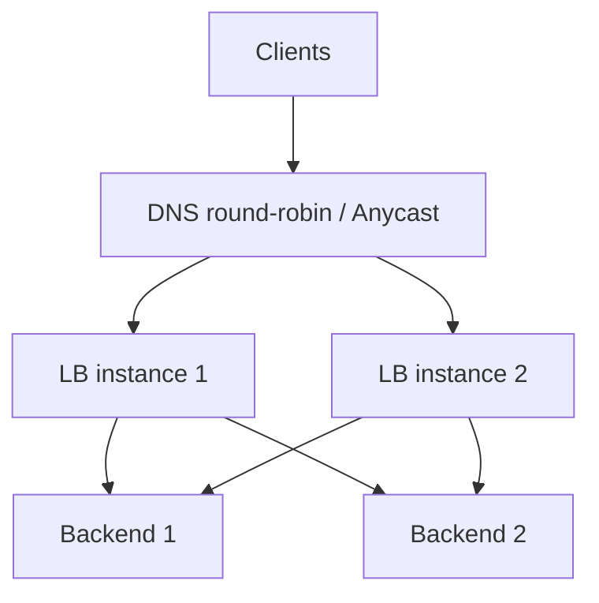
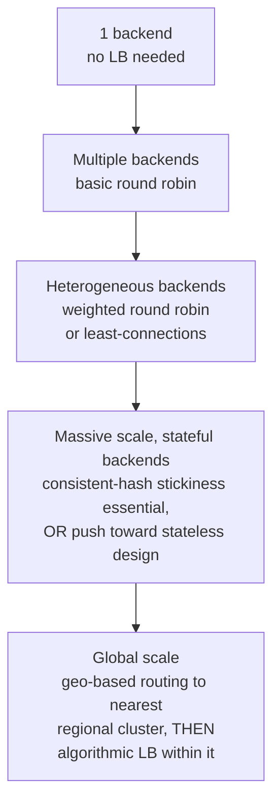

# Load Balancing

> [!abstract] What you'll be able to do after this chapter
> Choose correctly between L4 and L7 load balancing for a given requirement, pick the right distribution algorithm for the actual traffic shape, and explain how the load balancer itself avoids being a single point of failure.

---

## Why this exists

Every HLD chapter in this book assumes "requests get distributed across a fleet of servers" without dwelling on how. This chapter is that mechanism — and it matters because the *wrong* choice here silently reintroduces the exact hotspot and single-point-of-failure problems the rest of a distributed design worked hard to avoid.

## L4 vs. L7

| | L4 (Transport layer) | L7 (Application layer) |
|---|---|---|
| **What it sees** | IP + port only — no visibility into HTTP content | Full request — headers, path, cookies, body |
| **Speed** | Faster — minimal per-packet decision-making | Slower — has to parse and inspect the request |
| **Routing capability** | Same backend pool for everything | Content-aware routing (e.g. `/api/*` to one service, `/static/*` to another) |
| **TLS termination** | Not possible — it isn't reading the content | Possible — it's already parsing the request anyway |

> [!tip] The precise way to frame this choice in an interview
> L4 is the right default when every backend serves identical traffic and raw throughput matters most (e.g., balancing across a fleet of otherwise-identical stateless API servers). L7 is required the moment routing needs to depend on *what the request actually is* — different paths going to different services, exactly the API-gateway routing decision from [[CS Fundamentals/02 - Networking/API Gateway|the API Gateway chapter]].

## Distribution algorithms

- **Round robin** — requests cycle through backends in order. Simple, assumes all backends and all requests are roughly equal cost — breaks down if request costs vary widely.
- **Weighted round robin** — same idea, but backends with more capacity get proportionally more requests — the fix for a heterogeneous fleet.
- **Least connections** — route to whichever backend currently has the fewest active connections. Adapts automatically to uneven request costs, unlike plain round robin.
- **IP hash / consistent hash** — a given client (by IP or session key) always routes to the same backend, using [[CS Fundamentals/06 - Distributed Systems/Consistent Hashing|the same consistent-hashing technique already covered in depth]]. Needed for **session stickiness** — anything holding per-connection state on a specific backend (an in-memory session, a WebSocket connection like [[LLD/22 - Design Google Meet/Design Google Meet|Google Meet's room state]]) needs the same client landing on the same server repeatedly.

## Health checks

A load balancer must stop routing to a backend that's actually unhealthy, not just theoretically alive.

- **Active health checks** — the LB proactively pings each backend on an interval (e.g., `GET /health`) and removes non-responding ones from rotation.
- **Passive health checks** — the LB observes real traffic; a backend returning a burst of errors or timeouts gets removed without needing a dedicated probe.

> [!bug] A naive health check can mask a real problem
> A `/health` endpoint that just returns `200 OK` unconditionally proves the process is running, not that it can actually serve real requests (its database connection could be dead). A meaningful health check verifies the backend's actual ability to do its job — check its critical dependencies, not just its own liveness.

## The load balancer itself is a single point of failure

> [!warning] Don't stop the design at "put a load balancer in front" — that node needs redundancy too
> A single LB instance recreates exactly the SPOF problem load balancing exists to solve for the backend fleet. Real deployments run **multiple LB instances**, reached via **DNS round-robin** to several LB IPs, or **anycast routing** (the same network address announced from multiple physical locations, with the network layer routing each client to the nearest one) — the same idea used by [[CS Fundamentals/02 - Networking/CDN Internals|CDN edge routing]].

## Scaling: 1 backend to a global fleet

At global scale, load balancing becomes two layers, not one: a geographic routing decision (which region/cluster should handle this user, typically via anycast or geo-DNS, per [[CS Fundamentals/02 - Networking/CDN Internals|CDN Internals]] and [[CS Fundamentals/02 - Networking/HTTP Evolution & DNS Resolution|HTTP Evolution & DNS Resolution]]) happens *before* any of this chapter's algorithms even apply — those algorithms then operate *within* whichever regional cluster the user was routed to.

## Failure scenarios

> [!bug] What actually happens
> - **A backend fails a health check:** removed from rotation automatically — the direct payoff of active health checking, no manual intervention needed.
> - **The load balancer itself fails:** covered above — multiple LB instances behind DNS round-robin/anycast prevent this from being a full outage.
> - **A health check is too shallow:** the bug callout above, made concrete — a backend whose process is alive but whose actual dependency (database, downstream service) is down keeps receiving traffic it can't correctly serve, since a naive `200 OK` health check never catches this.

## Monitoring

> [!info] What to watch
> **Per-backend request distribution** — the direct signal for detecting skew, whether from a bad algorithm choice or an unexpectedly hot backend. **Health-check failure rate** — a rising trend across many backends simultaneously often points to a shared downstream dependency issue, not independent backend failures. **LB-level latency/error rate** — since every request passes through it, the LB's own overhead is directly additive to every request's total latency.

## Common mistakes

> [!warning] Real, recurring errors
> 1. **Shallow health checks** — the bug callout above; verify the backend's actual ability to serve, not just process liveness.
> 2. **Using session-sticky routing when state could be externalized instead** — unnecessarily couples clients to specific backends when moving session state to a shared store (Redis) would let any algorithm work, including simpler ones.
> 3. **Running a single LB instance with no redundancy** — the exact SPOF the "load balancer itself is a single point of failure" section above warns against.

---

## Interview Q&A

> [!info] Leveled by seniority
> **Beginner:** "What's the difference between L4 and L7 load balancing?" — Section 2's table: transport-layer speed vs. application-layer content awareness. **Intermediate:** "When would you use least-connections over round robin?" — when request costs vary meaningfully; least-connections adapts, round robin doesn't. **Senior:** "One backend in a fleet is receiving 3x the traffic of the others despite round-robin configuration — diagnose it." — expects checking for session stickiness inadvertently concentrating traffic, or a health-check/registration bug causing uneven backend counts, not assuming the algorithm itself is broken. **Staff:** "Design load balancing for a service with both stateless HTTP APIs and stateful WebSocket connections behind the same fleet." — expects recognizing these need different treatment: stateless traffic can use any algorithm freely, WebSocket connections need stickiness (IP hash/consistent hash) for their connection's lifetime. **Architect:** "How would you design load balancing for a globally-distributed service where user session data must stay in the user's home region?" — expects the two-layer answer from Section "Scaling": geographic routing first (keeping users in their home region), algorithmic load balancing within that region second — not one flat global algorithm.

> [!question]- When would you choose IP hash over least-connections?
> Whenever backends hold per-client state that isn't shared across the fleet — a WebSocket connection, an in-memory session cache. Least-connections would happily route the same client to a different backend on their next request, losing that state. If state is externalized (session store in Redis, as in most chapters in this book), least-connections becomes viable again since stickiness no longer matters.

> [!question]- What's the difference between what a load balancer does and what an API gateway does?
> Meaningful overlap in practice (many gateways *do* load balance), but conceptually distinct: load balancing answers "which of these identical/near-identical backend instances handles this request," while the gateway answers "which *service* should handle this request, plus auth/rate-limiting/transformation." A gateway typically load-balances *across* whichever service it routes to.

---
*Related: [[00 - Start Here/How This Handbook Works|Book Map]] · [[CS Fundamentals/02 - Networking/API Gateway|API Gateway]] · [[CS Fundamentals/06 - Distributed Systems/Consistent Hashing|Consistent Hashing]] · [[CS Fundamentals/02 - Networking/CDN Internals|CDN Internals]]*
