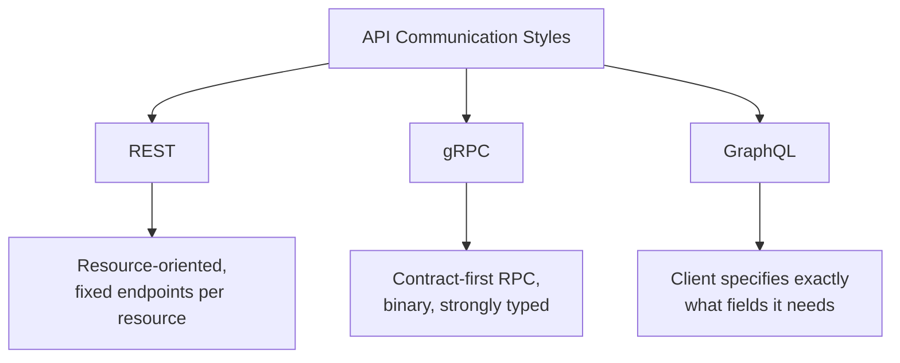
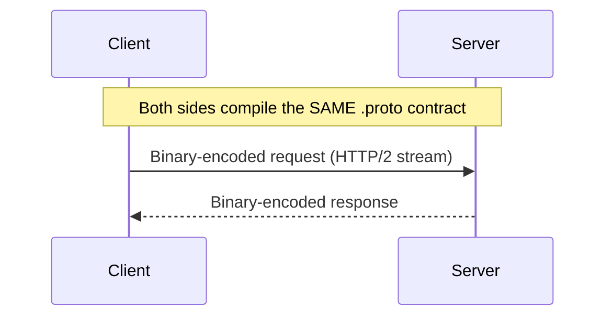
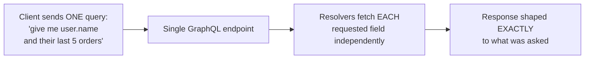
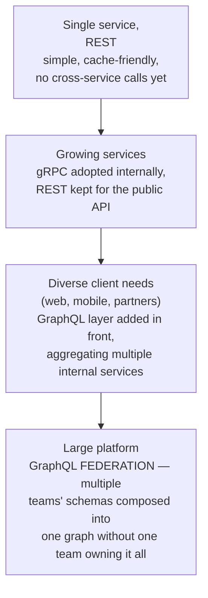

# REST, gRPC & GraphQL

> [!abstract] What you'll be able to do after this chapter
> State the precise tradeoff between all three API styles (not just "gRPC is faster"), explain GraphQL's N+1 problem with a concrete example and its fix, and name the specific reasons a real system typically ends up using more than one style simultaneously.

> [!info] Distinct from HTTP Evolution
> [[CS Fundamentals/02 - Networking/HTTP Evolution & DNS Resolution|HTTP Evolution & DNS Resolution]] covers the *transport*: HTTP/1.1 vs. HTTP/2 vs. HTTP/3. This chapter covers the *API contract style* built on top of that transport — how a client and server agree on what a request/response actually looks like, a genuinely different layer of decision.

---

## The big picture

## What is it, and why does it exist?

All three answer the same underlying question — how should a client and a server agree on what data moves between them — with three genuinely different designs. **REST** models an API as **resources** (`/users/5`) manipulated with standard HTTP verbs. **gRPC** models an API as **remote procedure calls** against a strongly-typed, schema-first contract, serialized in a compact binary format. **GraphQL** models an API as a single endpoint where the **client specifies the exact shape** of the response it wants, rather than the server dictating a fixed response shape per endpoint.

**The problem each solves:** a REST endpoint returning a fixed shape either **over-fetches** (a mobile client gets a `User` object with 20 fields when it only needs 2) or **under-fetches** (a screen needing a user plus their last 5 orders needs two separate round trips, since `/users/5` doesn't include orders). gRPC exists for internal service-to-service calls where JSON's text-based verbosity and REST's per-resource endpoint sprawl are real, measurable costs at high call volume. GraphQL exists specifically to let the client, not the server, decide the response shape per request — directly targeting REST's over/under-fetching problem.

> [!example] Layman analogy
> **REST** is ordering from a fixed menu — the dish comes exactly as listed, no substitutions, and if you want two different dishes you place two separate orders. **gRPC** is a private phone line between kitchen and warehouse — fast, precise, but both ends need to speak the exact same pre-agreed shorthand, and it's not something a customer at the counter could use directly. **GraphQL** is telling the waiter exactly which parts of the meal you want assembled into one plate — no unwanted side dishes, one trip to the kitchen regardless of how many separate things you're combining.

## REST — resource-oriented, verb-based

REST models everything as a **resource** identified by a URL, manipulated via standard HTTP verbs (`GET`, `POST`, `PUT`, `DELETE`) — `GET /users/5`, `POST /orders`. Its biggest practical strength is falling directly out of HTTP itself: `GET` requests are natively cacheable by browsers, CDNs, and proxies with zero extra infrastructure, and the verb-per-operation model is close to universally understood.

> [!info] The Richardson Maturity Model — a real, precise way to describe "how RESTful" an API actually is
> **Level 0:** a single endpoint, everything via `POST`, essentially RPC-over-HTTP wearing REST's clothing. **Level 1:** real resource URLs (`/users/5`) but still often only `POST`. **Level 2:** proper HTTP verbs used correctly per resource — where the overwhelming majority of "REST APIs" in production actually sit. **Level 3 (HATEOAS):** responses include links to related actions/resources, letting a client navigate the API dynamically rather than hardcoding every URL — theoretically the "complete" form of REST, genuinely rare in practice because the added complexity rarely pays for itself outside specific hypermedia-heavy use cases.

REST's real weakness is exactly the over-fetching/under-fetching problem above — a fixed response shape per endpoint that either includes fields a given client doesn't need, or forces multiple round trips to assemble data that spans more than one resource.

## gRPC — contract-first, binary RPC

gRPC defines the API contract in a `.proto` file — a language-neutral schema describing every message and service method — and both client and server generate strongly-typed code from that **same** contract at build time. Messages are serialized with **Protocol Buffers**, a compact binary format, transported over **HTTP/2**, giving gRPC multiplexed streaming for free at the transport layer (per [[CS Fundamentals/02 - Networking/HTTP Evolution & DNS Resolution|HTTP Evolution]]'s HTTP/2 coverage).

> [!tip] Four call types, not just simple request/response
> **Unary** (one request, one response — the REST-equivalent default), **server streaming** (one request, a stream of responses — e.g., subscribing to live updates), **client streaming** (a stream of requests, one final response — e.g., uploading data in chunks), and **bidirectional streaming** (both sides stream independently and concurrently — e.g., a real-time chat backend). This is a genuine capability REST's simple request/response model doesn't offer without layering something else (WebSockets, SSE) on top.

gRPC's real strengths — compact binary payloads, strong compile-time-checked contracts, native streaming — are exactly why it's the default choice for internal service-to-service traffic in a microservices mesh, precisely the same reasoning [[CS Fundamentals/05 - Messaging & Streaming/Kafka Ecosystem and Production Patterns|Kafka's Schema Registry and Protobuf/Avro usage]] already applies to message payloads. Its real weakness: it isn't browser-native (requires a `grpc-web` proxy translating to a browser-compatible transport), and its binary payloads are far harder to inspect/debug by hand than readable JSON.

## GraphQL — client-specified response shape

GraphQL exposes a **single endpoint** with a defined schema of types and fields; a client sends a **query** describing exactly which fields it wants, potentially spanning what would be several separate REST resources, and gets back a response shaped exactly to match — no more, no less. Each field in the schema is backed by a **resolver** — a function responsible for fetching just that field's data, potentially from a completely different backend service than the field next to it.

> [!bug] The N+1 problem — precisely, with a concrete example
> A query asking for a list of 10 users, each with their `posts` field, naively triggers **1** query to fetch the 10 users, then **10 separate** queries — one per user — to fetch each user's posts, since each user's `posts` resolver runs independently, unaware that 9 other resolvers are about to ask for the same kind of data for different users. That's 11 total round trips for what should be 2. **The fix:** a batching layer (commonly `DataLoader`) that collects all the individual "get posts for user X" resolver calls happening within the same request tick, and issues **one** batched query (`WHERE user_id IN (1,2,3...10)`) instead of 10 separate ones — turning `N+1` into `2`.

GraphQL's real weakness: the flexibility that solves over/under-fetching also makes REST's free `GET`-based HTTP caching unavailable by default (every query is technically a `POST` to the same single endpoint, from an HTTP-caching perspective), and an unrestricted client can construct a deeply nested, expensive query that the server never anticipated — real production GraphQL APIs need explicit **query depth/complexity limiting** as a defense, not an optional hardening step.

## Comparison, precisely

| | REST | gRPC | GraphQL |
|---|---|---|---|
| **Payload format** | JSON (text, larger) | Protocol Buffers (binary, compact) | JSON (text) |
| **Contract** | Loose (OpenAPI optional) | Strict, schema-first `.proto`, code-generated | Strict, schema-first, but resolved at query time |
| **Caching** | Free via HTTP `GET` semantics | Not HTTP-cache-friendly | Hard — needs persisted queries or field-level caching |
| **Over/under-fetching** | Real, structural weakness | N/A — RPC calls return exactly the defined response | Solved directly — client controls response shape |
| **Streaming** | Not native | Native, 4 call types | Not native (subscriptions exist but are a separate mechanism) |
| **Browser-native** | Yes | No — needs `grpc-web` | Yes |
| **Best fit** | Public APIs, simple CRUD, cache-friendly reads | Internal service-to-service, performance-sensitive, streaming | Client-diverse public APIs (web + mobile) needing flexible response shapes |

## Where this shows up later

> [!success] Direct connections
> [[CS Fundamentals/02 - Networking/HTTP Evolution & DNS Resolution|HTTP Evolution & DNS Resolution]] — gRPC's use of HTTP/2 multiplexing directly builds on that chapter's transport-level coverage. [[CS Fundamentals/05 - Messaging & Streaming/Kafka Ecosystem and Production Patterns|Kafka Ecosystem & Production Patterns]] — the same Protobuf/schema-first discipline gRPC applies to APIs, applied there to message payloads. [[CS Fundamentals/02 - Networking/API Gateway|API Gateway]] — commonly the exact point where a public REST or GraphQL API is translated into internal gRPC calls.

## Scaling: one style to a deliberately mixed API surface

## Failure scenarios

> [!bug] What actually happens
> - **A GraphQL query triggers an N+1 explosion under real load:** already covered above — without batching, a moderately-sized list query can silently generate dozens of downstream calls, multiplying database or service load far beyond what the query's shape suggests at a glance.
> - **A large number of long-lived gRPC streaming connections exhausts server resources:** HTTP/2 streams are cheaper than full connections, but not free — a server accepting unbounded concurrent streaming clients (per the bidirectional-streaming call type) needs explicit capacity planning, the same way any long-lived-connection service does.
> - **REST over-fetching degrades a bandwidth-constrained mobile client:** returning full resource objects when only 2 of 20 fields are used isn't just wasteful server-side — it directly costs the client real latency and battery on a poor connection, a real, user-facing consequence, not just a backend inefficiency.

## Monitoring

> [!info] What to watch
> **Per-resolver latency and call count, for GraphQL** — the direct signal for diagnosing an N+1 problem before it's reported as "the API is slow" without more specific detail. **Query complexity/depth distribution, for GraphQL** — informs whether complexity limiting is tuned correctly, and surfaces clients accidentally (or deliberately) sending expensive queries. **Active gRPC stream count and duration** — the direct capacity signal for streaming-heavy services. **Response payload size vs. fields actually used, for REST** (where trackable) — a concrete, quantifiable measure of how much over-fetching is actually happening in practice.

## Common mistakes

> [!warning] Real, recurring errors
> 1. **Exposing GraphQL without query depth/complexity limiting** — the N+1/expensive-query section above; a real, common way an unguarded GraphQL API becomes a self-inflicted denial-of-service vector.
> 2. **Calling gRPC directly from a browser without `grpc-web`** — gRPC's binary framing and HTTP/2 requirements aren't natively supported by browser fetch/XHR APIs; this is a real, common surprise for teams new to gRPC.
> 3. **Using REST verbs loosely** — routing everything through `POST` regardless of actual semantics breaks the free HTTP caching and idempotency assumptions (per [[CS Fundamentals/06 - Distributed Systems/Idempotency|Idempotency]]) that correct verb usage provides for free.

---

## Interview Q&A

> [!info] Leveled by seniority
> **Beginner:** "What's the core difference between REST and GraphQL?" — REST returns a fixed shape per endpoint; GraphQL lets the client specify exactly which fields it wants in a single request. **Intermediate:** "Why is gRPC generally not used for public, browser-facing APIs?" — it isn't natively browser-compatible (needs a `grpc-web` proxy) and its binary payloads are harder to inspect than JSON — real, practical frictions for a public API's diverse client population. **Senior:** "A GraphQL API's response times are inconsistent — sometimes fast, sometimes very slow for what looks like a similar query — diagnose it." — expects checking for the N+1 problem via per-resolver metrics, since query *shape* (how much nested/list data it touches) determines actual backend call volume far more than the query's textual size suggests. **Staff:** "Design the API surface for a platform serving a public web app, a public mobile app, and internal microservices." — expects gRPC internally (performance, strong contracts), and a GraphQL (or REST) layer at the edge for the diverse public clients — explicitly not one single style forced across every consumer, since internal and public clients have genuinely different needs. **Architect:** "How would you evaluate whether to adopt GraphQL federation for an organization with 10 teams each owning part of the API surface?" — expects weighing the real coordination benefit (one composed graph instead of clients juggling 10 separate APIs) against federation's genuine operational complexity (schema composition, cross-team contract management) — a real, non-default decision, not an automatic yes once more than one team is involved.

> [!question]- Why can't GraphQL just use HTTP `GET` caching the way REST does?
> A GraphQL query is typically sent as a `POST` body (since queries can be large and don't fit cleanly in a URL), and even when sent via `GET`, different clients requesting different field subsets from the same endpoint produce different response shapes for the same URL — defeating simple URL-keyed HTTP caching. Real GraphQL caching needs either persisted queries (a fixed, cacheable ID per known query shape) or field-level caching inside the resolver layer, both real, deliberate additions REST gets by default.

> [!question]- If gRPC is faster, why doesn't everything just use it?
> "Faster" is real but not the only axis — gRPC's strict, code-generated contracts mean any schema change needs coordinated regeneration on both sides, its binary payloads resist casual debugging with a browser or `curl`, and it isn't natively browser-compatible. For a public API serving unknown, diverse clients, REST's universality and GraphQL's client-driven flexibility are usually worth more than gRPC's raw performance advantage — the right choice depends on who's actually calling the API, not which protocol benchmarks fastest in isolation.

## Summary / Cheat Sheet

- **REST** = resource-oriented, HTTP verbs, free `GET` caching — but fixed response shape causes over/under-fetching.
- **gRPC** = contract-first RPC, Protocol Buffers (binary), HTTP/2 streaming — fast and strongly typed, but not browser-native.
- **GraphQL** = client specifies exact response shape via one endpoint — solves over/under-fetching, but caching is hard and needs explicit query-complexity limiting.
- **N+1 problem** (GraphQL): a list query's per-item resolver fires independently, causing `N` extra calls — fixed via batching (`DataLoader`).
- **Real systems mix styles**: gRPC internally, REST or GraphQL at the public edge — rarely just one style everywhere.

---
*Related: [[CS Fundamentals/00 - Learning Path|CS Fundamentals Learning Path]] · [[CS Fundamentals/02 - Networking/HTTP Evolution & DNS Resolution|HTTP Evolution & DNS Resolution]] · [[CS Fundamentals/02 - Networking/API Gateway|API Gateway]] · [[CS Fundamentals/05 - Messaging & Streaming/Kafka Ecosystem and Production Patterns|Kafka Ecosystem & Production Patterns]] · [[CS Fundamentals/06 - Distributed Systems/Idempotency|Idempotency]]*
