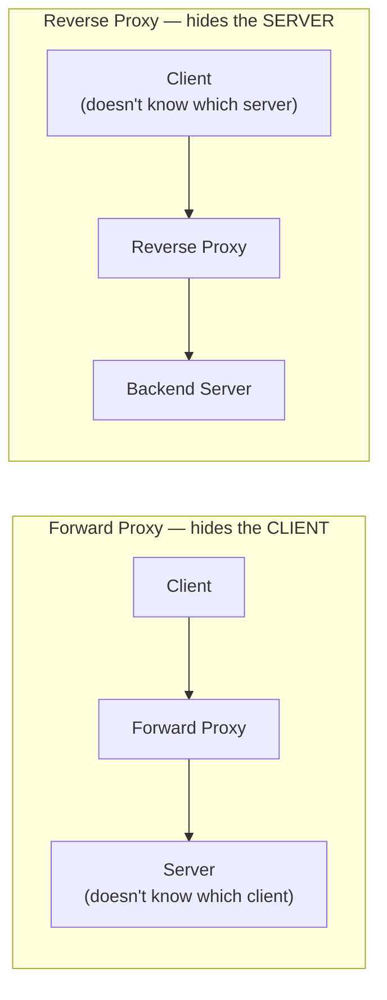
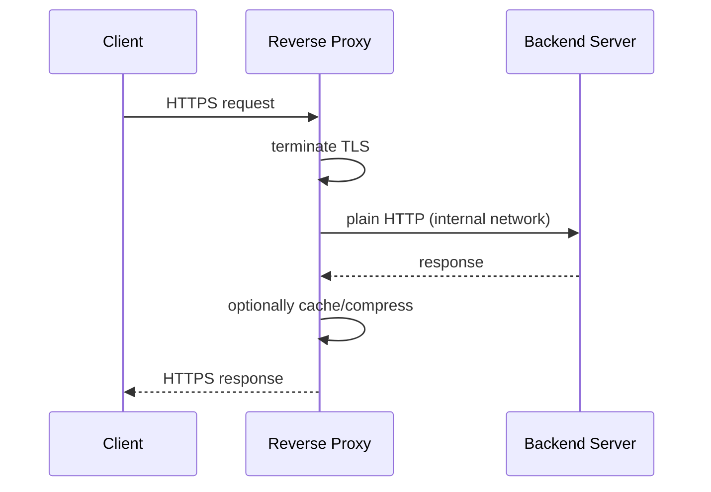

# Reverse Proxy

> [!abstract] What you'll be able to do after this chapter
> State the forward-proxy vs. reverse-proxy distinction precisely (a classic interview trap), and explain exactly how Reverse Proxy, Load Balancer, and API Gateway relate — three names for overlapping capability, not three competing architectures.

> [!info] Why this chapter exists despite Load Balancing and API Gateway already being written
> [[CS Fundamentals/02 - Networking/Load Balancing|Load Balancing]] and [[CS Fundamentals/02 - Networking/API Gateway|API Gateway]] are both, technically, **specific applications of the reverse-proxy concept** — this chapter is the general idea underneath both, and exists specifically to draw the boundaries between all three precisely, since conflating them is one of the most common imprecisions in system design interviews.

---

## What is it, and why does it exist?

A reverse proxy is a server that sits in front of one or more backend servers, receiving client requests on the backends' behalf and forwarding them, then returning the response back to the client as if the proxy itself had generated it. The client never talks to the backend directly, and often never even knows the backend exists.

**The problem this solves:** exposing backend servers' real addresses directly to the internet is a security liability (attackers can target them directly), makes it impossible to add uniform behavior (TLS termination, compression, caching) without modifying every single backend, and tightly couples clients to specific server addresses — you can't swap, scale, or relocate a backend without breaking every client that hardcoded its address.

> [!example] Layman analogy
> A hotel receptionist. Guests never call a room's direct extension — they call the front desk, and the receptionist routes the call to whichever room the guest actually needs. The hotel can move a guest to a different room entirely, and callers never notice, because they were never talking to the room directly in the first place.

## Forward proxy vs. reverse proxy — the precise distinction

> [!warning] A classic, easy-to-get-backward interview trap
> A **forward proxy** sits in front of **clients** — it hides the client's identity from the servers they're talking to (a corporate proxy, a VPN, a privacy tool). The server doesn't know which specific client it's really talking to. A **reverse proxy** sits in front of **servers** — it hides the backend's identity/topology from clients. The client doesn't know which specific server actually handled its request. Same underlying mechanism (something in the middle, forwarding traffic), opposite side of the conversation it's protecting.

## Internal working

A request arrives at the reverse proxy's public IP. The proxy inspects it (path, host header, headers generally), decides where it should go, forwards it to the appropriate backend, and relays the response back — optionally terminating TLS along the way, caching the response, compressing it, or rewriting headers, all without the backend needing to implement any of that itself.

## Reverse Proxy vs. Load Balancer vs. API Gateway, precisely

> [!tip] The actual, high-value content of this chapter
> All three are reverse proxies. The difference is what problem each is **specialized** for solving — and a single piece of software (Nginx, Envoy, HAProxy) can play all three roles simultaneously depending on configuration.

| | Reverse Proxy | Load Balancer | API Gateway |
|---|---|---|---|
| **General concept** | Anything forwarding traffic on behalf of servers | A reverse proxy specialized for distributing load across **many identical replicas** of one service | A reverse proxy specialized for **API-specific concerns**: auth, rate limiting, routing to **different services** by path |
| **Typical decision** | "Where does this request go?" | "Which of these N identical instances should handle this?" | "Which *service* should handle this, and is the caller even allowed to?" |
| **Covered in depth** | This chapter | [[CS Fundamentals/02 - Networking/Load Balancing\|Load Balancing]] | [[CS Fundamentals/02 - Networking/API Gateway\|API Gateway]] |

## Tradeoffs

Adding a reverse proxy adds a network hop (real, if usually small, latency cost) and introduces a new component that must itself be made redundant — a single reverse-proxy instance is exactly the kind of single point of failure [[00 - Start Here/100 System Design Interview Questions|the 100-questions file]] warns about naming explicitly. In exchange: backend isolation, uniform TLS/caching/compression handling, and the ability to change backend topology without touching any client.

## Production usage

Nginx, HAProxy, and Envoy are the standard real-world reverse-proxy implementations — often serving static assets directly from the proxy layer (never even reaching a backend for a cached, unchanging file), a real, common performance optimization worth naming.

---

## Interview Q&A

> [!question]- Is a CDN edge node a reverse proxy?
> Functionally, yes — a CDN edge server receives client requests and either serves a cached response directly or forwards to origin on the client's behalf, exactly the reverse-proxy shape, specialized further for geographic distribution and caching. Worth naming this overlap explicitly if asked — see [[CS Fundamentals/02 - Networking/CDN Internals|CDN Internals]].

> [!question]- If Nginx can act as a load balancer AND a reverse proxy AND (with more config) an API gateway, why does this handbook have three separate chapters?
> Because the *configuration and reasoning* differs meaningfully even when the software doesn't — deciding "route by path to a different service with an auth check" (gateway) is a genuinely different design problem than "spread traffic evenly across N replicas of the same service" (load balancer), even if the same binary implements both. Precision about which problem you're solving matters more than which tool you'd reach for.

> [!question]- Why terminate TLS at the reverse proxy instead of at each backend server?
> Centralizes certificate management to one place instead of N backends each needing their own certs and renewal process, and offloads the CPU cost of the TLS handshake from application servers — the same reasoning already covered in the API Gateway chapter, since TLS termination is one of the capabilities that chapter's "API Gateway" role includes.

## Summary / Cheat Sheet

- **Forward proxy** hides the **client** from the server. **Reverse proxy** hides the **server** from the client. Opposite sides.
- **Load Balancer** = reverse proxy specialized for spreading load across identical replicas.
- **API Gateway** = reverse proxy specialized for API concerns (auth, rate limiting, routing to different services).
- One piece of software can be all three at once — the distinction is about **problem being solved**, not separate technologies.

---
*Related: [[CS Fundamentals/00 - Learning Path|CS Fundamentals Learning Path]] · [[CS Fundamentals/02 - Networking/Load Balancing|Load Balancing]] · [[CS Fundamentals/02 - Networking/API Gateway|API Gateway]] · [[CS Fundamentals/02 - Networking/CDN Internals|CDN Internals]]*
