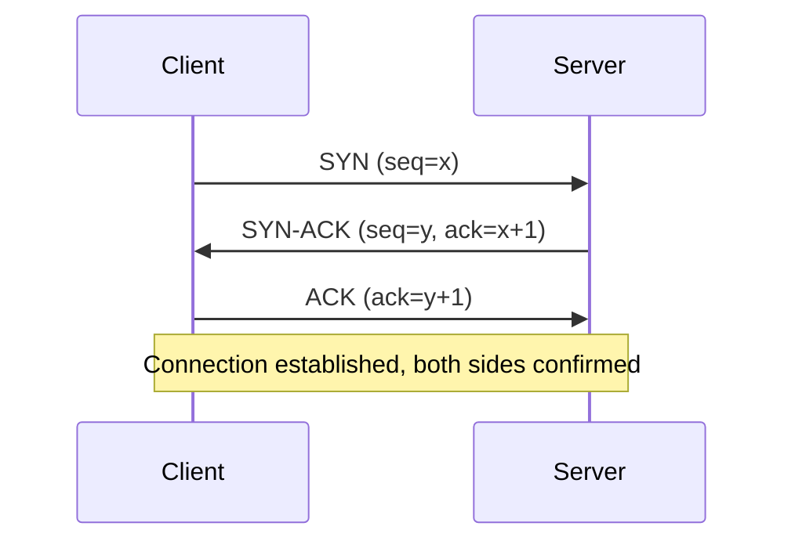
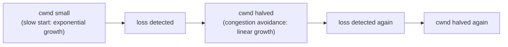

# TCP Deep Dive

> [!abstract] What you'll be able to do after this chapter
> Draw the 3-way handshake and the 4-way close from memory with a justification for each step, explain flow control vs congestion control as genuinely different mechanisms, and diagnose a real production Nagle's-algorithm latency bug.

---

## 1. Why TCP exists

Raw IP packet delivery gives you none of what most applications actually need: packets can be **lost**, **duplicated**, or **arrive out of order** — IP is a "best effort" protocol with zero guarantees. TCP sits on top of IP and adds exactly four things: **reliability** (retransmit lost data), **ordering** (deliver bytes to the application in the order they were sent, even if packets arrived out of order), **flow control** (don't overwhelm a slow receiver), and **congestion control** (don't overwhelm the network itself).

## 2. The three-way handshake — and why three, not two

Each side needs to confirm two things: "I can send you data" and "I received your confirmation that you can send me data." A 2-way handshake can't close that gap — the second party would have no way to know their SYN-ACK actually arrived before sending real data. The third message (`ACK`) is what confirms the server's `SYN-ACK` was received, giving both sides mutual confirmation before any application data flows.

> [!bug] Worth naming explicitly in an interview
> Even the 3-way handshake doesn't perfectly solve this in an absolute theoretical sense (the "Two Generals Problem" proves no finite handshake can guarantee both sides have *provably* synchronized state over an unreliable channel) — it's a practical, good-enough solution, not a mathematical guarantee. Naming this shows real depth beyond "SYN, SYN-ACK, ACK."

## 3. Reliability — sequence numbers & acknowledgment

Every byte sent gets a sequence number. The receiver acknowledges the next byte it expects (`ACK` = "I have everything up through here"). If the sender doesn't see an ACK within a timeout, it retransmits. **Fast retransmit** is a real optimization worth knowing: three duplicate ACKs for the same sequence number signal a specific packet was likely lost (later packets *did* arrive, confirming they're being acked with the same "still waiting for X" number) — the sender retransmits immediately, without waiting for the full timeout.

## 4. Flow control vs congestion control — genuinely different mechanisms

> [!warning] The most common thing candidates conflate
> These solve two *different* problems and use *different* mechanisms — treating them as the same concept is a real gap interviewers probe for.

**Flow control** protects the **receiver**. The receiver advertises a **window size** — how many unacknowledged bytes it's willing to buffer. The sender must never have more than that outstanding at once. Purely about not overwhelming *this specific receiver's* buffer.

**Congestion control** protects the **network** itself, independent of what any single receiver can handle. TCP maintains a **congestion window (cwnd)**, starting small and growing via **slow start** (roughly doubling every round-trip) until packet loss is detected, then switching to **congestion avoidance** (linear growth) — and on loss, cutting the window multiplicatively (commonly halving it). This produces the well-known TCP "sawtooth" throughput pattern.

The **actual send window** is `min(flow-control window, congestion window)` — the sender is bounded by whichever constraint is tighter at any given moment.

## 5. Connection teardown & TIME_WAIT

Closing a connection is (typically) a four-message exchange: `FIN → ACK → FIN → ACK`. After the final `ACK`, the side that initiated the close enters **TIME_WAIT** — a state where the connection lingers (not fully freed) for **2×MSL** (Maximum Segment Lifetime, historically ~30-60 seconds total).

> [!tip] Why TIME_WAIT exists — not just "cleanup"
> If a duplicate or delayed packet from the *old* connection is still in flight when a *new* connection happens to reuse the exact same source/destination IP+port pair, that stray packet could be misdelivered into the new connection's stream. TIME_WAIT ensures enough time passes for any such stragglers to die out in the network before the address pair can be reused.

**Real production consequence:** a host making very many short-lived outbound TCP connections (a proxy, a load balancer, a service hammering an external API without connection pooling) can accumulate thousands of sockets stuck in TIME_WAIT, eventually **exhausting available local ports** — a genuine, recurring production incident. Mitigation: connection pooling/reuse (avoid creating new connections per request at all), or `SO_REUSEADDR`/tuned TIME_WAIT settings where appropriate.

## 6. A real production gotcha: Nagle's Algorithm + Delayed ACK

**Nagle's algorithm** batches small outgoing writes into fewer, larger packets to reduce overhead — good for bulk throughput. **Delayed ACK** on the receiving side waits briefly (up to ~40ms) hoping to piggyback an ACK on outgoing data rather than sending a bare ACK packet. Combined, these two independently-reasonable optimizations can interact badly: a sender waiting for an ACK before sending its next small write, paired with a receiver delaying that ACK — produces a real, measurable **~40ms stall** on latency-sensitive small-message traffic.

> [!bug] The fix, worth knowing by name
> Setting `TCP_NODELAY` on the socket disables Nagle's algorithm — the standard fix for latency-sensitive applications sending small, frequent messages (RPC calls, interactive protocols) where throughput-optimized batching actively hurts.

## 7. TCP vs UDP — the core tradeoff (briefly, full UDP treatment is its own future chapter)

TCP's reliability/ordering guarantees come at a real cost: the handshake before any data flows, retransmission waits on loss, and **head-of-line blocking** — a single lost packet blocks *all* subsequently-arrived data from being delivered to the application until the gap is filled, even if later bytes already arrived intact. UDP has none of TCP's guarantees or overhead — the right choice when a late packet is *worse* than a dropped one (live video/audio, gaming) rather than needing every byte to eventually arrive correctly.

---

## 🎯 Interview follow-up Q&A

> [!quote]- "Why does TCP use a 3-way handshake instead of 2 messages?"
> Both sides need to independently confirm "I can send" and "I've received your confirmation that you can send" before exchanging real data — a 2-way exchange leaves the initiator's confirmation-of-confirmation unverified.
>
> **Follow-up: "Does the 3-way handshake fully guarantee both sides have synchronized state?"**
> Not in an absolute theoretical sense — the Two Generals Problem shows no finite handshake over an unreliable channel can provide a mathematical guarantee. It's a practical, robust-in-practice solution, not a provable one.

> [!quote]- "What's the difference between flow control and congestion control?"
> Flow control protects the specific receiver from being overwhelmed, governed by its advertised window size. Congestion control protects the network itself from being overwhelmed, governed by the sender's dynamically-adjusted congestion window (slow start → congestion avoidance → multiplicative decrease on loss).
>
> **Follow-up: "What actually determines how much data can be in flight at any moment?"**
> The minimum of the flow-control window and the congestion window — whichever constraint is currently tighter.

> [!quote]- "What real production problem can excessive TIME_WAIT sockets cause?"
> A host opening many short-lived outbound connections without pooling can exhaust its available local ports, since each closed connection lingers in TIME_WAIT for roughly 2×MSL before its port can be reused.
>
> **Follow-up: "How would you fix it?"**
> Connection pooling/reuse to avoid creating new short-lived connections in the first place — addressing the root cause rather than tuning TIME_WAIT duration, which only reduces the symptom's window, not the underlying churn.

---
*Related: [[00 - Start Here/How This Handbook Works|Book Map]] · [[HLD/01 - Design TinyURL (URL Shortener)/Design TinyURL|Design TinyURL]]*
