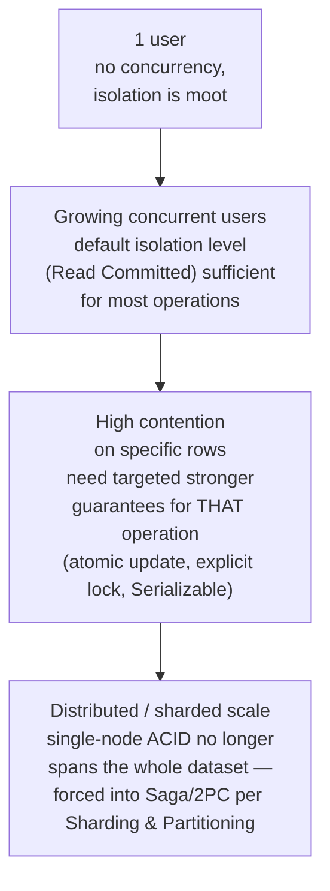

# ACID & Isolation Levels

> [!abstract] What you'll be able to do after this chapter
> Name all four ACID guarantees precisely, explain the real difference between a dirty read, a non-repeatable read, and a phantom read with an example of each, and know exactly which isolation level your database actually defaults to.

---

## Why this exists

Every database chapter in this book has assumed "the write either happens correctly or it doesn't" without dwelling on what makes that true. ACID is the contract a relational database makes about **transactions** — a group of operations that must behave as one indivisible unit even while other transactions run concurrently and the machine might crash mid-way.

## The four guarantees

### Atomicity — all or nothing

A transaction either fully completes or has no effect at all — there's no "half-applied" state visible to anyone.

> [!example] Layman
> An all-or-nothing light switch — either the whole transaction happens, or none of it does, never half-way. Transferring money between two accounts either moves the full amount on both sides, or neither side changes at all — never "debited but not credited."

### Consistency — valid state to valid state

A transaction moves the database from one state that satisfies all its rules (foreign keys, unique constraints, custom checks) to another state that also satisfies them. This is the DB *enforcing* the application's rules, not the app's job alone.

> [!example] Layman
> A recipe that must always end with a balanced meal — a transaction can't leave the "meal" half-cooked in a way that violates what counts as a valid meal (like a foreign key pointing at a row that no longer exists).

### Isolation — concurrent transactions don't see each other's mess

This is where nearly all the real depth and nearly all the real interview follow-ups live — see the full section below.

### Durability — once committed, it survives a crash

Once a transaction is acknowledged as committed, it's guaranteed to persist even if the server crashes a millisecond later — implemented via a **write-ahead log (WAL)**: the change is durably written to an append-only log *before* being applied to the actual data pages, so a crash mid-write can always be replayed from the log on restart.

> [!example] Layman
> Once you sign a contract and it's filed, even if the office burns down that night, a fireproof copy was already stored elsewhere the moment you signed — the WAL is that fireproof copy, written before anything else happens.

---

## Isolation levels — the part interviewers actually probe

Isolation defines *how much* of one transaction's in-progress work another concurrent transaction is allowed to see. Weaker isolation is faster (less locking/coordination) but permits more surprising anomalies.

| Level | Dirty reads | Non-repeatable reads | Phantom reads |
|---|---|---|---|
| **Read Uncommitted** | Possible | Possible | Possible |
| **Read Committed** | Prevented | Possible | Possible |
| **Repeatable Read** | Prevented | Prevented | Possible (in the SQL standard's definition; Postgres's implementation actually also prevents phantoms) |
| **Serializable** | Prevented | Prevented | Prevented |

### The three anomalies, precisely

> [!bug] Dirty read
> Transaction A reads a value that Transaction B has changed but **not yet committed**. If B then rolls back, A acted on data that never actually existed.
> **Layman:** reading someone's rough draft before they've saved it — and then the draft gets deleted.

> [!bug] Non-repeatable read
> Within a single transaction, reading the **same row twice** returns two different values, because another transaction committed a change to it in between.
> **Layman:** you ask the librarian for a book's page count twice during one visit, and it changed between asks because someone else finished editing it in between.

> [!bug] Phantom read
> Within a single transaction, running the **same query twice** returns a different *set of rows* — new rows now match a filter that didn't match before, because another transaction inserted them in between.
> **Layman:** you have your own personal copy of specific books checked out (those specific rows can't change under you), but new books matching your search criteria can still be added to the shelf mid-search.

**Serializable** is the strongest level: transactions behave *as if* they ran one at a time in some strict order, even though they actually ran concurrently — it eliminates all three anomalies, at the cost of the most locking/retry overhead.

## How isolation is actually implemented

Two real mechanisms, worth naming precisely rather than treating isolation as a black box:

- **Lock-based isolation** — a transaction acquires locks on rows/ranges it touches, blocking other transactions from conflicting access until it commits. Simple to reason about, but readers can block writers and vice versa.
- **MVCC (Multi-Version Concurrency Control)** — used by Postgres and MySQL's InnoDB — each transaction sees a consistent *snapshot* of the data as of when it started, while writes create new row versions rather than overwriting in place. Readers never block writers and writers never block readers, at the cost of needing to garbage-collect old row versions.
> [!info] Already covered
> MVCC's mechanics are covered in more depth in [[CS Fundamentals/03 - Databases/SQL Query Execution Deep Dive|SQL Query Execution Deep Dive]] — this chapter connects it specifically to *which anomalies it prevents*.

## What real databases actually default to

> [!warning] "It's in a transaction" doesn't mean what you think it means
> A transaction alone doesn't guarantee full protection from concurrency anomalies — the **isolation level configured** determines exactly which anomalies are still possible. Postgres defaults to **Read Committed** (dirty reads prevented, but non-repeatable and phantom reads are still possible). MySQL's InnoDB defaults to **Repeatable Read**. Assuming "I used a transaction" automatically means "no race condition is possible" is a real, common interview trap — the correct answer names the specific isolation level and what it actually prevents.

## ACID vs. BASE

ACID is the strong-consistency end of the same spectrum [[Glossary/BASE|BASE]] sits at the other end of — the same strong-vs-eventual tradeoff already covered generally in [[CS Fundamentals/06 - Distributed Systems/CAP Theorem & PACELC|CAP Theorem & PACELC]], here specifically as the SQL world's concrete instantiation of the "strong" side. Many NoSQL databases deliberately relax some or all ACID guarantees in exchange for horizontal scale and availability — [[CS Fundamentals/03 - Databases/Cassandra Internals|Cassandra Internals]] and [[CS Fundamentals/03 - Databases/MongoDB Internals|MongoDB Internals]] both make this tradeoff explicitly.

## Scaling: 1 user to 1 billion

At low concurrency, isolation level is nearly invisible — anomalies need overlapping concurrent transactions to even be possible. As concurrent load grows, the database's default isolation level (Read Committed for Postgres, Repeatable Read for MySQL) handles most operations fine, with targeted fixes (an atomic conditional update, an explicit row lock) applied only where a specific, known race condition matters — never blanket Serializable everywhere. At distributed/sharded scale, ACID's guarantees stop spanning the whole dataset at all — a transaction touching data on two different shards has no single-node WAL or lock table covering both, forcing the [[Glossary/Two-Phase Commit (2PC)|2PC]]/[[Glossary/Saga Pattern|Saga]] tradeoff already covered in [[CS Fundamentals/06 - Distributed Systems/Sharding & Partitioning|Sharding & Partitioning]].

## Failure scenarios

> [!bug] What actually happens
> - **Crash mid-transaction:** the WAL is replayed on restart — any transaction that hadn't committed is rolled back entirely (Atomicity enforced even across a crash), any transaction that had committed is guaranteed present (Durability).
> - **A long-running transaction holding locks:** under lock-based isolation, other transactions needing the same rows simply wait — a transaction accidentally left open across a slow network call or user think-time is a real, common production incident, blocking unrelated work that shouldn't have been affected at all.
> - **Deadlock:** two transactions each hold a lock the other needs — the database detects the cycle and aborts one transaction (returning a deadlock error), forcing the application to retry. This is expected, handled behavior, not a bug — applications touching multiple rows/tables need retry logic for exactly this case.

## Monitoring

> [!info] What to watch
> **Long-running transaction detection** — the direct signal for the lock-contention failure mode above, catchable before it causes a wider incident. **Lock wait time** — rising values signal contention building up. **Deadlock rate** — a non-zero baseline is normal for some workloads, but a rising trend signals a real access-pattern problem. **Serialization failure/retry rate** — for any code path using Serializable isolation, this is the direct, measurable cost of that choice.

## Common mistakes

> [!warning] Real, recurring errors
> 1. **Assuming "it's in a transaction" alone prevents all race conditions** — Section "What real databases actually default to" already names this precisely; the isolation level configured is what actually matters.
> 2. **Not knowing your database's actual default isolation level** — Postgres and MySQL default to genuinely different levels; assuming one when running the other is a real, catchable interview and production gap.
> 3. **Holding a transaction open across a network call or user interaction** — locks held for the duration block unrelated work for far longer than the actual database operation needs.
> 4. **Reaching for Serializable everywhere "to be safe"** — pays real throughput cost via aggressive locking/retries for every transaction, when a targeted fix at the few genuinely contended operations is usually the better answer.

---

## Interview Q&A

> [!info] Leveled by seniority
> **Beginner:** "What does the 'I' in ACID stand for and what does it prevent?" — Isolation; prevents concurrent transactions from seeing each other's in-progress, uncommitted work. **Intermediate:** "Name the three isolation anomalies and give an example of each." — dirty read, non-repeatable read, phantom read, per the table above. **Senior:** "A specific endpoint is experiencing intermittent data corruption under load — how do you diagnose an isolation-level gap?" — expects checking the actual configured isolation level first, then identifying the specific check-then-act sequence in the code that isolation alone doesn't protect, per the BookMyShow/ATM cross-link. **Staff:** "Design the transaction/consistency strategy for a system where 95% of operations are low-stakes but 5% (payments) require the strongest guarantees." — expects a per-operation isolation strategy, not one global level, mirroring the "targeted fix, not blanket Serializable" principle above. **Architect:** "How does ACID's meaning change once a system is sharded across multiple nodes?" — expects the Scaling section's answer: single-node ACID no longer covers the whole dataset, forcing an explicit Saga/2PC decision for any operation spanning shards.

> [!question]- Why would a default isolation level ever be insufficient for correctness?
> The classic check-then-act race condition — read a balance, then write a new balance based on it — can still corrupt data under Read Committed, since another transaction can commit a conflicting change in the gap between the read and the write. This is precisely why [[LLD/06 - Design BookMyShow - Seat Booking/Design BookMyShow - Seat Booking|BookMyShow's]] and [[LLD/11 - Design an ATM/Design an ATM|the ATM's]] fixes use an atomic conditional update (or a row-level lock) rather than relying on isolation level alone — a stronger guarantee than the database's default provides for granted.

> [!question]- Why not just always use Serializable to avoid thinking about this?
> Serializable's stronger guarantees come from more aggressive locking or more frequent transaction retries on conflict — real throughput cost under contention. Most systems use a weaker level by default and add targeted fixes (an atomic update, an explicit lock) only where a specific known race condition actually matters, rather than paying Serializable's cost for every transaction in the system.

> [!question]- How does this connect to the CAP theorem?
> ACID's Isolation and Consistency guarantees are what a single-node (or synchronously-replicated) relational database can afford to offer strongly. The moment a system distributes data across nodes with asynchronous replication — which most systems in this book eventually do at scale — those same guarantees become the CP/AP tradeoff from [[CS Fundamentals/06 - Distributed Systems/CAP Theorem & PACELC|CAP Theorem & PACELC]]: full ACID semantics across a distributed system get expensive fast, which is exactly why systems consciously relax them (BASE) once they outgrow a single node.

---
*Related: [[00 - Start Here/How This Handbook Works|Book Map]] · [[CS Fundamentals/03 - Databases/SQL Query Execution Deep Dive|SQL Query Execution Deep Dive]] · [[CS Fundamentals/06 - Distributed Systems/CAP Theorem & PACELC|CAP Theorem & PACELC]] · [[Glossary/BASE|BASE]]*
