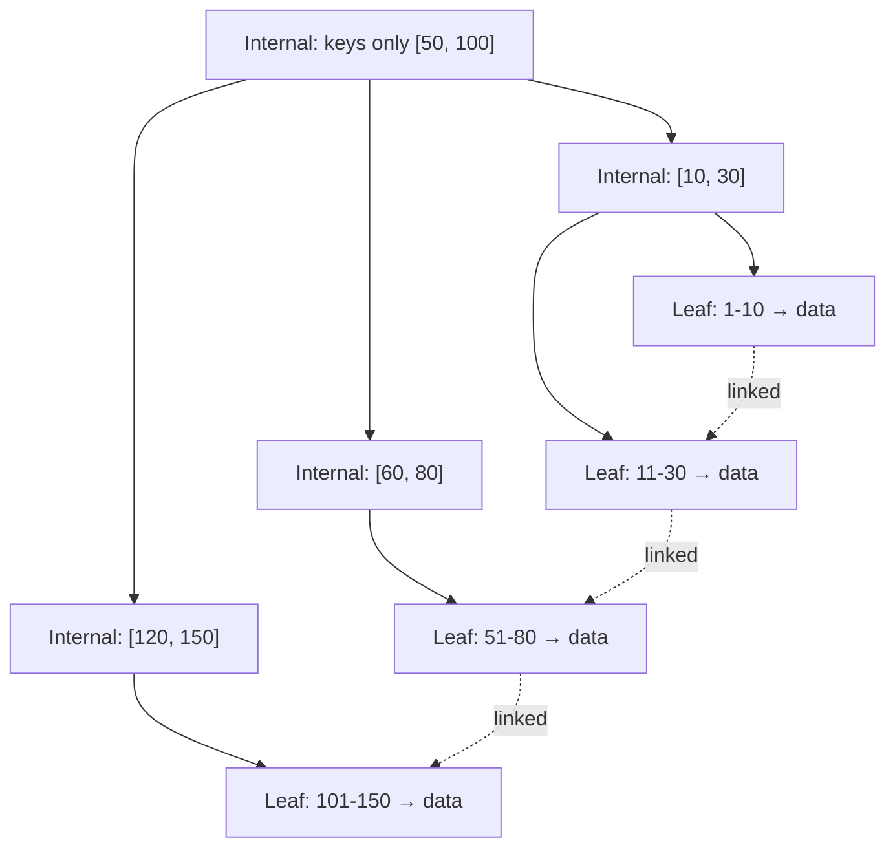
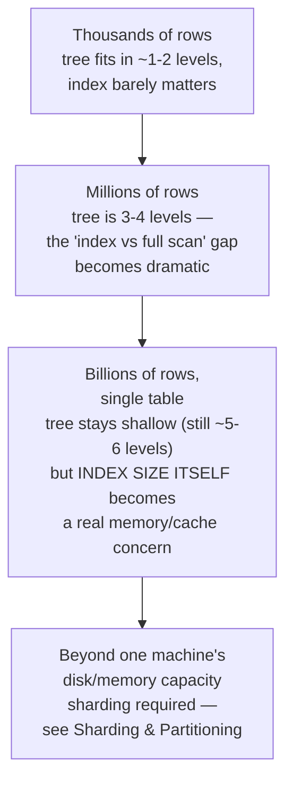

# Indexes & B+ Trees

> [!abstract] What you'll be able to do after this chapter
> Explain *why* databases use B+ Trees specifically (not binary trees, not plain B-Trees), draw one from memory, explain clustered vs non-clustered indexes with the actual storage implication, and spot a leftmost-prefix-rule bug in a composite index.

---

## 1. Why an index exists at all

Without an index, finding a row matching `WHERE email = 'x'` requires scanning every row — a **full table scan**, `O(n)`. An index is a separate, structured lookup — pay some write-time and storage overhead to get `O(log n)` lookups instead.

## 2. Why B+ Trees, not a plain binary search tree

A balanced binary tree gives `O(log₂ n)` height, but that base-2 branching factor is the wrong shape for **disk-backed** structures. Historically, the dominant cost of a database read wasn't CPU comparisons — it was **disk seeks**, and each tree-node traversal could mean a separate seek. Minimizing **tree height** (not just balance) is what actually matters: fewer levels means fewer disk reads to find any row.

B-Trees (and B+ Trees) solve this by making each node hold **many** keys — not 1-2 like a binary tree, but often hundreds — giving a very high branching factor and correspondingly tiny height (often just 3-4 levels for tables with millions of rows, meaning **3-4 disk reads** to find any row, regardless of table size).

## 3. B-Tree vs B+ Tree — the distinction that actually matters

| | B-Tree | B+ Tree |
|---|---|---|
| Data storage | Both internal *and* leaf nodes hold data/pointers | **Only leaf nodes** hold data — internal nodes hold keys purely for navigation |
| Leaf linking | Leaves not linked to each other | Leaves are linked in a **sorted linked list** |
| Internal node size | Larger (carries data payload) | Smaller (keys only) → **higher fanout** → shorter tree |
| Range queries (`BETWEEN`) | Requires re-traversing the tree | **Fast** — find the start leaf once, then walk the linked list |

This is exactly why virtually every real relational database (Postgres, MySQL/InnoDB, Oracle) uses **B+ Trees**, not plain B-Trees: smaller internal nodes mean an even shallower tree, and the linked leaves make range scans — extremely common in real queries — cheap without any re-traversal.

## 4. Node sizing — matched to a disk page, on purpose

Each node is sized to fit one disk page (commonly 4KB or 8KB) — **one node = one disk read**. Branching factor works out to roughly `page_size / (key_size + pointer_size)`, typically in the hundreds. This isn't incidental; it's the design that produces the "3-4 levels for millions of rows" property directly.

## 5. Insertion — how the tree stays balanced without ever rebalancing wholesale

Insert into the correct leaf, in sorted position. If that leaf now exceeds the branching factor, **split** it into two leaves and push the median key up into the parent. If the parent overflows too, split it recursively. This local, incremental splitting is what keeps the tree balanced automatically — no separate "rebalance the whole tree" step ever runs. Deletion mirrors this: an underflowed node **merges** with (or borrows a key from) a sibling.

## 6. Clustered vs non-clustered indexes

> [!warning] The detail that trips people up
> A **clustered** index determines the actual **physical storage order** of table rows — the leaf nodes *are* the rows (InnoDB's primary key works this way). Since data can only be physically sorted one way, **a table can have exactly one clustered index.** A **non-clustered (secondary)** index stores the indexed column(s) plus a reference back to the actual row — in InnoDB specifically, that reference is the **primary key value**, meaning a secondary-index lookup requires a second trip into the clustered index to fetch the full row (an extra "bookmark lookup") unless the query only needs columns already present in the secondary index itself (a "covering index").

## 7. Composite indexes & the leftmost-prefix rule

An index on `(a, b, c)` is a B+ Tree sorted by `a` first, then `b` within each `a`, then `c` within each `(a, b)`. It efficiently serves queries filtering on `(a)`, `(a, b)`, or `(a, b, c)` — but **cannot** efficiently serve a query filtering only on `b` or only on `c`, since neither is the leading sort key of the structure.

> [!bug] The classic real-world gotcha
> An index on `(last_name, first_name)` does **not** help a query filtering only on `first_name` — the database can't binary-search a structure sorted primarily by `last_name` using only a `first_name` predicate. This is a genuinely common production performance bug: someone adds a composite index expecting it to cover every column within it, in any combination, and it silently doesn't.

## 8. When indexes hurt

Every index adds **write overhead** — every `INSERT`/`UPDATE`/`DELETE` must also update every relevant index — plus storage overhead. Over-indexing a write-heavy table is a real, common production mistake. An index on a **low-cardinality** column (e.g. a boolean with only two distinct values) often doesn't help much either — the query optimizer may correctly decide a full scan is cheaper than following an index pointer to a large fraction of the table anyway.

## 9. The alternative worth naming: hash indexes, and LSM Trees as a different family entirely

A **hash index** gives `O(1)` average lookup but supports **no range queries and no ordering** — a genuine tradeoff, not strictly worse. And B+ Trees aren't the only major indexing structure family: **LSM Trees** (used by Cassandra, RocksDB, LevelDB) optimize for **write-heavy** workloads via append-only writes and background compaction, trading some read cost for dramatically cheaper writes — the direct "when B+ Trees are the wrong choice" answer, covered in full in [[CS Fundamentals/03 - Databases/Storage Engines - B-Tree vs LSM-Tree|Storage Engines: B-Tree vs. LSM-Tree]].

## 10. Scaling: 1 user to 1 billion rows

The genuinely remarkable property of a B+ Tree is that its height grows **logarithmically** — going from a million to a billion rows adds only one or two more levels, not a thousand times more disk reads. The real scaling pressure at extreme row counts isn't tree height — it's whether the **index itself** (not just the data) still fits comfortably in memory/page cache; a huge composite index on a huge table can itself become large enough that traversing it stops being reliably cache-resident, reintroducing real disk I/O per lookup even though the tree is still only a few levels deep. Past a single machine's realistic capacity, [[CS Fundamentals/06 - Distributed Systems/Sharding & Partitioning|sharding]] becomes necessary — at which point each shard maintains its own, smaller B+ Tree rather than one impossibly large one.

## 11. Failure scenarios

> [!bug] What happens when things go wrong
> - **Crash mid-insert (during a node split):** relational databases protect index structures the same way they protect table data — via the [[CS Fundamentals/03 - Databases/Storage Engines - B-Tree vs LSM-Tree|write-ahead log]]; an incomplete split is recovered by replaying the WAL on restart, never left in a corrupted intermediate state.
> - **Index and table data disagreeing (corruption):** a rare but real failure mode, usually from disk-level corruption or a bug — databases provide index-rebuild tooling specifically because this can happen, and detecting it usually surfaces as queries silently returning wrong/missing rows rather than an obvious crash, which is what makes it dangerous.
> - **A composite index silently not being used:** not a crash, but a genuine "failure" from the application's perspective — the leftmost-prefix-rule mistake from Section 7 causes queries to silently fall back to a full scan, degrading performance without any error at all.

## 12. Monitoring

> [!info] What to watch
> **Query plan usage** (`EXPLAIN ANALYZE`, already covered in [[CS Fundamentals/03 - Databases/SQL Query Execution Deep Dive|SQL Query Execution Deep Dive]]) — confirms whether a specific query is actually using the index you expect, catching leftmost-prefix mistakes directly. **Index size relative to available memory/page cache** — the practical signal for whether index lookups are still cache-resident or have started requiring real disk I/O. **Write latency on heavily-indexed tables** — a rising trend here is the direct, measurable cost of Section 8's "every index adds write overhead," worth tracking explicitly rather than assuming it's negligible.

## 13. Common mistakes

> [!warning] Real, recurring production errors
> 1. **Assuming a composite index helps any query touching its columns, in any combination** — the leftmost-prefix rule (Section 7) means an index on `(a, b)` doesn't help a query filtering only on `b`.
> 2. **Over-indexing a write-heavy table** — every additional index is real, ongoing write overhead (Section 8), not a free performance win.
> 3. **Indexing a low-cardinality column expecting a speedup** — a boolean or few-distinct-value column often doesn't benefit, since the optimizer may correctly prefer a full scan anyway.
> 4. **Not understanding the "bookmark lookup" cost of a non-clustered index** — a secondary index lookup that isn't a covering index pays an extra trip into the clustered index per row, a real, easy-to-miss cost when comparing two query plans.

---

## 🎯 Interview follow-up Q&A

> [!info] Leveled by seniority
> **Beginner:** "What is a database index?" — a separate structure trading write overhead for faster lookups than a full table scan. **Intermediate:** "Why B+ Trees specifically, not binary trees?" — Section 2, minimizing disk-seek-driving tree height via high branching factor. **Senior:** "Diagnose a query that should be using an index but is running a full scan instead." — expects the leftmost-prefix-rule check (Section 7) and `EXPLAIN ANALYZE` usage as the actual diagnostic tool, not a guess. **Staff:** "A table's index has grown large enough that lookups have gotten slower over the past year despite the tree height barely changing — why, and what would you do?" — expects the Section 10 answer: the index itself no longer fits comfortably in page cache, and the fix is likely partitioning/sharding rather than "add a faster disk." **Architect:** "How would you decide whether a workload needs a B+ Tree-based engine or an LSM-Tree-based one?" — expects a real tradeoff walk-through referencing [[CS Fundamentals/03 - Databases/Storage Engines - B-Tree vs LSM-Tree|Storage Engines]]: read-heavy/balanced workloads favor B+ Tree engines, write-heavy/high-ingest workloads favor LSM-Tree engines, not a reflexive "B+ Tree is standard so use it."

> [!quote]- "Why do databases use B+ Trees instead of a plain balanced binary search tree?"
> Minimizing tree *height* matters far more than just balance, because historically each level traversed could mean a disk seek. B+ Trees achieve a very high branching factor per node (hundreds of keys), keeping the tree only 3-4 levels deep even for millions of rows — a binary tree's height would be dramatically taller for the same data volume.
>
> **Follow-up: "Why not just use a hash table for every index, since hashing is O(1)?"**
> A hash index can't support range queries (`BETWEEN`, `ORDER BY`, prefix matches) or ordered iteration at all — the hash function destroys any notion of "nearby" keys being stored nearby. B+ Trees trade a bit of lookup speed (`O(log n)` vs `O(1)`) for range-query support that's essential for most real query patterns.

> [!quote]- "What's the difference between a clustered and non-clustered index?"
> A clustered index physically orders the table's rows to match the index — the leaf nodes *are* the row data. A non-clustered index is a separate structure pointing back to the rows.
>
> **Follow-up: "How many clustered indexes can a table have, and why only that many?"**
> Exactly one — physical storage can only be sorted in one order at a time, so only one index can be "clustered" against it. Every other index on that table is necessarily non-clustered.

> [!quote]- "Given a composite index on `(last_name, first_name)`, does a query filtering only on `first_name` use this index efficiently?"
> No. The index is sorted primarily by `last_name`; without a `last_name` predicate, the database cannot binary-search into the structure using `first_name` alone — it would need a full index scan (or full table scan), not the efficient seek the index is meant to provide.

---
*Related: [[00 - Start Here/How This Handbook Works|Book Map]] · [[HLD/01 - Design TinyURL (URL Shortener)/Design TinyURL|Design TinyURL]] · [[Glossary/Consistent Hashing|Consistent Hashing]] · [[CS Fundamentals/03 - Databases/Storage Engines - B-Tree vs LSM-Tree|Storage Engines: B-Tree vs. LSM-Tree]] · [[CS Fundamentals/03 - Databases/SQL Query Execution Deep Dive|SQL Query Execution Deep Dive]]*
