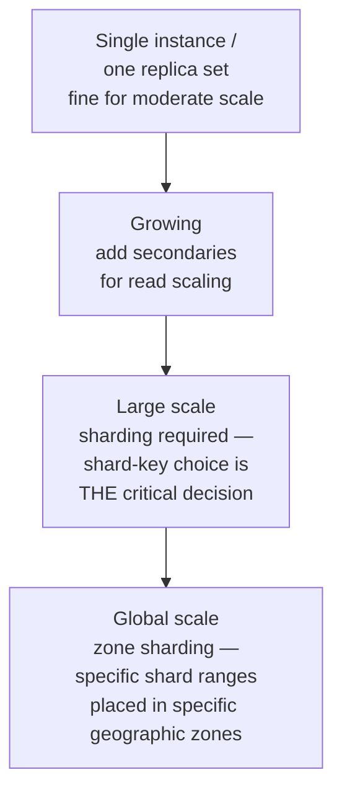

# MongoDB Internals

> [!abstract] What you'll be able to do after this chapter
> Explain why the document model reduces joins by design (not by accident), describe WiredTiger's concurrency improvement over the old MMAPv1 engine precisely, and name the exact shard-key mistake that creates a hot shard.

---

## 1. Why MongoDB exists

Relational schemas are rigid — every row in a table must match the same column structure, and evolving that structure at scale means real migrations. MongoDB's pitch: store data as flexible, nested **documents** (BSON — binary JSON) that don't require a uniform schema across a collection, letting applications iterate quickly without constant schema migrations. Related data can be **nested inside one document** (arrays, sub-documents) instead of requiring a join across separate tables — the document model is, in effect, denormalization-by-default, trading storage duplication and update complexity for read-path simplicity, the same fundamental tradeoff normalization-vs-denormalization always makes, just baked into the storage model itself.

## 2. Data model — collections of documents, not tables of rows

A **collection** groups documents loosely (analogous to a table), but individual documents within it can have different fields — modern MongoDB supports **optional schema validation** for teams that want structure back, but it's opt-in, not the default. Documents can nest arrays and sub-documents arbitrarily deep, letting a single read fetch a fully-formed object without joining across collections at all.

## 3. Storage engine — WiredTiger, and the concurrency leap it represented

**WiredTiger** is the modern default storage engine (replacing the original **MMAPv1**). It's B-Tree based internally (with an optional LSM-tree configuration available), and adds **document-level concurrency control** with compression (snappy/zlib by default, reducing storage footprint).

> [!bug] A real historical detail worth knowing
> MMAPv1 used much **coarser locking** — historically collection-level, and even earlier, database-level — meaning concurrent writes to *different* documents in the same collection could still block each other. WiredTiger's move to document-level locking was a genuine, significant concurrency improvement, not a marginal tuning change — worth naming specifically if asked about MongoDB's concurrency history, since it shows awareness of how the system actually evolved rather than describing only its current state.

## 4. Replication — replica sets and automatic failover

MongoDB uses **replica sets**: one primary, multiple secondaries — conceptually the same leader-follower replication pattern covered generally elsewhere, with MongoDB-specific mechanics: automatic **failover** via an election protocol among secondaries when the primary becomes unreachable, conceptually similar to [[Glossary/Raft (Consensus)|Raft-style consensus]] (a distinct implementation, but the same underlying idea — a majority of nodes must agree on the new primary). Reads can be routed to secondaries (trading consistency for read scalability — a real, direct [[CS Fundamentals/06 - Distributed Systems/CAP Theorem & PACELC|PACELC]] tradeoff) or required to be majority-committed for stronger consistency guarantees, at added latency cost.

## 5. Sharding — and the shard-key mistake that creates a hot shard

Data is partitioned across multiple replica sets (**shards**) using a **shard key** — the MongoDB-specific detail worth internalizing is that **choosing a good shard key is the single highest-leverage decision** in a sharded MongoDB deployment.

> [!bug] The concrete mistake, named precisely
> Choosing a **monotonically increasing** shard key (a timestamp, an auto-incrementing ID) means **every new write lands on the same shard** — the one currently responsible for the highest key range — creating a hot shard while every other shard sits idle for writes. This is the exact same hot-key/hot-partition failure mode already covered for caches and consistent hashing, just showing up in the context of a shard-key choice instead.

MongoDB offers two sharding strategies with a genuine tradeoff: **hashed sharding** (hashes the shard key, distributing writes evenly — but destroys the shard key's natural ordering, making efficient range queries across the sharded field impossible) vs **ranged sharding** (preserves natural ordering for efficient range queries — but is exactly what creates the hot-shard risk described above if the key is monotonically increasing).

## 6. When NOT to use MongoDB

Needing **multi-document ACID transactions across many collections at high throughput** — supported since MongoDB 4.0, but with a real, non-trivial performance cost; worth stating precisely rather than the outdated "MongoDB doesn't support transactions" claim, which is simply wrong for modern versions. **Highly relational data with frequent many-to-many joins** — MongoDB's `$lookup` aggregation stage exists, but isn't as efficient as native relational joins at scale. Needing **strict schema enforcement** as a first-class, always-on guarantee rather than an opt-in validation layer.

## 7. Scaling: 1 user to 1 billion

At moderate scale, a single replica set (one primary, a couple of secondaries for durability and read offload) handles most workloads comfortably. As read traffic grows, adding more secondaries scales reads directly, at the cost of the staleness/consistency tradeoff already named in Section 4. Once write volume or dataset size exceeds what one replica set can handle, sharding becomes necessary — and the shard-key decision (Section 5) becomes the single highest-leverage choice in the whole deployment, since correcting it later is expensive. At global scale, **zone sharding** — explicitly placing specific shard key ranges in specific geographic zones — combines sharding with physical placement, letting data live close to the users who predominantly access it.

## 8. Failure scenarios

> [!bug] What actually happens
> - **The primary fails:** an automatic election among secondaries promotes a new primary — conceptually similar to Raft-style consensus (Section 4), with a brief unavailability window for writes during the election itself.
> - **A single shard's replica set loses its primary:** that shard's own election happens independently — unrelated shards and their data remain fully available throughout, a direct benefit of each shard being its own independently-replicated unit.
> - **Network partition between the `mongos` router and a specific shard:** that shard's data becomes temporarily unreachable *through that router*, while queries targeting other shards continue normally — a partial, contained failure rather than a full outage.

## 9. Monitoring

> [!info] What to watch
> **Replication lag per secondary** — directly determines how stale a read-from-secondary can be. **Primary election frequency** — a rising rate signals an unstable primary (often resource starvation), not just "normal" occasional failover. **Per-shard chunk distribution** — the direct, proactive way to catch a hot shard forming, rather than discovering it after a customer-visible slowdown. **Oplog window size** — how much write history the primary's oplog retains; too small a window means a secondary that falls behind during a slow period can't catch up incrementally and needs a full, expensive resync.

## 10. Common mistakes

> [!warning] Real, recurring errors
> 1. **Choosing a monotonically increasing shard key** — Section 5 covers this precisely.
> 2. **Assuming reads from secondaries are always safe** — without considering replication lag, a secondary read can return meaningfully stale data for workloads that need current information.
> 3. **Treating `$lookup` as cost-equivalent to a relational JOIN** — it isn't as efficient at scale; leaning on it heavily is often a sign the data model should be reconsidered rather than a straightforward feature substitution.
> 4. **Sizing the oplog too small** — during a slow period or maintenance window, an undersized oplog window means a temporarily-lagging secondary can silently fall irrecoverably behind, needing a full resync rather than a quick catch-up.

---

## 🎯 Interview follow-up Q&A

> [!info] Leveled by seniority
> **Beginner:** "What is MongoDB, and how does its data model differ from a relational database?" — Section 1-2, flexible documents instead of rigid tables, related data nested instead of joined. **Intermediate:** "What changed between MMAPv1 and WiredTiger?" — Section 3, document-level locking replacing much coarser locking. **Senior:** "Diagnose an unevenly-loaded sharded MongoDB cluster." — expects checking per-shard chunk distribution first, then confirming whether it's a genuine shard-key design flaw (Section 5) vs. a celebrity-key hotspot needing key-splitting, per [[CS Fundamentals/06 - Distributed Systems/Sharding & Partitioning|Sharding & Partitioning]]. **Staff:** "Design a globally-distributed MongoDB deployment where European user data must stay in Europe for compliance." — expects zone sharding named explicitly, tying shard key ranges to specific geographic zones by policy. **Architect:** "How would you decide between MongoDB and Cassandra for a new write-heavy, globally-distributed system?" — expects a real tradeoff: MongoDB's richer query model and document flexibility vs. Cassandra's leaderless architecture and simpler horizontal write scaling without manual resharding — not a reflexive "NoSQL is NoSQL" answer.

> [!quote]- "Why does MongoDB's document model reduce the need for joins?"
> Related data can be nested directly inside one document (arrays, sub-documents) instead of living in separate tables that need to be joined at query time — a single document read returns a fully-formed object. This is denormalization built into the storage model itself, trading some data duplication and update complexity for simpler, faster reads.

> [!quote]- "What changed with the move from MMAPv1 to WiredTiger?"
> Locking granularity — MMAPv1's coarser (historically collection-level, even earlier database-level) locking meant concurrent writes to different documents in the same collection could still contend; WiredTiger's document-level locking removed that unnecessary contention, a genuine concurrency improvement rather than an incremental tuning change.

> [!quote]- "What makes a bad MongoDB shard key, concretely?"
> A monotonically increasing key (timestamp, auto-increment ID) — every new write targets the shard currently owning the highest key range, concentrating all write load onto one shard while the rest of the cluster sits idle for writes.
>
> **Follow-up: "How would you fix that while still supporting range queries on that field?"**
> A common approach is a **compound shard key** combining a well-distributed prefix (e.g. a hashed or bucketed field) with the naturally-ordered field as a secondary component — spreading writes across shards while still allowing efficient range scans within each shard's slice of the ordered field.

---
*Related: [[00 - Start Here/How This Handbook Works|Book Map]] · [[CS Fundamentals/06 - Distributed Systems/CAP Theorem & PACELC|CAP Theorem & PACELC]] · [[Glossary/Raft (Consensus)|Raft]] · [[HLD/03 - Design a Distributed Cache (build Redis)/Design a Distributed Cache|Design a Distributed Cache]] (hot-key parallel)*
