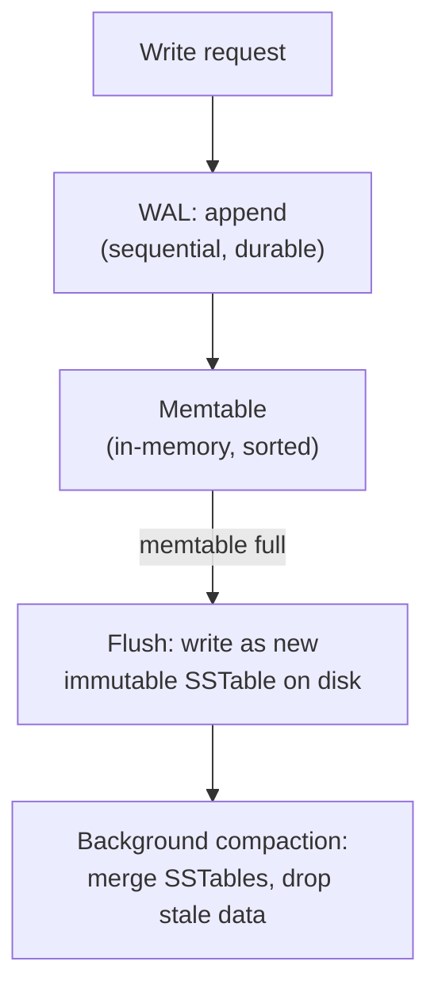

# Storage Engines: B-Tree vs. LSM-Tree

> [!abstract] What you'll be able to do after this chapter
> Explain the two fundamental strategies every database storage engine chooses between, derive why one is read-optimized and the other write-optimized from first principles (not memorized labels), and recognize this exact tradeoff every time it resurfaces later — Cassandra, MongoDB's WiredTiger, Postgres, and even Kafka's own log all make this same choice.

> [!info] The general theory underneath two chapters you may have already read
> [[CS Fundamentals/03 - Databases/Indexes & B+ Trees|Indexes & B+ Trees]] and [[CS Fundamentals/03 - Databases/Cassandra Internals|Cassandra Internals]] each describe **one specific, applied instance** of the two strategies this chapter generalizes. Read this chapter to understand *why* those two designs exist at all, not just how each one individually works.

---

## What is it, and why does it exist?

A storage engine is the part of a database actually responsible for getting data onto disk and back — independent of the query language sitting on top of it. SQL and NoSQL databases both need *some* storage engine underneath; the query language is a separate layer entirely.

**The problem this solves:** RAM is fast but volatile (data vanishes on power loss) and limited in size. Disk is durable and cheap per byte, but — per [[CS Fundamentals/00 - Computer Architecture/CPU, Memory & Cache Hierarchy|the Computer Architecture chapter's latency table]] — orders of magnitude slower than RAM, and critically, **disk strongly prefers sequential access over random access**. A storage engine's entire job is bridging "how the application wants to read/write data" with "how disk actually behaves well."

> [!example] Layman analogy
> A library. **Option A:** every time a new book arrives, immediately walk it to its exact correct shelf position, re-shuffling neighboring books if needed to keep everything alphabetically ordered — browsing is always fast (everything's in order), but every single new arrival costs a trip across the library. **Option B:** pile new arrivals on a "recent arrivals" cart, and only periodically walk the whole cart to the shelves at once, merging it into the ordered collection — adding a book is instant (just drop it on the cart), but a browser might need to check both the cart *and* the shelves to be sure they've found everything, until the next merge happens.

## Technical explanation

- **Page:** a fixed-size block of disk storage (typically 4-16KB) — matches the OS page size from [[CS Fundamentals/Operating Systems/Memory Management & Virtual Memory|the Memory Management chapter]], not a coincidence: I/O is naturally done in page-sized units at every layer.
- **Write-Ahead Log (WAL):** before modifying the actual data structure, the engine first appends a record of the intended change to a separate, sequential log file. If the process crashes mid-update, the WAL can be replayed on restart to recover exactly what was in progress — the universal durability primitive underneath nearly every database.
- **In-place update (B-Tree style):** modifying a page directly, at its existing location on disk.
- **Append-only + merge (LSM-Tree style):** never modifying existing data in place — always writing new data to a fresh location, and periodically merging/cleaning up in the background.

## Internal working

### B-Tree storage engines — read-optimized, in-place

Used by Postgres, MySQL's InnoDB, and MongoDB's WiredTiger. Data lives in disk pages organized as a B-Tree (full mechanics in [[CS Fundamentals/03 - Databases/Indexes & B+ Trees|Indexes & B+ Trees]]). A write means: find the correct page, read it in, modify it, write it back to its **same location** on disk.

> [!bug] Why random writes are the real cost here
> Each write potentially touches a page anywhere in the file — a **random** disk location, not a predictable sequential one. Even on SSDs (which don't have a physical read head to move, unlike spinning HDDs), random I/O patterns still carry real overhead versus sequential access. A workload with many scattered writes pays this cost on every single one.

### LSM-Tree storage engines — write-optimized, append-only

Used by Cassandra, RocksDB, LevelDB. A write never touches existing on-disk data — it's appended to a WAL, then added to an in-memory sorted structure (the **memtable**). When the memtable fills up, it's flushed to disk as an immutable, sorted file (an **SSTable** — Sorted String Table). Over time, a background process merges and cleans up SSTables (**compaction**), removing duplicate/overwritten/deleted entries.

> [!tip] Why this makes writes fast, precisely
> Every write is a sequential append — to the WAL, and eventually to a new SSTable file — never a random seek to an existing location. Sequential disk I/O is dramatically faster than random I/O at the hardware level, which is the entire reason this design exists. The cost is deferred: **reads** may need to check the memtable *and* multiple SSTables (since the value you want could be in any of them, or have been overwritten in a more recent one), and **compaction** consumes background I/O and CPU to keep that read cost bounded over time.

> [!success] This is exactly Cassandra's write path, generalized
> [[CS Fundamentals/03 - Databases/Cassandra Internals|Cassandra Internals]] describes precisely this model — memtable, commit log (its name for the WAL), SSTables, compaction, tombstones for deletes — as one concrete, fully-specified LSM-Tree implementation. This chapter is the theory Cassandra's design is an instance of.

### Mitigating LSM-Tree's read cost: Bloom filters

Checking every SSTable on every read would be slow. Each SSTable keeps a small [[Glossary/Bloom Filter|Bloom filter]] — a compact structure that can definitively say "this key is **not** in this SSTable" (skip it entirely) or "this key **might** be in this SSTable" (worth actually checking) — dramatically reducing how many SSTables a read needs to touch.

## Complexity comparison

| | B-Tree | LSM-Tree |
|---|---|---|
| Write | `O(log n)`, but may involve random I/O | `O(1)` amortized append — sequential, fast |
| Read | `O(log n)`, single well-ordered structure | Potentially checks multiple SSTables (mitigated by Bloom filters) |
| Space overhead | Lower — data stored once, in place | Higher — old/overwritten versions linger until compaction runs |
| Background cost | None specific to the storage model | Compaction — real, ongoing CPU/I/O cost |

## Tradeoffs

| | B-Tree | LSM-Tree |
|---|---|---|
| **Best for** | Read-heavy or balanced OLTP workloads | Write-heavy workloads (high ingest rate) |
| **Write amplification** | Lower | Higher — the same logical write gets physically rewritten multiple times across compaction cycles |
| **Maturity/tooling** | Very mature (decades of production use — Postgres, MySQL) | Mature but a newer design (Google's Bigtable paper, 2006) |
| **Real users** | Postgres, MySQL InnoDB, MongoDB's WiredTiger | Cassandra, RocksDB, LevelDB, HBase |

## Where this shows up later in this book

> [!info] The same theory, in five different places
> [[CS Fundamentals/03 - Databases/Indexes & B+ Trees|Indexes & B+ Trees]] (the B-Tree side, in full mechanical depth) · [[CS Fundamentals/03 - Databases/Cassandra Internals|Cassandra Internals]] (the LSM-Tree side, in full mechanical depth) · [[CS Fundamentals/03 - Databases/MongoDB Internals|MongoDB Internals]]'s WiredTiger engine (B-Tree-based) · [[CS Fundamentals/05 - Messaging & Streaming/Kafka Internals|Kafka Internals]]'s append-only log (the exact same "sequential writes are fast" principle, applied outside a traditional database entirely).

---

## Interview Q&A

> [!question]- Why would you choose an LSM-Tree engine over a B-Tree engine for a specific workload?
> When writes dominate — high-ingest logging, time-series data, event streams — LSM-Tree's append-only write path avoids the random-I/O cost B-Tree updates pay on every write. If the workload is read-heavy or has balanced read/write with lower write volume, B-Tree's simpler, single-structure reads usually win, and you avoid paying LSM-Tree's compaction overhead for no real write-side benefit.

> [!question]- What is write amplification, and why does it matter for LSM-Tree engines specifically?
> The same logical write ends up physically rewritten multiple times as compaction merges it from one SSTable level into the next over its lifetime — the actual disk I/O performed is a multiple of the original write size. This is a real, measurable operational cost (disk wear on SSDs, sustained background I/O competing with foreground traffic) that B-Tree engines, which update a value once in place, don't pay in the same way.

> [!question]- Why does almost every storage engine use a WAL, regardless of whether it's B-Tree or LSM-Tree based?
> Because durability requires SOME record of intent to exist before the (potentially slower, multi-step) actual data-structure update completes — if the process crashes between "started the update" and "finished the update," the WAL is what lets recovery know exactly what to redo. It's a universal primitive precisely because the durability problem it solves is the same regardless of which strategy the rest of the engine uses.

## Summary / Cheat Sheet

- **B-Tree engines:** in-place updates, read-optimized, mature, used by Postgres/MySQL/MongoDB's WiredTiger.
- **LSM-Tree engines:** append-only writes (WAL → memtable → SSTable → compaction), write-optimized, used by Cassandra/RocksDB/LevelDB.
- **WAL** is the universal durability primitive underneath both — sequential append before the real update, enabling crash recovery.
- The core tradeoff: **B-Tree pays cost on write** (random I/O to update in place); **LSM-Tree defers cost to background compaction and read-side lookups** (checking multiple SSTables, mitigated by Bloom filters).
- Sequential disk I/O beats random disk I/O at the hardware level — this single fact is *why* LSM-Tree exists at all.

---
*Related: [[CS Fundamentals/00 - Learning Path|CS Fundamentals Learning Path]] · [[CS Fundamentals/03 - Databases/Indexes & B+ Trees|Indexes & B+ Trees]] · [[CS Fundamentals/03 - Databases/Cassandra Internals|Cassandra Internals]] · [[Glossary/Bloom Filter|Bloom Filter]]*
