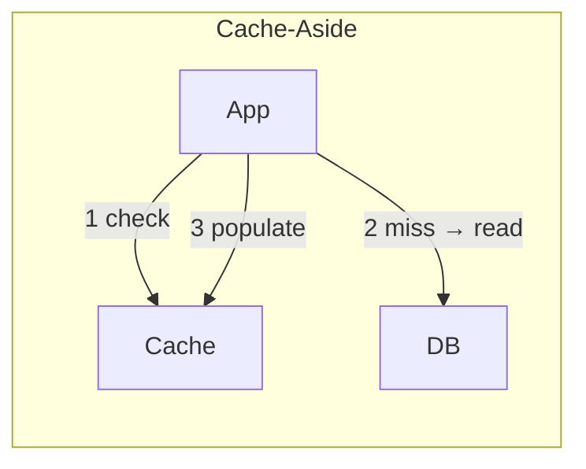
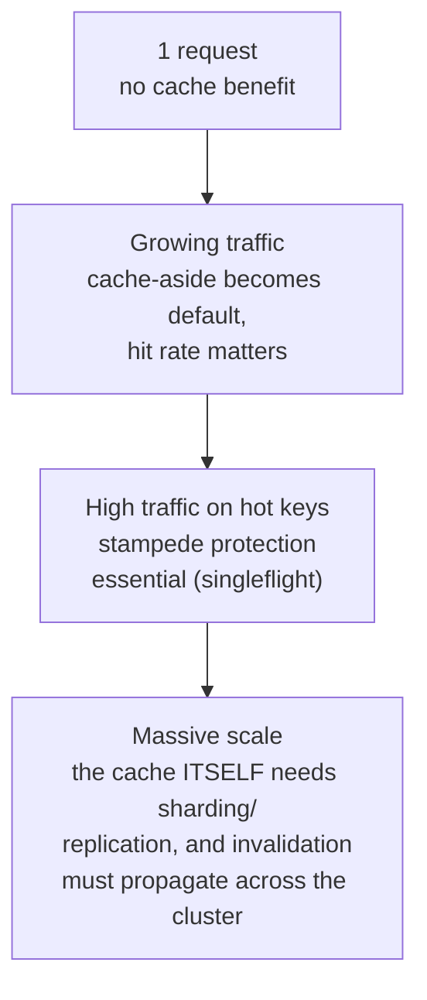

# Caching Strategies

> [!abstract] What you'll be able to do after this chapter
> Pick the right write strategy (cache-aside/write-through/write-back/refresh-ahead) for a given access pattern and justify it, explain LRU vs LFU with real implementation detail, and tell cache stampede and cache penetration apart — including the actual Go tool for fixing stampede.

---

## 1. Why caching works at all — the mechanism, not just "it's faster"

The memory hierarchy is a tradeoff: faster storage is smaller and more expensive (CPU registers → L1/L2/L3 → RAM → SSD → HDD → network). Caching exploits **locality of reference** — **temporal** locality (data accessed recently is likely accessed again soon) and **spatial** locality (nearby data is likely accessed together) — to keep the hot subset of data in a faster tier, without needing to keep *everything* there.

## 2. The four write strategies — and the real tradeoff each one makes

| Strategy | How it works | Wins | Costs |
|---|---|---|---|
| **Cache-aside** (lazy loading) | App checks cache first; on miss, reads DB, populates cache, returns. | Only requested data ever gets cached — no wasted space. Resilient — a cache outage just means every request falls through to the DB. | First request for any key always eats the full miss + DB-read penalty. A window exists where cache can go stale if the DB changes without explicit invalidation. |
| **Write-through** | Writes go to cache *and* DB together, synchronously, before returning success. | Cache is always consistent with the DB. | Write latency = both writes combined. Caches data that might never be read again. |
| **Write-back** (write-behind) | Writes go to cache immediately (marked dirty), flushed to DB asynchronously later, often batched. | Very fast writes; can coalesce multiple writes to the same key into one DB write. | **Real durability risk** — if the cache crashes before the async flush, that write is gone. This is a genuine cost to state plainly, not hand-wave past. |
| **Refresh-ahead** | Cache proactively re-fetches a key's value *before* it expires, predicting continued demand. | Avoids the "thundering herd on expiry" problem for specifically hot keys. | Wasted refresh work for keys that turn out not to be re-requested; needs access-pattern tracking, added complexity. |

## 3. Eviction policies — the actual implementation, not just the acronym

**LRU (Least Recently Used)**: evict whatever hasn't been touched in the longest time. Implemented in `O(1)` per operation via a **hash map + doubly linked list** — the hash map gives instant lookup, the linked list tracks recency order, moving a touched node to the front and evicting from the back. See [[DSA/Linked List/LRU Cache (LeetCode #146)|the exact working implementation]] already in this vault.

**LFU (Least Frequently Used)**: evict whatever is accessed least *often*, not least recently. Better than LRU for workloads with genuinely "hot forever" keys that a temporary burst of unrelated traffic might otherwise evict under pure LRU. The real implementation wrinkle: frequency counts need an **aging** mechanism, or an old key that was extremely popular once (high frequency count) but is now cold will never get evicted, permanently squatting on cache space — a subtlety worth naming if asked to implement LFU for real.

**Random / FIFO eviction**: simpler, no metadata tracking overhead at all — sometimes surprisingly competitive when the workload doesn't have strong recency/frequency skew, and always cheaper to implement/maintain than LRU/LFU bookkeeping.

## 4. Cache invalidation — "the two hard problems in computer science"

- **TTL-based**: simplest — set an expiry, forget about it. Doesn't guarantee freshness; stale data can be served for up to the full TTL window.
- **Explicit invalidation on write**: accurate, but every write path in the codebase must remember to invalidate — a common source of real bugs the moment someone adds a *new* write path and forgets this step.
- **Event-driven invalidation**: a change-data-capture stream (e.g. via [[CS Fundamentals/05 - Messaging & Streaming/Kafka Internals|Kafka]]) fires whenever the source of truth changes, triggering invalidation automatically — more robust, at the cost of more infrastructure to run.

## 5. Cache stampede (thundering herd) — and the real Go fix

A popular key **expires**, and many concurrent requests all miss **simultaneously**, all hammering the DB at once for the same data.

**Mitigations:**
1. **Locking / single-flight** — the first request to miss acquires a lock and repopulates the cache; every other concurrent request for the *same key* waits for that one repopulation instead of independently querying the DB.
2. **Probabilistic early expiration** — add jitter so that replicated copies of a hot key across a cluster don't all compute the same exact expiry instant.
3. **Never let specifically-hot keys fully expire** — refresh-ahead, targeted at the hottest subset.

> [!success] The actual tool, in Go
> `golang.org/x/sync/singleflight` does exactly mitigation #1 — `group.Do(key, fn)` ensures that if multiple goroutines call it concurrently with the same key, only one actually executes `fn` (the expensive DB read); the rest block and receive the same result once it completes. This is the direct, real-world, production answer to "how do you prevent cache stampede in Go," not just a description of the general idea.

## 6. Cache penetration — a different problem, often confused with stampede

Cache penetration is requests for keys that **don't exist in the DB at all** (an attacker probing random IDs, or a legitimate bug querying a nonexistent record). Since a "not found" result was never cached, **every** such request bypasses the cache and hits the DB, every single time.

**Mitigations:**
- **Cache the negative result too** — store "this key doesn't exist" with a short TTL, so repeated misses for the same nonexistent key don't repeatedly hit the DB.
- **[[Glossary/Bloom Filter|Bloom filter]] in front of the DB** — cheaply reject queries for keys that provably don't exist, before ever touching cache or DB at all.

## 7. Scaling: 1 request to a distributed cache cluster

At the largest scale, caching stops being "one cache in front of one database" — the cache layer itself becomes a distributed system, needing [[CS Fundamentals/06 - Distributed Systems/Consistent Hashing|consistent hashing]] or server-side sharding (per [[CS Fundamentals/04 - Caching/Redis Internals|Redis Cluster]]) to scale, and **invalidation must now propagate across every relevant shard/replica**, not just one in-process map — a genuinely harder version of the same "the two hard problems in computer science" challenge named above.

## 8. Failure scenarios

> [!bug] What actually happens
> - **The cache goes down entirely:** every request falls through to the database — which must now absorb the **full** load the cache was previously handling, a real capacity risk if the cache was absorbing the majority of read traffic, not just a graceful degradation.
> - **A forgotten invalidation path serves stale data indefinitely:** Section 4's real bug pattern — a new write path added later that doesn't know it needs to invalidate the cache, silently serving stale reads until the TTL (if any) eventually expires.
> - **A write-back cache crashes with unflushed dirty data:** the durability risk named in Section 2, made concrete — data acknowledged as "written" from the application's perspective is genuinely gone if the cache dies before the async flush to the database completes.

## 9. Monitoring

> [!info] What to watch
> **Cache hit rate** — the single most fundamental cache health metric; a decline signals either a changing access pattern or a cache too small for the current working set. **Eviction rate** — a rising rate confirms the cache is undersized relative to demand, not just an isolated blip. **Singleflight/stampede-collapse rate** — how often concurrent requests are being coalesced into one, a direct signal of how "hot" specific keys actually are in practice.

## 10. Common mistakes

> [!warning] Real, recurring errors
> 1. **Forgetting to invalidate on a newly-added write path** — Section 4's core, recurring bug pattern.
> 2. **Using write-back for data that can't tolerate loss** — trading real durability risk for write speed without deliberately deciding that tradeoff is acceptable for this specific data.
> 3. **Not distinguishing cache stampede from cache penetration** — Section 5 vs. Section 6; each needs a genuinely different fix, and applying the wrong one doesn't help.
> 4. **Setting TTLs uniformly across all keys** — ignoring that some keys are far hotter than others; a uniform TTL either wastes freshness on cold keys or under-protects hot ones from stampede risk.

---

## 🎯 Interview follow-up Q&A

> [!info] Leveled by seniority
> **Beginner:** "What is cache-aside?" — the app checks cache first, reads the DB on miss, then populates the cache. **Intermediate:** "What's the difference between cache stampede and cache penetration?" — Section 6's precise distinction. **Senior:** "A specific key's cache hit rate suddenly dropped to near-zero — diagnose it." — expects checking whether the key started expiring on a shorter cycle, was evicted due to memory pressure, or whether a bug is bypassing the cache-population step entirely, rather than guessing. **Staff:** "Design a caching strategy for a system where 1% of keys account for 90% of traffic." — expects refresh-ahead or dedicated stampede protection specifically for that hot 1%, distinct from the default policy for the long tail. **Architect:** "How would cache invalidation change as a single in-process cache grows into a distributed, multi-node cache cluster?" — expects Section 7's answer: invalidation must now be propagated across every relevant node, turning a previously-local operation into a genuinely distributed one with its own consistency considerations.

> [!quote]- "Cache-aside vs write-through — when would you pick each?"
> Cache-aside fits read-heavy, DB-of-record workloads where you want the cache to only ever hold what's actually been requested, and want resilience to cache outages (fall through to DB). Write-through fits workloads where read-after-write consistency matters and you're willing to pay write latency for it.
>
> **Follow-up: "What happens if a write-through's DB write succeeds but the cache write fails?"**
> The cache is now stale relative to the DB — a real failure mode worth designing for explicitly (e.g. treating the cache write as best-effort and relying on a short TTL as a backstop, or retrying the cache write with the DB write already having succeeded as the source of truth).

> [!quote]- "How do you prevent cache stampede on a viral key?"
> Single-flight — ensure only one request actually recomputes/refetches the value on a miss, while every concurrent request for the same key waits on that single in-flight computation instead of independently hitting the database.
>
> **Follow-up: "How does Go's `singleflight` package solve this specifically?"**
> `singleflight.Group.Do(key, fn)` deduplicates concurrent calls sharing the same key — the first caller executes `fn`, and every other concurrent caller for that same key blocks and receives the identical result, without `fn` ever running more than once concurrently for that key.

> [!quote]- "What's the difference between cache stampede and cache penetration?"
> Stampede is many concurrent requests for a key that's **popular but just expired**. Penetration is repeated requests for a key that **never existed in the first place**, so it never gets cached at all and every request pays the full DB round-trip forever.
>
> **Follow-up: "How does a Bloom filter help specifically with penetration?"**
> It lets you cheaply answer "does this key possibly exist?" before ever touching the cache or DB — a Bloom filter has no false negatives, so a "definitely not present" answer safely short-circuits the request entirely, without needing a DB round-trip to confirm the negative.

---
*Related: [[00 - Start Here/How This Handbook Works|Book Map]] · [[DSA/Linked List/LRU Cache (LeetCode #146)|LRU Cache implementation]] · [[Glossary/Bloom Filter|Bloom Filter]] · [[HLD/01 - Design TinyURL (URL Shortener)/Design TinyURL|Design TinyURL]]*
