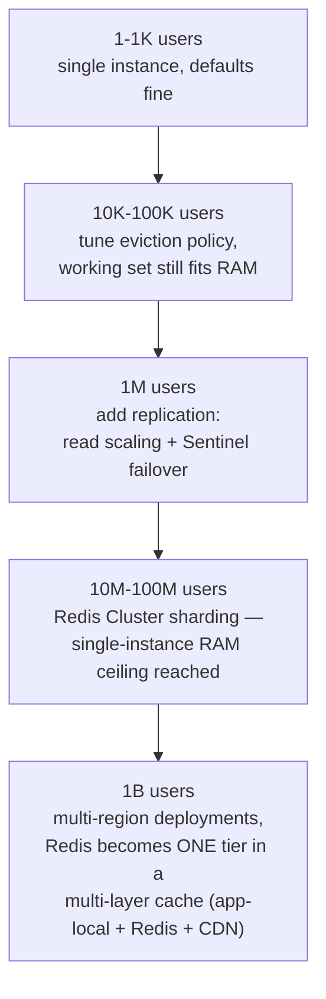

# Redis Internals

> [!abstract] What you'll be able to do after this chapter
> Explain why single-threaded Redis outperforms most multi-threaded stores for its workload, pick the right data structure for a given problem (not just "use a string"), justify RDB vs AOF, and explain hash-slot sharding precisely enough to contrast it with generic [[Glossary/Consistent Hashing|consistent hashing]].

---

## 1. Why Redis exists

A generic cache-in-front-of-a-database gets you fast key-value lookups, but a lot of real application logic — "top 10 scores," "is this user in the set of banned IDs," "push this job onto a queue" — still requires pulling data *out* of the cache and processing it in the application. Redis's actual pitch is different: it's an **in-memory data structure server** — push that logic **down into the data layer** by giving you rich, purpose-built types (not just strings) with atomic operations on them.

## 2. Single-threaded execution — and why that's a feature, not a limitation

> [!warning] Precision matters here
> Redis's **command execution** is single-threaded. Since Redis 6+, **I/O** (reading/writing client sockets) can be multi-threaded — these are two different things, and conflating them is a common imprecision.

Why single-threaded execution works well:
1. In-memory operations are fast enough that CPU is rarely the bottleneck for typical workloads — the win from parallelizing command execution would be small.
2. It **eliminates lock contention entirely** for command execution — no mutex around shared data structures, no context-switch overhead, no risk of the exact class of [[Glossary/Race Condition|race conditions]] a multi-threaded design would need to guard against.
3. Built on an **event loop** (epoll/kqueue-based I/O multiplexing) — handles many concurrent client connections without one-OS-thread-per-connection.

## 3. Data structures — pick the one that matches the problem

| Type | Backing structure | Real use case |
|---|---|---|
| **String** | Binary-safe byte string | Simple caching, atomic counters (`INCR`) |
| **List** | Linked list | Queues (`LPUSH`/`RPOP`) |
| **Set** | Hash table | Unique membership, `O(1)` membership checks |
| **Hash** | Hash table of field→value | Representing an object's fields under one key, without needing N separate keys |
| **Sorted Set (ZSET)** | **Skip list + hash table combo** | `O(log n)` insertion *and* `O(log n)` range-by-score queries — the exact data structure behind real-time leaderboards |

> [!tip] The Sorted Set is the interview-favorite detail
> A skip list is a probabilistic, multi-level linked list giving `O(log n)` search without the rebalancing complexity of a tree. Combined with a hash table (for `O(1)` "what's this member's current score" lookups), ZSET gives Redis both fast score-based range queries *and* fast individual-member lookups from one structure — worth naming both halves of the combo, not just "it uses a skip list."

## 4. Persistence — RDB vs AOF, and why you'd use both

- **RDB (snapshot):** a periodic, point-in-time binary dump of the entire dataset. Fast to load on restart, compact on disk. **Data since the last snapshot is lost on crash.**
- **AOF (append-only file):** every write operation is logged; replayed on restart to rebuild state. Configurable fsync policy (`always`/`everysec`/`never`) trades durability directly against write throughput. Larger on disk, slower to replay than RDB (mitigated by periodic AOF rewrite/compaction).

> [!success] Real production configuration
> Running **both together** is common: AOF as the durable source of truth (minimal data loss), RDB snapshots for fast cold-start recovery — the combination trades a bit of disk space for both fast restarts *and* strong durability, rather than picking one weakness to live with.

## 5. Replication & sharding

**Replication:** leader-follower (master-replica), **asynchronous by default** — meaning a follower can lag behind the leader, a real consideration if you're reading from replicas expecting strong consistency. **Redis Sentinel** monitors leader health and automates failover (electing a new leader among replicas) for a single logical dataset.

**Redis Cluster (sharding):** uses **hash slots** — 16,384 fixed slots, each key mapped to a slot via `CRC16(key) mod 16384`, each slot owned by a specific node.

> [!bug] Different mechanism from generic consistent hashing — say this explicitly
> [[Glossary/Consistent Hashing|Consistent hashing]] (as used in Dynamo-style systems) maps keys and nodes onto a continuous ring, remapping only a fraction of keys when a node joins/leaves. Redis Cluster instead uses a **fixed number of discrete slots**, reassigned in whole-slot chunks between nodes during resharding — conceptually related (both minimize full-dataset remapping on topology change) but a genuinely different mechanism, worth distinguishing precisely if asked to compare.

## 6. Why Redis is fast — the actual mechanics

Everything lives in RAM (no disk seek on the read path at all). Single-threaded execution avoids lock overhead entirely. Purpose-built data structures (skip lists, hash tables) keep every operation at its structure's optimal complexity. A simple text protocol (RESP) keeps parsing overhead minimal per command.

## 7. When NOT to use Redis

Dataset far exceeding available RAM — Redis isn't designed as a primary store for huge, mostly-cold datasets; a disk-based store fits better. Complex relational queries/joins — Redis has no query planner or join capability; that's not its job. Needing the strongest possible synchronous durability on *every* write (`AOF fsync=always`) has a real, measurable throughput cost — for that specific critical-path data, a proper WAL-backed relational DB with real replication guarantees may be the better fit.

## 8. Scaling: Redis from 1 user to 1 billion

At small scale, a single instance with sane defaults is genuinely sufficient — resist the urge to add replication or clustering before the data justifies it. The first real inflection point is **memory pressure**: once the working set approaches available RAM, eviction policy (`maxmemory-policy`) stops being a default nobody thinks about and becomes an active capacity decision. The second inflection point is **RAM ceiling per instance** — no single machine has unlimited memory, forcing Redis Cluster's hash-slot sharding once the dataset genuinely can't fit on one node. At the largest scale, Redis stops being "the cache" and becomes one tier among several (local in-process cache, Redis, CDN edge) — the same tiering principle already covered generally in [[CS Fundamentals/04 - Caching/Caching Strategies|Caching Strategies]].

## 9. Failure scenarios

> [!bug] What actually happens when each component fails
> - **Redis instance crashes, no persistence configured:** all data lost — acceptable for a pure cache-aside deployment (the database is the source of truth, the cache just repopulates on next access), catastrophic if Redis was treated as a primary store.
> - **Leader crashes in a replicated setup:** Sentinel detects the failure (via a quorum of Sentinel processes, not a single one — a single Sentinel would itself be a single point of failure for failover detection) and promotes a replica. Since replication is asynchronous by default, any writes not yet propagated to the promoted replica at the moment of the crash are lost.
> - **A node in Redis Cluster goes down:** the hash slots it owned become unavailable until a configured replica for those slots is promoted — if no replica exists for that node's slots, that portion of the keyspace is simply unreachable until the node recovers.
> - **Memory exhaustion:** without an eviction policy configured, Redis refuses new writes once `maxmemory` is hit rather than crashing or corrupting existing data — a deliberate, safe failure mode worth naming precisely rather than assuming Redis just "breaks" under memory pressure.

## 10. Monitoring

> [!info] What to watch
> **Memory:** `used_memory` vs. `maxmemory` — the leading indicator before eviction or write-rejection kicks in. **Hit rate:** `keyspace_hits` vs. `keyspace_misses` — a declining hit rate signals either a changing access pattern or a cache too small for its working set. **`evicted_keys`:** a rising count means the eviction policy is actively discarding data under memory pressure — worth alerting on, not just observing. **Replication lag:** the gap between `master_repl_offset` and each replica's offset — directly determines how stale a read-from-replica can be. **Slow log:** Redis's built-in `SLOWLOG` surfaces exactly which commands are blocking the single execution thread longest — the direct monitoring tool for catching the `O(n)` blocking-command problem before it becomes a production incident.

## 11. Common mistakes

> [!warning] Real, recurring production errors
> 1. **Running `KEYS *` (or any unbounded `O(n)` command) in production** — blocks every other client for the command's full duration, since command execution is single-threaded. Use `SCAN` (cursor-based, incremental) instead.
> 2. **No eviction policy and no TTLs set** — the dataset grows unbounded until `maxmemory` is hit, then writes start failing with no warning if nobody was watching the memory metric.
> 3. **Treating Redis as a primary datastore without understanding the durability tradeoff** — RDB alone loses everything since the last snapshot on a crash; this is fine for a cache, a real problem if Redis is (incorrectly) the only copy of important data.
> 4. **Storing very large values under a single key** — a multi-megabyte JSON blob under one key means any operation touching it (even a simple `GET`) both blocks the single execution thread for longer and costs real network transfer time.
> 5. **Ignoring hot keys under Redis Cluster** — sharding distributes *different* keys evenly, but one extremely popular single key still lives entirely on one node/slot — "we sharded it" doesn't fix a genuinely hot individual key, the same hot-key reasoning already covered in [[CS Fundamentals/06 - Distributed Systems/Sharding & Partitioning|Sharding & Partitioning]].

---

## 🎯 Interview follow-up Q&A

> [!info] Leveled by seniority — the kind of follow-up expected at each level
> **Beginner:** "What is Redis used for?" — fast key-value caching in front of a slower primary datastore. **Intermediate:** "Why is single-threaded Redis fast?" — no lock contention, in-memory access, purpose-built data structures (Section 6). **Senior:** "How would you handle a hot key under Redis Cluster?" — split the hot key into several sub-keys (e.g. append a random suffix) and fan reads out across them, the same fix already named for hot shards generally. **Staff:** "Design a caching strategy for a globally distributed application with users on three continents." — layered tiering (local app cache → regional Redis clusters → CDN for static content), with explicit reasoning about cross-region replication lag and which data can tolerate it. **Architect:** "How would you decide between Redis, Memcached, and a local in-process cache for a specific latency-critical read path, accounting for operational cost at scale?" — expects a real, prioritized tradeoff walk-through: local cache for the absolute hottest, smallest data (zero network hop, but per-instance, not shared); Redis when rich data structures or persistence matter; Memcached when the workload is purely simple key-value at very high raw throughput and Redis's extra features aren't needed.

> [!quote]- "Why is Redis fast despite being single-threaded?"
> In-memory access removes disk latency entirely; single-threaded command execution removes lock/context-switch overhead; purpose-built data structures keep every operation near-optimal complexity for its use case.
>
> **Follow-up: "Doesn't single-threaded execution mean one slow command blocks every other client?"**
> Yes — this is a genuine, real production gotcha. An `O(n)` command like `KEYS *` on a large dataset, or an unbounded range query on a huge sorted set, blocks *every* other client for its duration. The fix: avoid `O(n)` blocking commands in production (use `SCAN`, which is cursor-based and incremental, instead of `KEYS`), and be deliberate about which commands can run against large collections.

> [!quote]- "RDB or AOF — which would you use?"
> Depends on the durability/performance tradeoff needed — but in practice, most production Redis deployments use **both together**: AOF for durability, RDB for fast cold-start recovery.
>
> **Follow-up: "Why would you use both instead of picking the stronger one (AOF) alone?"**
> AOF replay on restart is slower than loading an RDB snapshot — combining both means restarting from the (fast) RDB snapshot and then replaying only the (smaller) AOF segment written since that snapshot, getting both fast recovery and strong durability rather than trading one for the other.

> [!quote]- "How does Redis Cluster shard data across nodes?"
> Via 16,384 fixed hash slots, each key assigned to a slot by `CRC16(key) mod 16384`, and each slot owned by a specific node.
>
> **Follow-up: "How is this different from consistent hashing?"**
> Consistent hashing maps keys and nodes onto a continuous ring and remaps only a thin slice of keys near a topology change. Redis Cluster instead reassigns whole discrete slots between nodes during resharding — a fixed, coarser-grained partitioning scheme rather than a continuous ring.

---
*Related: [[00 - Start Here/How This Handbook Works|Book Map]] · [[CS Fundamentals/04 - Caching/Caching Strategies|Caching Strategies]] · [[Glossary/Consistent Hashing|Consistent Hashing]]*
