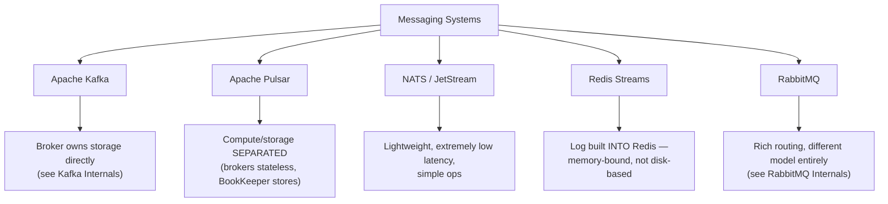
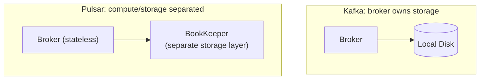

# Kafka Alternatives: Pulsar, NATS & Redis Streams

> [!abstract] What you'll be able to do after this chapter
> Explain Pulsar's genuinely different architectural choice (separating compute from storage) precisely rather than calling it "another Kafka," and know exactly which of these four systems fits a given workload instead of defaulting to Kafka for everything.

---

## The big picture

## Apache Pulsar — the same log model, a genuinely different architecture

> [!success] The real, precise distinction — not just "another Kafka"
> [[CS Fundamentals/05 - Messaging & Streaming/Kafka Internals|Kafka's]] brokers directly own and store partition data on local disk — a broker failure means that data must be re-replicated from surviving ISR members. Pulsar **separates compute from storage entirely**: brokers are stateless (they just serve reads/writes and route traffic), while actual data lives in a separate distributed storage layer called **BookKeeper**. A broker crashing in Pulsar doesn't require re-replicating anything — the data was never tied to that broker in the first place; a different broker just picks up serving the same topic, reading from the same underlying storage.

This makes Pulsar's broker-failure recovery structurally simpler (no re-replication needed, just redirect traffic to another stateless broker) at the cost of a genuinely more complex overall system (two distinct clusters — brokers and BookKeeper — to operate instead of one).

## NATS / JetStream — lightweight, latency-first

NATS core is an extremely lightweight, low-latency publish/subscribe system, historically without persistence (messages not durably stored — fire and forget, by design, for maximum speed). **JetStream** adds persistence and replay on top of NATS core, closer to Kafka's durability model, but the system as a whole remains simpler to operate than Kafka. NATS fits latency-sensitive service-to-service messaging where operational simplicity and minimal latency matter more than Kafka's massive-throughput event-streaming design point.

## Redis Streams — a log built into a system you may already run

Redis Streams is an append-only log **data structure inside Redis itself** — reusing [[CS Fundamentals/04 - Caching/Redis Internals|Redis's existing single-threaded, in-memory architecture]] already covered in depth. If a system already runs Redis, adding stream-based messaging needs no new infrastructure at all — a real, meaningful operational simplicity win.

> [!bug] The real capacity ceiling, precisely
> Redis Streams inherits Redis's fundamental constraint: **data lives in memory**. Kafka's retention is disk-based and routinely holds far more data than fits in RAM, for far longer. Redis Streams is a poor fit for high-volume, long-retention event streaming — it's a strong fit for smaller-scale, latency-sensitive streaming where the data volume genuinely fits comfortably in memory.

## Comparison table

| | Kafka | Pulsar | NATS/JetStream | Redis Streams | RabbitMQ |
|---|---|---|---|---|---|
| **Storage model** | Broker-owned disk | Separated (BookKeeper) | Disk (JetStream) | In-memory | Broker-owned |
| **Throughput ceiling** | Very high (millions/sec) | Very high, comparable to Kafka | High, lower than Kafka at extreme scale | Bound by available RAM | Moderate (thousands-tens of thousands/sec) |
| **Operational complexity** | High | Higher (two systems: brokers + BookKeeper) | Low | Low if already running Redis | Moderate |
| **Best fit** | High-volume event streaming, replay, multiple independent consumers | Same as Kafka, plus wanting simpler broker-failure recovery | Latency-sensitive service messaging, simple ops | Small-scale streaming, already-Redis shops | Complex routing, moderate volume |

## Where this shows up later

> [!success] Direct connections
> [[CS Fundamentals/05 - Messaging & Streaming/Kafka Internals|Kafka Internals]] and [[CS Fundamentals/05 - Messaging & Streaming/RabbitMQ Internals|RabbitMQ Internals]] — the two systems most of this handbook's HLD chapters actually reach for; this chapter exists to answer "what about the alternatives" precisely rather than leave it unaddressed. [[CS Fundamentals/04 - Caching/Redis Internals|Redis Internals]] — Redis Streams' single-threaded, in-memory foundation is exactly what's already covered there.

---

## Interview Q&A

> [!question]- When would you genuinely choose Pulsar over Kafka, not just as a Kafka clone?
> When broker-failure recovery time is a critical concern (Pulsar's stateless brokers mean failover doesn't wait on re-replication), or when you specifically want to scale compute (brokers) and storage (BookKeeper) independently of each other — Kafka couples the two since brokers own their own storage directly.

> [!question]- Why wouldn't you just always use Kafka, given it's the most widely adopted and highest-throughput option?
> Kafka's operational complexity and infrastructure footprint are real costs — for a system with genuinely modest messaging needs, or one that already runs Redis and needs simple streaming, adopting a full Kafka cluster is the same category of premature-complexity mistake already named for microservices and Kubernetes elsewhere in this book: real power, unnecessary cost if the workload doesn't need it.

> [!question]- What's the practical risk of choosing Redis Streams for a workload that later outgrows memory capacity?
> Once stream data volume approaches available RAM, you're forced into either aggressive trimming (losing retention/replay capability) or a costly migration to a disk-based system like Kafka — worth sizing this risk explicitly before adopting Redis Streams for anything with unclear or growing volume, rather than discovering the ceiling in production.

## Summary / Cheat Sheet

- **Pulsar**: same log model as Kafka, but **separates compute (brokers) from storage (BookKeeper)** — simpler broker-failure recovery, more complex overall system.
- **NATS/JetStream**: lightweight, low-latency, simple ops — fits service-to-service messaging more than high-volume event streaming.
- **Redis Streams**: a log built into Redis — zero new infrastructure if already running Redis, but **memory-bound**, not disk-based like Kafka.
- Default to Kafka for high-volume event streaming with replay; consider the alternatives specifically for their named, real advantages — not as generic substitutes.

---
*Related: [[CS Fundamentals/00 - Learning Path|CS Fundamentals Learning Path]] · [[CS Fundamentals/05 - Messaging & Streaming/Kafka Internals|Kafka Internals]] · [[CS Fundamentals/04 - Caching/Redis Internals|Redis Internals]]*
