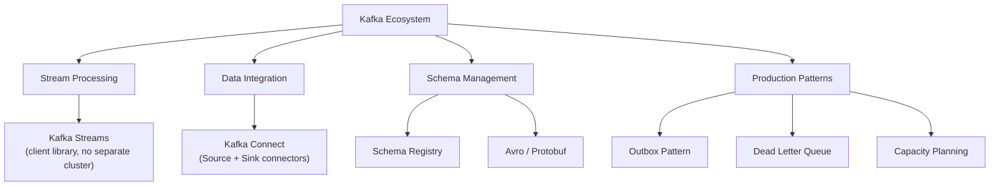
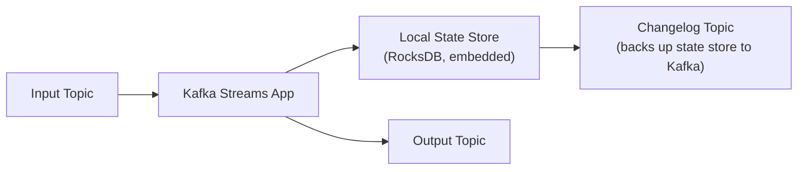
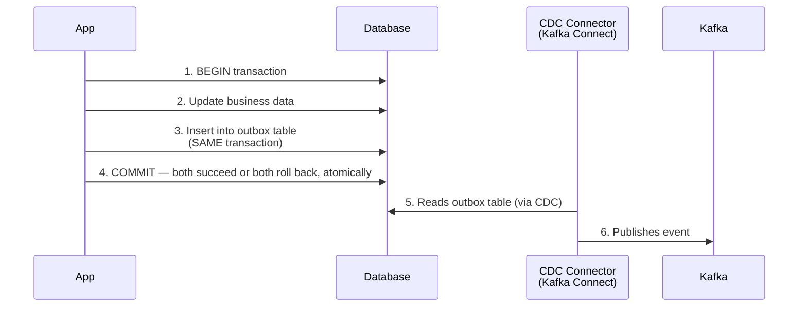

# Kafka Ecosystem & Production Patterns

> [!abstract] What you'll be able to do after this chapter
> Explain what Kafka Streams and Kafka Connect actually solve beyond raw producer/consumer code, state precisely why a Schema Registry exists (and what breaks without one), and implement the Outbox Pattern correctly — the standard fix for the "update my database AND publish an event, atomically" problem that a naive dual-write can't solve.

> [!info] Builds directly on Kafka Internals
> [[CS Fundamentals/05 - Messaging & Streaming/Kafka Internals|Kafka Internals]] covers the core mechanics — partitions, replication, delivery guarantees. This chapter covers the ecosystem built *on top* of that core, and the production-grade patterns real systems need when using it.

---

## The big picture

## Kafka Streams — stream processing without a separate cluster

Kafka Streams is a **client library**, not a separate infrastructure component — an application links it in and processes Kafka topics directly, with no dedicated processing cluster (unlike Spark or Flink).

- **KStream:** a record stream — every event is independent (think: every individual page view).
- **KTable:** a changelog/current-state view — the latest value per key (think: a user's current profile) — built on exactly the [[CS Fundamentals/05 - Messaging & Streaming/Kafka Internals|log compaction concept]] already covered: a KTable is conceptually a compacted topic, materialized as queryable state.

> [!tip] Why the local state store has a changelog topic behind it
> Stateful operations (aggregations, joins) need to remember data across events — Kafka Streams keeps that state in a local, embedded store (RocksDB) for fast access, but continuously backs it up to a dedicated **changelog topic** in Kafka. If the application instance crashes and restarts (or moves to another machine), it rebuilds its local state by replaying the changelog — the same "the log is the source of truth, local state is just a cache of it" principle as [[CS Fundamentals/03 - Databases/Storage Engines - B-Tree vs LSM-Tree|the Storage Engines chapter's]] WAL-based recovery, applied here to stream processing state instead of database pages.

## Kafka Connect — data integration without custom code

Kafka Connect is a framework for moving data **into** Kafka (Source Connectors) and **out of** Kafka (Sink Connectors) without writing custom producer/consumer code for every integration.

- **Source Connector example:** a CDC (Change Data Capture) connector reading a database's write-ahead log and publishing each row change as a Kafka event — the exact mechanism [[HLD/23 - Design an E-commerce System/Design an E-commerce System|the E-commerce chapter's]] search-index-sync pipeline depends on.
- **Sink Connector example:** consuming a topic and writing each record into Elasticsearch, S3, or another database — standardized, configuration-driven, not hand-rolled per integration.

## Schema Registry — the problem it exists to solve

> [!bug] Without it, an independent producer deploy can silently break every consumer
> Producers and consumers of a Kafka topic are deployed independently, on their own schedules. If a producer changes its message format (renames a field, changes a type) with no shared contract, every consumer expecting the old format can break — or worse, silently misinterpret the new data without erroring at all. **Schema Registry** stores every schema version centrally, and enforces **compatibility rules** (backward-compatible: new schema can read old data; forward-compatible: old schema can read new data) *before* allowing a new schema to be registered — catching a breaking change at publish time, not in a downstream consumer's production incident weeks later.

## Avro & Protobuf — why binary formats, paired with Schema Registry

Both are binary serialization formats (vs. plain JSON) offering smaller payload size, faster serialization/deserialization, and — critically — explicit **schema evolution** rules (which field changes are safe, which aren't). Kafka messages typically carry just a small schema-ID reference (looked up in Schema Registry) rather than the full schema itself, keeping messages compact while still fully self-describing to any consumer that resolves the ID.

## Production pattern: the Outbox Pattern

> [!warning] The problem: updating a database AND publishing an event isn't atomic by default
> An application often needs to update its own database *and* publish a Kafka event about that change — a naive "write to DB, then publish to Kafka" is two separate operations against two separate systems. If the process crashes between them, you get a DB update with no event (consumers never learn about it) or, in the reverse order, an event with no committed DB change (consumers act on something that didn't actually happen).

The fix: write the event to an **outbox table** in the **same database transaction** as the actual business data change — atomic, since it's one transaction in one database. A separate process (commonly a Kafka Connect CDC source connector) reads the outbox table asynchronously and publishes to Kafka. The dual-write problem is solved by making it not a dual-write at all — only the database write is atomic and required; publishing to Kafka becomes a reliable, asynchronous *consequence* of that single atomic write, not a second thing that needs to succeed at the same instant.

## Production pattern: Dead Letter Queue, Kafka-style

> [!info] Kafka has no native DLX like RabbitMQ — the pattern is different
> [[CS Fundamentals/05 - Messaging & Streaming/RabbitMQ Internals|RabbitMQ's dead-letter exchange]] is a broker-native feature. Kafka's equivalent is an **application-level convention**: a consumer that fails to process a message publishes it to a separate **retry** or **dead-letter topic** instead of crashing or blocking the main partition — letting the main topic's offset keep advancing while failed messages get investigated (or retried with backoff) separately, out of band.

## Capacity planning

**Partition count:** roughly `target throughput ÷ per-partition throughput ceiling`, with headroom for future growth — but more partitions isn't free, since [[CS Fundamentals/05 - Messaging & Streaming/Kafka Internals|each partition adds per-broker replication and file-handle overhead]] already noted in the core chapter. **Broker sizing:** driven by aggregate disk (retention × throughput), network bandwidth (replication traffic multiplies write bandwidth by the replication factor), and memory (page cache sizing directly affects how much read traffic is served from RAM vs. disk).

## Kafka vs. the alternatives — quick reference

> [!info] Full comparison
> [[CS Fundamentals/05 - Messaging & Streaming/Kafka Alternatives - Pulsar, NATS and Redis Streams|Kafka Alternatives: Pulsar, NATS & Redis Streams]] covers Pulsar, NATS, and Redis Streams in depth. [[CS Fundamentals/05 - Messaging & Streaming/RabbitMQ Internals|RabbitMQ Internals]] and [[CS Fundamentals/05 - Messaging & Streaming/Kafka Internals|Kafka Internals']] own comparison table cover Kafka vs. RabbitMQ specifically.

---

## Interview Q&A

> [!question]- Why does a KTable need a changelog topic if it's just "current state"?
> Because the KTable's state lives in a local, in-process store (RocksDB) for fast access — if that process crashes, the local store is gone. The changelog topic is what makes that state durable and recoverable: Kafka (the log) is always the source of truth, and the local store is rebuildable from it, never the other way around.

> [!question]- Why not just have producers and consumers agree on a schema informally, without a Schema Registry?
> Informal agreement works until it doesn't — the moment two teams deploy independently and one changes a field without the other knowing, you get silent data corruption or consumer crashes discovered in production, not at deploy time. Schema Registry converts an informal, error-prone social agreement into an enforced, versioned contract checked automatically before a breaking change can even be published.

> [!question]- Why is the Outbox Pattern preferred over just retrying the Kafka publish if it fails after the DB commit?
> Retrying blindly reintroduces the exact problem: if the process crashes before the retry logic even runs, the event is still lost, since nothing durable recorded "this event needs to be published" outside of in-memory application state. The outbox table itself IS that durable record — even a process crash immediately after the DB commit leaves the outbox row in place for the CDC connector to eventually pick up and publish.

## Summary / Cheat Sheet

- **Kafka Streams** = stream processing library, no separate cluster; **KTable** state is durable via a changelog topic, the log is always the source of truth.
- **Kafka Connect** = standardized data movement in/out of Kafka via Source/Sink connectors — no custom integration code.
- **Schema Registry** = enforces compatibility rules on schema changes *before* they can break consumers.
- **Avro/Protobuf** = compact, schema-evolution-aware binary formats, paired with Schema Registry.
- **Outbox Pattern** = write the event to a table in the SAME DB transaction as the business data change; a CDC connector publishes it asynchronously — solves the atomic-dual-write problem by not requiring a dual write at all.
- **Kafka's DLQ** = an application-level convention (a separate retry/dead-letter topic), not a broker-native feature like RabbitMQ's DLX.

---
*Related: [[CS Fundamentals/00 - Learning Path|CS Fundamentals Learning Path]] · [[CS Fundamentals/05 - Messaging & Streaming/Kafka Internals|Kafka Internals]] · [[CS Fundamentals/05 - Messaging & Streaming/Kafka Alternatives - Pulsar, NATS and Redis Streams|Kafka Alternatives]] · [[HLD/23 - Design an E-commerce System/Design an E-commerce System|Design an E-commerce System]]*
