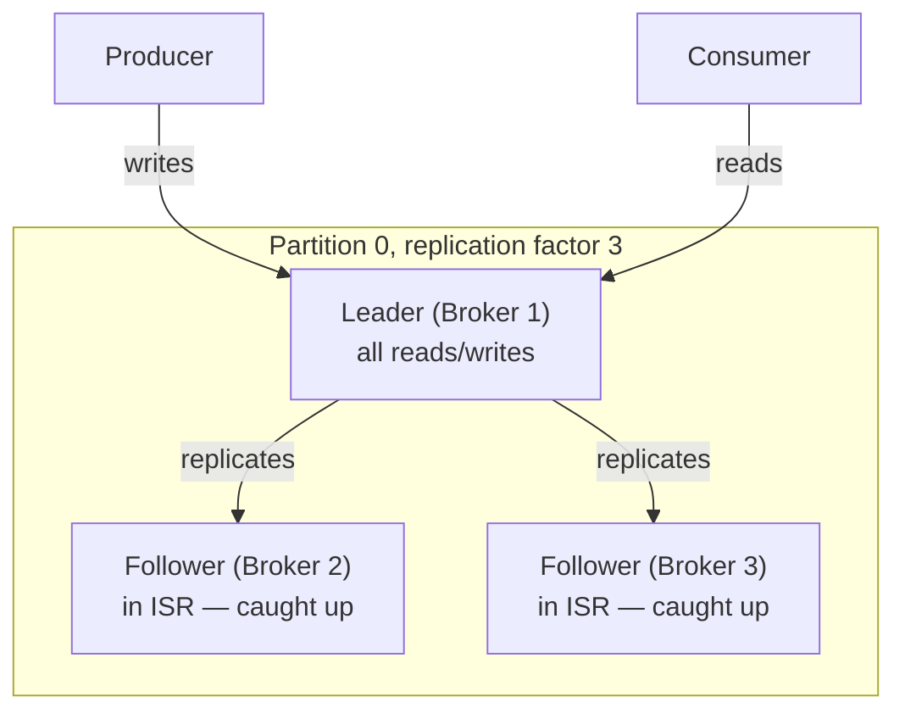
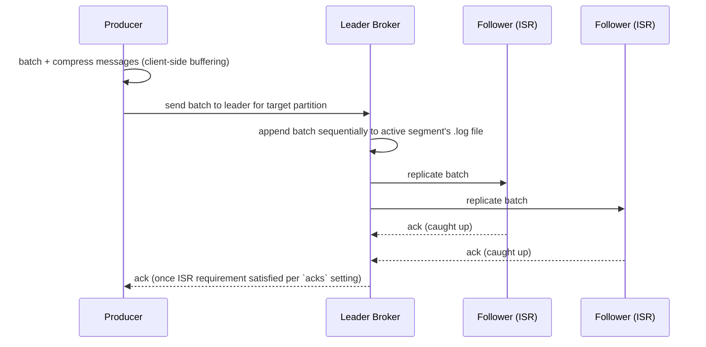
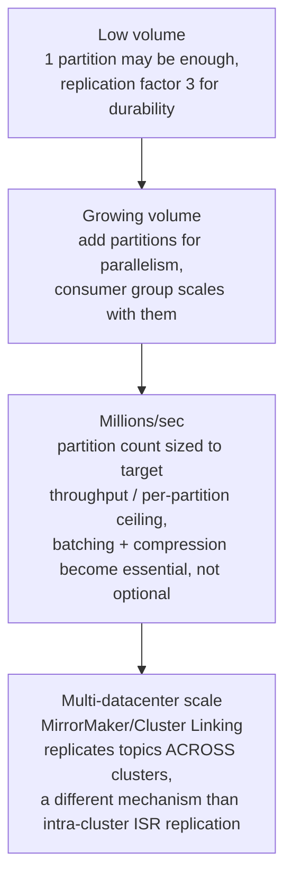

# Kafka Internals

> [!abstract] What you'll be able to do after this chapter
> Explain why Kafka exists and what it replaced, draw its broker/partition/replication architecture from memory, trace a message from `producer.Send()` to `consumer.Poll()` at the byte level, reason about exactly-once vs at-least-once with the actual config knobs, and answer "why is Kafka fast" with real mechanics instead of "because it's distributed."

---

## 1. Why Kafka was created — the problem before it existed

LinkedIn, circa 2010, had a real problem: dozens of systems needed to exchange high-volume event data (page views, clicks, application logs, metrics) with each other. Point-to-point integrations between every pair of systems became an unmaintainable mesh. Traditional message brokers of the era (ActiveMQ, RabbitMQ) were built around a different assumption: messages are **consumed once and discarded**, throughput expectations were in the thousands of messages/sec, and per-message bookkeeping (acknowledgment tracking, complex routing) was fine because volume was modest.

LinkedIn's actual numbers didn't fit that model — they needed **millions of events per second**, **multiple independent consumers reading the same stream** (one team building real-time analytics, another building a recommendation pipeline, another archiving to storage — all from the *same* underlying event, without knowing about each other), and the ability to **replay history** (a new consumer coming online later should be able to read from the beginning, or from any past point, not just "from now on").

That reframing — a message broker isn't a mailbox, it's a **distributed, append-only, replicated commit log that consumers read from independently at their own pace** — is Kafka. It's less "smarter RabbitMQ" and more "we modeled the problem completely differently."

| | Traditional MQ (RabbitMQ/ActiveMQ) | Kafka |
|---|---|---|
| Delivery model | Push — broker pushes to consumer | Pull — consumer pulls at its own pace |
| After consumption | Message typically deleted | Message retained (by time/size, or forever with compaction) |
| Multiple independent consumers of the same message | Needs fan-out exchanges/multiple queues, each a separate copy | Free — each consumer group tracks its own offset over the same log |
| Replay | Generally not supported | Native — just reset the offset |
| Ordering | Per-queue, broker-managed | Per-partition, client-managed via keying |
| Throughput ceiling | Thousands–tens of thousands/sec typical | Millions/sec per cluster, by design |
| Routing flexibility | Rich (exchanges, routing keys, topic matching) | Simple (topic + partition key) — a real limitation, not just a tradeoff |

---

## 2. The core architecture — every concept, in dependency order

### Topic & Partition
A **topic** is a named logical stream (`orders`, `page-views`). A topic is split into **partitions** — each partition is an independent, ordered, append-only log. Splitting into partitions is *the* mechanism for parallelism: each partition can be written to and read from independently, on different brokers, by different consumers.

> [!warning] The ordering guarantee people get wrong
> Kafka guarantees ordering **only within a single partition** — never across partitions of the same topic. If two events must be processed in order relative to each other, they must be **keyed** to land on the same partition (Kafka hashes the key to pick a partition deterministically). This is why "use `user_id` as the partition key" is such a common design choice — it guarantees per-user ordering while still spreading different users across partitions for parallelism.

### Broker
A **broker** is a single Kafka server process. A **cluster** is a set of brokers. Each broker holds a subset of partitions across all topics — no single broker needs to hold an entire topic.

### Segment — how a partition is actually stored on disk
A partition's log isn't one giant file — it's split into **segments**: a sequence of files, each capped at a configured size (e.g. 1GB) or age. Each segment is really three files sharing a base offset as their name:
- `00000000000000368769.log` — the actual message data, append-only.
- `00000000000000368769.index` — a **sparse** offset index (doesn't index every message — indexes every Nth byte range, then does a short linear scan from there) mapping logical offset → physical byte position in the `.log` file.
- `00000000000000368769.timeindex` — same idea, but timestamp → offset, enabling "give me messages since 3pm."

Only the newest segment (the **active segment**) is ever appended to. Older segments are immutable — this is what makes **retention** cheap: deleting old data is just deleting whole segment files, never rewriting or scanning through the log to find what to remove.

### Replication & ISR (In-Sync Replicas)
Each partition has a configured **replication factor** (commonly 3) — the partition's data is copied to that many brokers. One replica is the **leader** (all reads and writes for that partition go through it); the rest are **followers**, continuously pulling new data from the leader.

The **ISR** is the subset of replicas — leader included — that are fully caught up with the leader within a configured lag tolerance (`replica.lag.time.max.ms`). This is the single most important reliability concept in Kafka: **only ISR members are eligible to become the new leader** if the current leader dies. That's what prevents data loss — a replica that's fallen behind can never "win" leadership and silently roll back committed data.

### Controller & Leader Election
One broker in the cluster is elected the **controller** — the coordinator responsible for tracking which brokers are alive, and for triggering **leader election** when a partition's leader dies (picking a new leader from that partition's ISR). Historically this coordination ran through **ZooKeeper**; modern Kafka (post-KIP-500, the **KRaft** mode) replaces ZooKeeper with Kafka's own Raft-based consensus among a small set of controller nodes — same job, one less external dependency to operate.

### Consumer Group & Offset
A **consumer group** is a named set of consumers cooperating to read a topic. Kafka's load-balancing guarantee: **each partition is assigned to at most one consumer within a group at a time** — so a topic with 12 partitions can be consumed in parallel by up to 12 consumers in one group, each handling a distinct slice.

Each consumer group tracks, per partition, an **offset** — a monotonically increasing pointer marking "the next message this group hasn't read yet." Offsets are stored in an internal Kafka topic, `__consumer_offsets` (not ZooKeeper, in modern Kafka) — meaning offset storage gets the same durability/replication guarantees as any other Kafka data.

### Rebalancing
When a consumer joins or leaves a group (deploy, crash, scale-up), partitions must be **reassigned** among the remaining consumers. The original ("eager") protocol revokes *every* partition from *every* consumer first, then reassigns from scratch — a brief "stop the world" pause across the whole group. Newer **cooperative/incremental rebalancing** (KIP-429) only moves the partitions that actually need to move, letting unaffected consumers keep processing during the rebalance — a meaningful production win for large consumer groups.

### Log Compaction
An alternative to time/size-based retention: for a topic where each message has a key representing "current state of entity X" (think a changelog of a user's profile), **compaction** periodically rewrites segments keeping only the **latest** value per key, discarding older values for the same key. The topic becomes a compact snapshot of "current state of everything," not a full event history — useful for rebuilding state (e.g. feeding a KTable in Kafka Streams) rather than replaying every historical event.

---

## 3. Delivery guarantees — how "exactly-once" is actually built

Delivery semantics are controlled by the producer's `acks` setting plus two features (idempotent producer, transactions) — not a single on/off switch.

| `acks` | Meaning | Data-loss risk |
|---|---|---|
| `0` | Producer doesn't wait for any acknowledgment. | High — fire and forget. |
| `1` | Wait for the **leader** to acknowledge the write. | Leader can crash before replicating to followers → message lost. |
| `all` (`-1`) | Wait for **every ISR member** to acknowledge. | None, for messages that were acknowledged — combined with `min.insync.replicas`, guarantees a committed write survives any single broker failure. |

- **At-most-once**: `acks=0`, no retries. Fastest, can silently lose messages.
- **At-least-once**: `acks=all` + retries on failure. Never loses messages, but a retry after an ambiguous failure (network timeout where the write actually succeeded) can **duplicate** a message.
- **Exactly-once**: built from at-least-once + **idempotent producer** — each producer gets a unique Producer ID and attaches a monotonic sequence number to each message per partition; the broker detects and silently drops duplicate `(ProducerID, sequence)` pairs. For writes spanning **multiple partitions/topics atomically**, Kafka's **transactional API** wraps them so consumers configured with `isolation.level=read_committed` only ever see the full transaction's writes, never a partial one.

> [!bug] "Exactly-once" is not magic — say this in the interview
> There is no such thing as free exactly-once delivery over an unreliable network in the general distributed-systems sense. Kafka's "exactly-once" is really **at-least-once delivery + idempotent deduplication at the broker** — the illusion of exactly-once is achieved by making duplicates harmless, not by preventing them from ever being sent.

---

## 4. The write path — what actually happens on `producer.Send()`

The leader append is a **sequential disk write** — not random I/O. This single fact underlies most of Kafka's performance story (Section 5).

## 5. The read path — and why it's fast enough for zero-copy

A consumer requests messages starting at some offset. The broker doesn't scan the log linearly to find that offset — it uses the segment's sparse `.index` file to jump near the right byte position, then does a short scan from there.

Once located, the broker sends the raw bytes to the consumer using the **`sendfile` syscall** — data goes directly from the page cache (or disk) to the network socket **inside the kernel**, never copied into the Kafka broker's own user-space memory at all. This is **zero-copy** transfer, and it's a major reason Kafka can push near line-rate throughput on modest hardware.

## 6. Why Kafka is fast — the actual mechanics, not the marketing line

1. **Sequential I/O, not random.** Both writes (append-only) and most reads (streaming forward from an offset) are sequential — on spinning disks this is close to two orders of magnitude faster than random I/O, and even on SSDs sequential access still wins on throughput and avoids write amplification.
2. **OS page cache as the real cache.** Kafka deliberately does *not* maintain its own in-process cache of recent messages — it relies on the OS page cache, which is already caching recently-written/read file data for free. A consumer reading recent data is very likely served entirely from RAM without Kafka's own process ever "knowing."
3. **Zero-copy reads** (Section 5) — skips a full memory copy through user space per read.
4. **Client-side batching + compression.** Producers batch many small messages into one request and compress the batch (not per-message) — dramatically cutting network overhead and disk write amplification for high-volume, small-message workloads.

---

## 7. When Kafka is the *wrong* choice

- **Synchronous request/response (RPC).** Kafka is fundamentally asynchronous, pull-based — if a caller needs an immediate answer, reach for gRPC/REST, not a topic.
- **Complex routing logic.** RabbitMQ's exchange/routing-key model expresses "route this message based on these three header fields to one of many queues" far more naturally than Kafka's flat topic+partition model.
- **Small-scale task queues.** Running (or paying for a managed) Kafka cluster is real operational overhead — for "process background jobs at a few hundred/sec," SQS or a Redis-backed queue is simpler and cheaper to operate.
- **Very large individual payloads.** Kafka is tuned for high-volume small/medium messages; large blobs (video files, big documents) are better stored in object storage (S3) with just a *reference* published to Kafka.

## 8. Scaling: 1 message/sec to millions/sec

At low volume, a single partition per topic with a healthy replication factor is genuinely sufficient — resist adding partitions before throughput demands it, since more partitions means more per-broker overhead (Section on capacity planning in [[CS Fundamentals/05 - Messaging & Streaming/Kafka Ecosystem and Production Patterns|Kafka Ecosystem & Production Patterns]]). As throughput grows, partition count becomes the direct parallelism lever — both for producer write throughput and for how many consumers in a group can process concurrently. At true high-volume scale, client-side batching and compression (Section 6) stop being minor optimizations and become load-bearing for hitting target throughput at all. At multi-datacenter scale, **cross-cluster replication** (MirrorMaker 2, or Confluent's Cluster Linking) becomes necessary — a genuinely different mechanism from the intra-cluster ISR replication covered in Section 2, since it's replicating entire topics between independently-operated clusters, not just providing failover within one.

## 9. Failure scenarios

> [!bug] What actually happens, precisely
> - **A broker crashes:** the controller detects it (missed heartbeats) and triggers leader election for every partition that broker led, promoting an ISR member — covered in Section 2, but worth restating as the direct answer to "what happens when a broker dies." Partitions where that broker was only a follower are unaffected.
> - **The controller itself crashes:** in KRaft mode, the small set of controller nodes use Raft consensus among themselves (per [[CS Fundamentals/06 - Distributed Systems/Consensus (Raft & Paxos)|the Consensus chapter]]) to elect a new controller — the cluster's own coordination doesn't have a single point of failure, by the same mechanism Kubernetes' etcd uses for its own control plane.
> - **A consumer crashes mid-processing:** depending on offset-commit configuration, messages processed but not yet committed will be re-delivered to another consumer in the group after rebalancing — this is exactly why consumers need to be [[Glossary/Idempotency|idempotent]], since "processed but crashed before committing" is a real, expected occurrence, not a rare edge case.
> - **An entire data center hosting the cluster goes down:** intra-cluster replication (ISR) doesn't help here, since all replicas were in that same data center — this is specifically what cross-cluster replication (Section 8) exists to protect against, a genuinely different failure domain than a single broker or controller dying.

---

## 🎯 Interview follow-up Q&A

> [!info] Leveled by seniority
> **Beginner:** "What is Kafka used for?" — high-throughput, durable event streaming with multiple independent consumers and replay capability. **Intermediate:** "Why is Kafka fast despite writing every message to disk?" — Section 6's four mechanics: sequential I/O, page cache, zero-copy, batching/compression. **Senior:** "A consumer group's lag is climbing steadily — walk through your diagnostic approach." — the Production Experience section below: check consumer-side processing time/GC first, then broker-side health, rather than assuming Kafka itself is the bottleneck. **Staff:** "Design the partitioning and replication strategy for a topic that must survive a full data-center outage." — expects both intra-cluster ISR replication AND cross-cluster replication (Section 8) named explicitly, since they protect against genuinely different failure domains. **Architect:** "How would you decide between one large shared Kafka cluster and several smaller topic-specific clusters for a large organization?" — expects a real tradeoff discussion: shared cluster means lower operational overhead but noisy-neighbor risk (one team's hot topic affecting another's), separate clusters mean better isolation at the cost of more clusters to operate — the same "shared vs. dedicated infrastructure" tension that recurs throughout distributed systems design, not a Kafka-specific one.

> [!quote]- Q: "Why is Kafka fast despite writing every message to disk?"
> **A:** Sequential disk I/O (not random), reliance on the OS page cache instead of a separate application-level cache, zero-copy reads via `sendfile`, and client-side batching/compression.
>
> **Follow-up: "What if the OS page cache is cold — say, right after a broker restart?"**
> **A:** The first reads for that data do hit disk, but Kafka's access pattern is still sequential even on a cold cache, so it's far faster than a cold cache would be for random access. In steady state, the page cache re-warms quickly under normal read traffic, so cold-cache reads are a brief transient cost, not an ongoing one.

> [!quote]- Q: "What happens if the leader for a partition dies in the middle of a write?"
> **A:** Depends entirely on the `acks` setting. With `acks=all` and `min.insync.replicas` set to require multiple ISR acks, a message the producer was told succeeded is guaranteed to be on at least one surviving ISR member — no loss. With `acks=1`, the leader may have acknowledged the write to the producer before replicating it to followers; if it dies at that exact moment, that message is lost even though the producer believes it succeeded.
>
> **Follow-up: "So why would anyone ever use `acks=1`?"**
> **A:** Latency. `acks=all` waits for the slowest ISR member on every write; `acks=1` returns after just the leader's local append. For workloads where occasional loss of the most recent message is tolerable (metrics, non-critical logs), `acks=1` trades a small durability risk for meaningfully lower p99 write latency.

> [!quote]- Q: "How do you deal with rebalance-related pauses in a large consumer group?"
> **A:** Enable cooperative/incremental rebalancing (KIP-429) instead of the default eager protocol — it only reassigns the specific partitions that need to move (e.g. because a new consumer joined), instead of revoking every partition from every consumer and reassigning from scratch.
>
> **Follow-up: "What causes a rebalance in the first place, beyond a deploy?"**
> **A:** Any consumer failing to send a heartbeat within `session.timeout.ms` (crash, long GC pause, or a slow `poll()` loop that exceeds `max.poll.interval.ms`) is treated as a departure and triggers a rebalance — which is why unexpected rebalance storms are often a symptom of consumer-side GC pressure or slow downstream processing, not a Kafka problem itself.

> [!quote]- Q: "Why can't Kafka guarantee ordering across an entire topic?"
> **A:** Ordering is only maintained within a single partition's append-only log — different partitions are independent logs, written and read in parallel with no coordination between them, which is exactly what makes horizontal scaling possible.
>
> **Follow-up: "How would you design a system that genuinely needs strict global ordering?"**
> **A:** Either use a single partition for that topic (accepting the throughput ceiling of one partition's worth of parallelism), or key messages so a total order is only required *within* a partition's key-space (e.g. per-user ordering is usually what's actually needed, not truly global ordering) — true global ordering across unrelated events at high throughput is rarely required once you interrogate the actual requirement.

---

## 🏭 Production experience

> [!info] What to monitor
> - **Consumer lag** (messages produced − messages consumed, per partition) — the single most important Kafka health metric; growing lag means consumers can't keep up.
> - **Under-replicated partitions** — a partition whose ISR has shrunk below the replication factor signals a broker or network problem right now.
> - **Request latency percentiles** (produce/fetch) — watch p99, not just average.
> - **Disk usage vs retention** — a broker that fills its disk stops accepting writes.

> [!bug] Common production issues
> - **Hot partitions** — a poorly chosen (or missing) partition key sends disproportionate traffic to one partition, overloading its leader while others sit idle. Fix: pick a higher-cardinality key, or use a custom partitioner.
> - **Consumer lag spikes** — usually a slow downstream dependency (the consumer calls a database/API per message) or consumer-side GC pauses, not Kafka itself being slow.
> - **Rebalance storms** — flapping consumers (crash-looping, or intermittently missing heartbeats) repeatedly triggering rebalances, each one pausing the whole group briefly.
> - **Disk fill from retention misconfiguration** — retention set too long (or log compaction not enabled where it should be) for the actual write volume.

> [!success] Debugging approach
> Check consumer lag first (`kafka-consumer-groups.sh --describe`) to confirm *where* the slowdown is. Check broker logs for ISR shrink/expand events to rule out a broker/network issue. Check consumer-side GC logs/metrics if lag correlates with processing pauses rather than a steady climb.

> [!tip] Cost optimization
> Tiered storage (moving older segments to cheap object storage while keeping recent data on fast local disks) is the biggest lever for high-retention topics. Right-sizing partition count matters too — more partitions means more open file handles and more per-partition replication overhead per broker, so "just add more partitions" isn't free.

---
*Related: [[Glossary/Idempotency|Idempotency]] · [[00 - Start Here/How This Handbook Works|Book Map]] · [[CS Fundamentals/05 - Messaging & Streaming/Kafka Ecosystem and Production Patterns|Kafka Ecosystem & Production Patterns]] · [[CS Fundamentals/06 - Distributed Systems/Consensus (Raft & Paxos)|Consensus (Raft & Paxos)]]*
