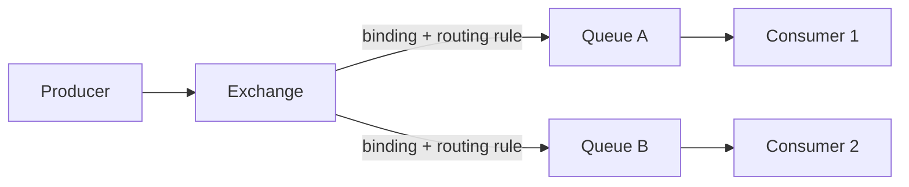

# RabbitMQ Internals

> [!abstract] What you'll be able to do after this chapter
> Explain the exchange-based routing model precisely (and why it exists at all), draw all four exchange types, explain how RabbitMQ achieves at-least-once delivery mechanically, and give a real, defensible answer to "RabbitMQ or Kafka" instead of a reflex.

---

## 1. Why RabbitMQ exists, and how it differs philosophically from Kafka

RabbitMQ implements **AMQP** (Advanced Message Queuing Protocol) and is built around **flexible routing** — the ability to express "route this message to different destinations based on its attributes" natively in the broker, not in application code. [[CS Fundamentals/05 - Messaging & Streaming/Kafka Internals|Kafka]]'s model (a topic split into partitions) is comparatively flat; RabbitMQ's model has a genuine extra layer of indirection specifically to support rich routing.

## 2. The core model: Producer → Exchange → Queue → Consumer

> [!warning] The detail most people get wrong
> Producers in RabbitMQ **never publish directly to a queue.** They publish to an **exchange**, which then routes the message to zero, one, or many bound queues based on routing rules. This extra indirection is the entire point of the architecture — it decouples "who's sending this" from "who ends up receiving it," letting routing logic live in broker configuration instead of being hardcoded into every producer.

## 3. Exchange types — the actual routing logic

| Exchange type | Routing behavior |
|---|---|
| **Direct** | Routes to queue(s) whose binding key **exactly matches** the message's routing key. |
| **Fanout** | Routes to **every** bound queue, ignoring the routing key entirely — pure broadcast. |
| **Topic** | Routes based on **wildcard pattern matching** on the routing key (`orders.*.created` matches `orders.us.created`, `orders.eu.created`, etc.). |
| **Headers** | Routes based on message **header attributes** instead of the routing key — less common, but exists for cases where routing logic doesn't naturally fit a hierarchical key string. |

## 4. Queues — push-based, ordered, competing consumers

A queue is an ordered buffer, typically drained by one or more **competing consumers** — RabbitMQ dispatches messages round-robin across consumers attached to the same queue by default. This is fundamentally **push-based**: the broker pushes messages to consumers as they become available, in contrast to Kafka's **pull-based** model where consumers request messages at their own pace. Push-based delivery generally means lower latency for a modest number of consumers; pull-based scales more naturally to very high-throughput, many-independent-reader scenarios.

## 5. Acknowledgment — how at-least-once delivery actually works

A consumer must explicitly **ack** a message after successfully processing it. If the consumer disconnects or crashes *before* acking, RabbitMQ detects this and **requeues** the message for redelivery — this requeue-on-failure behavior is the actual mechanism behind at-least-once delivery, not magic. A consumer can also explicitly **nack** a message (reject it, optionally with requeue) on a known processing failure.

> [!tip] Contrast with Kafka's model
> RabbitMQ tracks delivery state **per-message, broker-side** (has this specific message been acked?). Kafka instead tracks a single **offset per consumer group per partition** (client-side notion of "everything up to here is done") — a genuinely different bookkeeping model, worth naming explicitly if asked to compare.

**Dead-letter exchanges (DLX):** messages that expire (TTL) or get nacked without requeue can be routed to a dead-letter exchange instead of vanishing or looping forever — the standard production pattern for handling **poison messages** (ones that consistently fail processing) without blocking the rest of the queue.

## 6. RabbitMQ vs Kafka — a real decision framework, not a reflex

| | **RabbitMQ** | **Kafka** |
|---|---|---|
| Best fit | Complex routing logic, low-latency push delivery to a modest consumer count | Very high throughput, long retention, many independent consumer groups reading the same stream |
| Delivery model | Push, per-message ack | Pull, offset-based |
| Replay | Generally not supported — messages typically removed after ack | Native — reset the offset, replay from any point |
| Routing expressiveness | Rich (4 exchange types, pattern matching) | Simple (topic + partition key) |

> [!bug] "Which is just better" is the wrong question
> RabbitMQ is not "Kafka but worse," and Kafka is not "RabbitMQ but faster" — they solve genuinely different shapes of problem. A task-distribution system needing complex conditional routing to different worker pools fits RabbitMQ naturally; an event-sourcing pipeline needing months of replayable history for multiple independent downstream consumers fits Kafka naturally. Picking one reflexively without naming *why* is the actual interview failure mode here.

## 7. Production issues

**Unbounded queue growth:** by default, RabbitMQ keeps queued messages **in memory** until acked — a consumer falling behind (or crashing) can cause real memory pressure. **Lazy queues** (paging messages to disk instead) mitigate this at the cost of some throughput — a real, common production tuning decision.

**Redelivery loops:** a consistently-crashing consumer can cause the same message to be redelivered indefinitely (nack → requeue → redeliver → crash again). Mitigated by routing to a dead-letter exchange after a bounded number of redelivery attempts, rather than looping forever.

---

## 🎯 Interview follow-up Q&A

> [!quote]- "Explain the producer-exchange-queue-consumer model."
> Producers publish to an exchange, never directly to a queue. The exchange applies routing rules (based on its type and configured bindings) to decide which queue(s) actually receive the message. Consumers attach to queues, not exchanges.
>
> **Follow-up: "Why does RabbitMQ add this extra exchange indirection instead of publishing directly to queues?"**
> It decouples the producer from needing to know which queues exist or how many consumers there are — routing logic lives centrally in the exchange's configuration, so adding a new consumer interested in the same events means adding a new binding, not modifying every producer.

> [!quote]- "How does RabbitMQ guarantee at-least-once delivery?"
> Messages aren't considered fully delivered until the consumer explicitly acks them; if a consumer disconnects or crashes before acking, RabbitMQ automatically requeues the message for redelivery to another (or the same, once reconnected) consumer.
>
> **Follow-up: "What happens if a consumer acks a message, then crashes before finishing its actual side effects (e.g. writing to a database)?"**
> That message is lost from RabbitMQ's perspective — it was acked, so it's considered done, even though the real-world effect never completed. This is exactly why idempotent processing and acking *after* the side effect fully completes (not before) matters — acking too early trades safety for a smaller redelivery window.

> [!quote]- "RabbitMQ or Kafka — how would you choose?"
> [Use the decision framework in Section 6 — name the actual shape of the workload: routing complexity and consumer count point toward RabbitMQ; throughput and replay needs point toward Kafka.]
>
> **Follow-up: "Could you use RabbitMQ for something like Kafka's replay use case? Why or why not?"**
> Not naturally — RabbitMQ queues are generally designed to remove messages once acked, with no built-in notion of a long-retained, replayable log. You *could* approximate it by never acking and manually managing retention, but that's fighting the tool's design rather than using it as intended — a genuine sign the workload calls for Kafka instead.

---
*Related: [[00 - Start Here/How This Handbook Works|Book Map]] · [[CS Fundamentals/05 - Messaging & Streaming/Kafka Internals|Kafka Internals]]*
