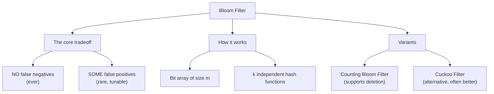
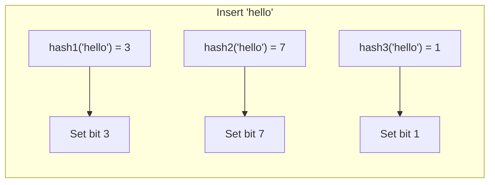
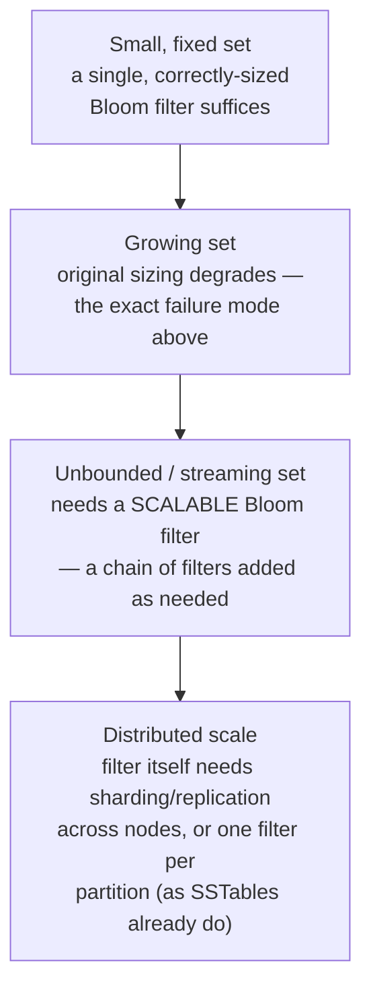

# Bloom Filter & Probabilistic Membership

> [!abstract] What you'll be able to do after this chapter
> Explain precisely why a Bloom filter can have false positives but never false negatives, derive why undersizing it degrades accuracy sharply rather than gracefully, and name a real production system that uses one to skip expensive lookups.

> [!info] A hashing structure with a different job than Consistent Hashing
> [[CS Fundamentals/06 - Distributed Systems/Consistent Hashing|Consistent Hashing]] uses hashing to answer "which node owns this key." A Bloom filter uses hashing to answer a completely different question — "have I possibly seen this exact item before" — trading perfect accuracy for dramatic space savings, a genuinely different tool for a genuinely different problem.

---

## The big picture

## What is it, and why does it exist?

A Bloom filter is a space-efficient probabilistic data structure that answers one question: "have I possibly seen this item before?" It never produces a false negative — if it says "no," the item is *definitely* not present. It can produce a false positive — if it says "yes," the item is *probably* present, but occasionally isn't.

**The problem this solves:** checking membership in a huge set the exact way — a hash set, a database lookup — costs real memory (storing every item) or real latency (a network round trip per check). Most of these checks are for items that turn out to be *absent* — "has this URL been crawled," "is this username taken," "does this key exist in a database that's expensive to query." A Bloom filter answers the overwhelming majority of these checks (the true negatives) almost instantly and with a tiny memory footprint, at the cost of occasionally saying "maybe" when the real answer is "no" — a cost worth paying because a false positive just means falling back to the real, authoritative check, never a wrong final answer.

> [!example] Layman analogy
> A bouncer holding a compressed, lossy summary of a "known troublemakers" list — instead of the full list with photos, he has a much shorter set of quick checks (build, hair color, jacket). If none of the checks match, he's *certain* you're not on the list. If all the checks happen to match, he still can't be fully sure — you might just resemble someone on the list — so he does one more, slower, definitive check before deciding. The summary saves him from doing the slow check on almost everyone; it just occasionally sends an innocent person through one extra step.

## How it actually works

A Bloom filter is a bit array of size `m`, all initially `0`, plus `k` independent hash functions. **Inserting** an item runs it through all `k` hash functions and sets the resulting `k` bit positions to `1`. **Querying** an item runs it through the same `k` hash functions and checks whether **all** `k` positions are `1` — if even one is `0`, the item was definitely never inserted (a bit that's `0` could never have been set by that item). If all `k` are `1`, the item was *probably* inserted — but those exact bits could have all been set by *other* items' hash collisions, which is precisely the source of a false positive.

> [!tip] Why false negatives are structurally impossible, but false positives aren't
> Bits are only ever set, never cleared (in the classic Bloom filter). So if an item was genuinely inserted, its `k` bits are guaranteed to still be `1` later — a false negative would require a bit to have somehow reverted to `0`, which never happens. A false positive requires no cleverness at all, though — it just needs enough *other* items' insertions to have coincidentally set the same `k` bit positions this query happens to check.

## The false-positive rate — why sizing matters precisely

The false positive rate depends on three things: bit array size `m`, number of items inserted `n`, and number of hash functions `k`. As more items get inserted, more bits get set to `1`, and the probability that a random query's `k` positions are *all* already `1` by coincidence rises — **not linearly, but accelerating** as the array fills up. This is why undersizing a Bloom filter for its expected `n` doesn't degrade gracefully — a filter sized for 1 million items holding 10 million will have a dramatically, not proportionally, worse false-positive rate, since the bit array approaches saturation and nearly every query starts returning "maybe." Sizing `m` and `k` correctly for the expected `n` and a target false-positive rate is a real, load-bearing design decision, not a minor tuning knob.

## Variants worth knowing by name

> [!info] Classic Bloom filters can't delete — these two fix that differently
> **Counting Bloom Filter:** replaces each bit with a small counter — inserting increments the `k` counters, deleting decrements them, and a position is "set" if its counter is above zero. Supports deletion at the cost of more memory per slot than a single bit. **Cuckoo Filter:** a different structure entirely (built on cuckoo hashing, storing item fingerprints rather than bits), supporting deletion *and*, at practical false-positive rates, often better space efficiency than a Bloom filter — a real, modern alternative worth naming, not just a footnote.

## Real production use — genuinely widely known patterns

> [!success] Where this actually runs in production
> **LSM-tree storage engines** (per [[CS Fundamentals/03 - Databases/Storage Engines - B-Tree vs LSM-Tree|Storage Engines]] and [[CS Fundamentals/03 - Databases/Cassandra Internals|Cassandra Internals]]): a Bloom filter per SSTable lets a read skip SSTables that definitely don't contain the key, avoiding a disk read entirely for the common case of a key that isn't in that particular file. **Web crawlers** (per [[HLD/12 - Design a Web Crawler/Design a Web Crawler|the Web Crawler chapter]]): checking "has this URL already been crawled" against a Bloom filter first avoids an expensive lookup against the full crawled-URL set for the vast majority of genuinely-new URLs. **Cache-penetration prevention** (per [[CS Fundamentals/04 - Caching/Caching Strategies|Caching Strategies]]): a Bloom filter in front of a cache/database catches requests for keys that definitely don't exist, preventing a flood of guaranteed-miss requests from ever reaching the database.

## Tradeoffs

A Bloom filter trades **certainty** for **space** — it's dramatically smaller than storing the actual set, at the cost of a tunable, nonzero false-positive rate and, in its classic form, no support for deletion at all. It's the right tool exactly when a false positive is cheap to handle (fall back to the real, authoritative check) and the memory savings genuinely matter at the scale involved.

## Where this shows up later

> [!success] Direct connections
> [[CS Fundamentals/03 - Databases/Storage Engines - B-Tree vs LSM-Tree|Storage Engines: B-Tree vs LSM-Tree]] and [[CS Fundamentals/03 - Databases/Cassandra Internals|Cassandra Internals]] — the SSTable read-path optimization above. [[HLD/12 - Design a Web Crawler/Design a Web Crawler|Design a Web Crawler]] — URL-dedup, the applied case study. [[CS Fundamentals/04 - Caching/Caching Strategies|Caching Strategies]] — cache-penetration prevention.

## Scaling: a small set to a distributed, ever-growing one

## Failure scenarios

> [!bug] What actually happens
> - **The filter is undersized for its actual item count:** false-positive rate degrades sharply, not gracefully — per the sizing section above, most queries can start returning "maybe" well before the array is literally full.
> - **An item is "deleted" from a classic Bloom filter:** it can't be — bits are never cleared, so a deleted item continues to produce a false positive forever unless a Counting Bloom Filter or Cuckoo Filter was used instead.
> - **A false positive triggers the expensive fallback path:** not a bug — a bounded, expected cost. The real failure mode is treating a Bloom filter's "yes" as certain and skipping the fallback verification entirely, which turns an expected rare inconvenience into a real correctness bug.

## Monitoring

> [!info] What to watch
> **Measured false-positive rate vs. the configured target** — the direct signal that the filter is still sized correctly for its actual item count. **Bit array saturation (% of bits set to 1)** — the leading indicator that a filter is approaching the point where its false-positive rate starts degrading sharply. **Fallback-path hit rate** — how often a "maybe" from the filter actually turns out to be a true negative on the authoritative check; a rate matching the configured false-positive rate is healthy, a rate far above it signals a sizing problem.

## Common mistakes

> [!warning] Real, recurring errors
> 1. **Assuming deletion works on a classic Bloom filter** — it doesn't; the Variants section above exists precisely because this is a common, incorrect assumption.
> 2. **Undersizing for the actual expected item count** — the Failure Scenarios entry above; sizing is a real design decision, not a default value.
> 3. **Treating a "yes" as certain instead of "probably, verify"** — skipping the authoritative fallback check turns an expected, bounded false-positive rate into an actual correctness bug.

---

## Interview Q&A

> [!info] Leveled by seniority
> **Beginner:** "What's the core tradeoff a Bloom filter makes?" — space efficiency in exchange for a tunable chance of false positives, but never false negatives. **Intermediate:** "Why can a Bloom filter never have a false negative?" — bits are only ever set, never cleared; an inserted item's bits are guaranteed to remain `1`. **Senior:** "A Bloom filter's false-positive rate has degraded noticeably in production over the last few months — diagnose it." — expects checking actual item count against the filter's original sizing, per the sizing/Failure Scenarios sections, rather than assuming a bug in the hash functions. **Staff:** "Design a Bloom filter strategy for an LSM-tree storage engine's read path, where SSTables are immutable but new ones are created constantly." — expects one Bloom filter per SSTable (matching the LSM-tree's own immutability, per Storage Engines), sized correctly at creation time for that SSTable's known, fixed item count, avoiding the growing-set degradation problem entirely by never mutating a filter after its SSTable is written. **Architect:** "When would you choose a Cuckoo Filter over a classic Bloom filter for a new system?" — expects naming the two real differentiators: needing deletion support, or wanting better space efficiency at the same target false-positive rate — a genuine, informed choice rather than defaulting to "Bloom filter" reflexively.

> [!question]- Why does a Bloom filter use multiple hash functions instead of just one?
> A single hash function makes false positives far more likely, since only one bit position needs to coincidentally collide. Using `k` independent hash functions means a false positive requires *all* `k` positions to be coincidentally set by other items — a much rarer event, tunable by choosing `k` appropriately for the array size and expected item count.

> [!question]- Can you resize a Bloom filter after it's been created?
> Not directly — the bit array size is fixed at creation and baked into how items hash into it. Growing the effective capacity means either creating a new, larger filter and re-inserting everything (expensive, and requires still having the original items), or using a Scalable Bloom Filter variant that chains additional filters together as the original approaches capacity.

## Summary / Cheat Sheet

- **Bloom filter** = probabilistic membership test: no false negatives, ever; some false positives, tunable.
- **Mechanism:** bit array of size `m`, `k` hash functions — insert sets `k` bits, query checks if all `k` are set.
- **False-positive rate** degrades sharply, not gracefully, once the filter is undersized for its actual item count — sizing is a real design decision.
- **Classic Bloom filters can't delete.** Counting Bloom Filter and Cuckoo Filter both fix this, differently.
- **Real production use:** LSM-tree SSTable read-path skipping, web-crawler URL dedup, cache-penetration prevention.

---
*Related: [[CS Fundamentals/00 - Learning Path|CS Fundamentals Learning Path]] · [[CS Fundamentals/03 - Databases/Storage Engines - B-Tree vs LSM-Tree|Storage Engines: B-Tree vs LSM-Tree]] · [[CS Fundamentals/03 - Databases/Cassandra Internals|Cassandra Internals]] · [[HLD/12 - Design a Web Crawler/Design a Web Crawler|Design a Web Crawler]] · [[CS Fundamentals/04 - Caching/Caching Strategies|Caching Strategies]]*
