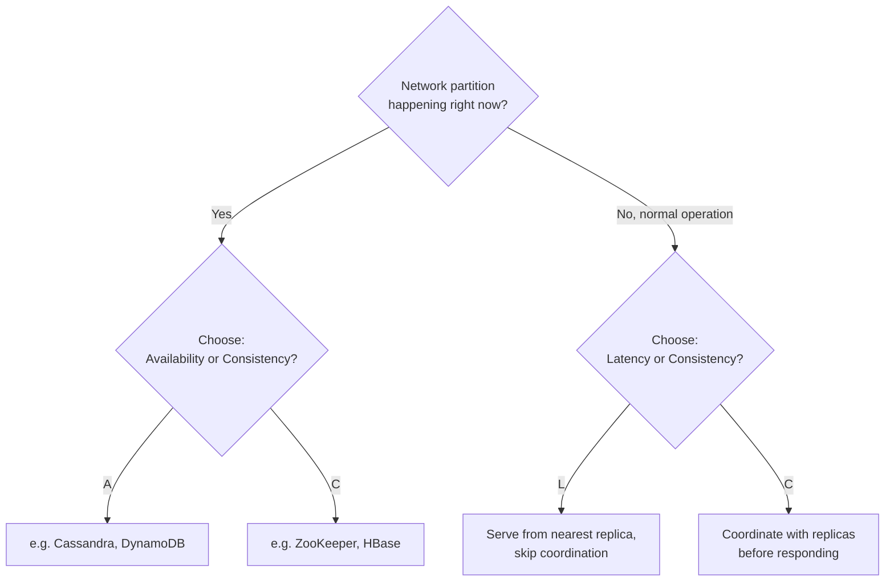
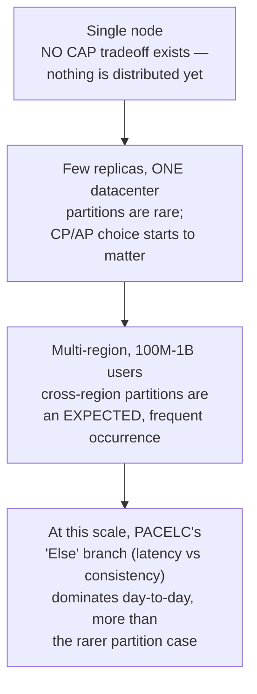

# CAP Theorem & PACELC

> [!abstract] What you'll be able to do after this chapter
> Explain CAP with the precise, formal definitions (not the folk version), give a concrete example instead of just the triangle, and bring up PACELC unprompted — the single strongest depth signal available on this topic.

---

## 1. Origin and why it matters

Eric Brewer conjectured CAP in 2000; Gilbert & Lynch formally proved it in 2002. It describes a genuine, unavoidable limit on distributed systems — not a design philosophy, a mathematical fact about what's achievable when a network partition occurs.

## 2. The precise definitions — not the folk version

> [!warning] The single most common mistake
> **CAP's "Consistency" is not the same thing as ACID's "Consistency."** CAP's C specifically means **linearizability** — every read receives the most recent write, or an error. ACID's C means a transaction moves the database from one *valid* state to another (respecting constraints). Conflating these two is a very common interview slip — say the word "linearizability" explicitly to signal you know the difference.

- **Consistency** (linearizability): every read returns the most recent write, system-wide, or an error — never stale data.
- **Availability**: every request to a non-failing node receives a response (not an error) — says nothing about whether that response is the *latest* data, just that it responds at all.
- **Partition tolerance**: the system keeps operating despite messages between nodes being dropped or delayed.

## 3. Why "partition tolerance" isn't really optional in practice

The folk version of CAP says "pick any 2 of 3" — technically true as a combinatorial statement, but misleading in practice. Real networks **will** partition eventually: a switch fails, a cross-data-center link drops, a cable gets physically cut. Dropping partition tolerance isn't a realistic option for a genuinely distributed system spanning more than one failure domain. The real-world choice isn't "which 2 of 3" — it's: **given that a partition will happen, do you choose Consistency or Availability during that partition?**

## 4. A concrete example — not just the triangle

> [!example] Two data centers, a banking app, the link between them drops
> **CP choice:** the minority-side data center stops processing withdrawals entirely until the partition heals — safe (no risk of the same account being drained twice from two disconnected copies of the balance), but customers on the cut-off side simply can't withdraw money — genuinely unavailable.
> **AP choice:** both sides keep processing withdrawals independently against their own local view of the balance — available, but now there's a real risk the same account gets overdrawn if both sides allowed withdrawals against a now-stale shared balance. Reconciliation happens after the partition heals, often at the *business logic* layer (flag negative-balance accounts for manual review) rather than trying to prevent the conflict at the database layer entirely.

| System | Typical choice | Behavior during a partition |
|---|---|---|
| ZooKeeper, etcd, HBase | **CP** | Minority-side nodes refuse requests (or error) rather than risk stale/conflicting reads. |
| Cassandra, DynamoDB, Riak | **AP** | Every node keeps serving reads/writes; divergent copies get reconciled later (read-repair, vector clocks, last-write-wins, or app-level conflict resolution). |

## 5. PACELC — the extension that separates surface-level from real understanding

CAP only describes behavior **during a partition** — which is, in practice, rare. **PACELC** covers the far more common "everything's fine, no partition" case too: **if Partition, choose Availability or Consistency** (identical to CAP) — **Else** (normal operation), you still choose between **Latency and Consistency.**

**Why this tradeoff exists even with zero partition:** achieving strong consistency requires coordinating with other replicas *before* acknowledging a read or write — waiting for a quorum ack, or routing everything through a single leader. That coordination costs real latency, every single time, partition or not. A system can skip that coordination — serve from the nearest/local replica immediately — for lower latency, at the cost of potentially returning slightly stale data, **even when nothing is broken.**

**Classifying real systems on the full scale:**
- **DynamoDB** — PA/EL: available during a partition, favors low latency during normal operation.
- **MongoDB** (default configuration) — PC/EC: consistent during a partition (writes only accepted by the primary), favors consistency during normal operation too (reads typically go to the primary).
- **Cassandra** — genuinely **tunable per query**, via consistency-level settings (`ONE`/`QUORUM`/`ALL`) — worth naming explicitly as a system that lets you pick a point on the PACELC spectrum per operation, rather than being locked into one classification globally.

## 6. When to choose which

Systems where slightly stale data is tolerable but downtime is not — social feeds, product catalogs, "like" counts — lean **AP/PA**. Systems where a conflict has real cost — financial ledgers, inventory that can be oversold, anything involving double-spend risk — lean **CP/PC**, or more realistically, a **hybrid**: strong consistency on the critical write path (the actual balance/inventory decrement), eventual consistency on read-heavy denormalized views built from it.

> [!bug] A common mistake worth naming
> Assuming "NoSQL always means AP" or "SQL always means CP" is false — it's determined by each specific system's design and configuration, not its category label. Google Spanner is relational-flavored **and** globally strongly-consistent (via TrueTime); MongoDB, often bucketed as "NoSQL," actually defaults to **CP-leaning** behavior.

## 7. Scaling: how the CAP/PACELC tension changes from 1 user to 1 billion

At small scale, on a single node, there's no CAP tradeoff at all — nothing is distributed, so nothing can partition. As replication is introduced within one data center, partitions become theoretically possible but genuinely rare (a rack-level network blip), so the CP/AP choice matters but doesn't dominate daily operation. At true global, multi-region scale, cross-region network links are meaningfully less reliable than intra-datacenter ones — partitions stop being a rare edge case and become an expected, recurring operational reality. At the same time, PACELC's "Else" branch — the latency-vs-consistency tradeoff paid on **every single request during normal operation** — becomes the more consequential day-to-day concern in aggregate, simply because it's paid continuously, while partitions, even at this scale, remain comparatively rare incidents.

## 8. Failure scenarios

> [!bug] Beyond the clean, textbook 2-way split
> - **Single node failure within a replica set (not a full partition):** handled by ordinary leader-election/replica-promotion — doesn't require invoking the full CP/AP decision, since the remaining nodes can still reach quorum among themselves.
> - **A genuine network partition splitting a cluster in two:** the CP/AP decision from Section 4 applies directly — minority side refuses (CP) or continues serving against a stale view (AP).
> - **A "gray failure" / partial partition:** some nodes can reach each other, others can't, in an inconsistent pattern — a genuinely harder, more realistic production scenario than the clean two-region split most textbook diagrams show, since different nodes may disagree about who's even reachable, complicating quorum calculations in ways a simple "side A vs. side B" model doesn't capture.

## 9. Monitoring

> [!info] What actually signals a CAP/PACELC tradeoff being paid in production
> **Replication lag** — the practical, measurable proxy for "how far into eventual consistency is this system right now," directly relevant to any AP or PACELC-EL system. **Quorum health** (number of currently-reachable replicas relative to what's required) — the leading indicator that a CP system is about to start refusing requests. **Cross-region request latency** — the direct, measurable cost of PACELC's "Else" branch during normal operation, worth tracking as its own metric rather than only noticing it via user complaints.

## 10. Common mistakes

> [!warning] Recurring, real imprecisions
> 1. **Assuming "NoSQL means AP" or "SQL means CP"** — false; it's determined by each system's specific design, not its category label (already covered in Section 6's bug callout — Spanner and MongoDB both break this assumption in opposite directions).
> 2. **Treating a system's CAP classification as a fixed, permanent label** — Cassandra is tunable *per query* via consistency levels; describing it with one fixed classification misses this entirely.
> 3. **Only ever discussing the partition case** — forgetting PACELC means missing that the latency-vs-consistency tradeoff is paid constantly during normal operation, not just during the comparatively rare moments a partition is actually happening.

---

## 🎯 Interview follow-up Q&A

> [!info] Leveled by seniority
> **Beginner:** "What does CAP theorem stand for?" — Consistency, Availability, Partition tolerance; you can't have all three simultaneously during a partition. **Intermediate:** "Why is partition tolerance not really optional?" — Section 3's answer, real networks partition eventually. **Senior:** "Classify a system you've worked with on the full PACELC spectrum, not just CAP." — expects the candidate to reason about BOTH the partition behavior and the normal-operation latency/consistency choice, not just one. **Staff:** "Design a data layer for a global application where 90% of reads can tolerate staleness but 10% (payment status) cannot — how do you avoid a single global CAP classification for the whole system?" — expects a hybrid answer: eventually-consistent reads for the tolerant majority, a strongly-consistent path specifically for the payment-status subset, mirroring Section 6's "hybrid" guidance concretely. **Architect:** "How would you evolve a single-region CP system into a multi-region deployment without silently changing its consistency guarantees underneath existing callers?" — expects discussion of making the tradeoff explicit and versioned/communicated to consumers, not just flipping a config flag and hoping downstream assumptions still hold.

> [!quote]- "Explain CAP theorem — with a real example, not just the triangle."
> [Use the banking/two-data-center example from Section 4 — a concrete scenario is what separates a memorized answer from a real one.]
>
> **Follow-up: "Is partition tolerance really 'optional' — why do people say you always effectively need P?"**
> Real distributed networks partition eventually — hardware fails, links drop. Since P isn't realistically avoidable for a system spanning more than one failure domain, the practical choice collapses to "C or A when a partition inevitably occurs," not a genuine 3-way pick.

> [!quote]- "What's the difference between CAP's Consistency and ACID's Consistency?"
> CAP's C means linearizability — every read sees the latest write, system-wide. ACID's C means a transaction respects the database's own integrity constraints, moving it from one valid state to another — a single-node correctness property, unrelated to cross-node recency.
>
> **Follow-up: "Give an example of a system that's ACID-consistent per-node but CAP-inconsistent across nodes."**
> A leader-follower relational database: each node individually enforces its own constraints correctly (ACID-consistent locally), but a follower serving a read before it's caught up with the leader's latest committed write is returning stale data — CAP-inconsistent, despite every individual node being perfectly ACID-compliant.

> [!quote]- "What does PACELC add that CAP doesn't cover?"
> CAP only describes the rare "partition is actively happening" case. PACELC adds that even during completely normal operation, there's still a latency-vs-consistency tradeoff, because achieving strong consistency requires replica coordination that costs time regardless of whether anything is failing.
>
> **Follow-up: "Classify DynamoDB and MongoDB on the PACELC spectrum and justify it."**
> DynamoDB: PA/EL — available during a partition (every node keeps serving), and favors low latency normally (reads can be eventually-consistent by default for speed). MongoDB (default config): PC/EC — writes only accepted by the primary during a partition (consistency over availability), and reads typically route to the primary during normal operation too, favoring consistency over the lowest possible latency.

---
*Related: [[00 - Start Here/How This Handbook Works|Book Map]] · [[Glossary/CAP Theorem|CAP Theorem (glossary stub)]] · [[Glossary/PACELC Theorem|PACELC (glossary stub)]] · [[Glossary/ACID|ACID]] · [[Glossary/BASE|BASE]] · [[HLD/01 - Design TinyURL (URL Shortener)/Design TinyURL|Design TinyURL]]*
